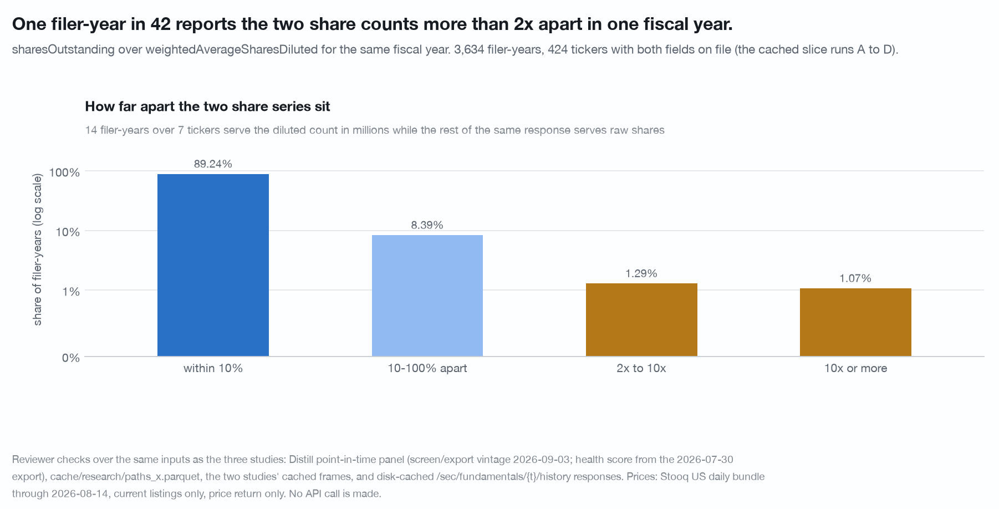

# Corrections

Scripts named here under `research/` that are not in the checkout are held by
the publisher and available on request (open an issue at
https://github.com/distillmarkets/agentic-stock-research/issues).

A dated log of what this toolkit and its published findings got wrong, what the
correct value is, and how the error was found. Entries are appended, never
edited away. A number that appears here is superseded wherever else it appears
in the repository.

Findings documents link here rather than restating a withdrawn number.

---

## 2026-09-04

The studies behind these entries were run against the 2026-09-03 panel and a
Stooq bundle through 2026-08-14. Every check below re-ran from cached responses
and the panel, with no new API call. The items are grouped by what they change.

### 1. `distill_toolkit.analysis.survival_curve` had three defects

Status: replaced by a Kaplan-Meier implementation (`analysis.failure_times`,
`analysis.kaplan_meier`, `analysis.survival_curve`) in the same commit that
records this entry; the `ended` event now raises rather than returning a
meaningless curve.

Found by writing synthetic frames with a known answer before using the helper
(`research/review-wave1/check_survival_helper.py`, which now runs as the
regression test for all three).

1. **It read `r_*` columns only.** It raised `KeyError` on a frame carrying
   market-adjusted `x_*` columns and no raw ones, so a market-adjusted event
   could not be asked for. Fixed: `survival_curve(..., prefix="x")` picks the
   basis.
2. **A failure that later lost its path left the denominator.** `at_risk` was
   computed as `~np.isnan(r)`, which removed a row from both the numerator and
   the base once its path ran out, including rows that had already failed. On
   ten synthetic rows where the truth is 20% incidence at every month from 6 on,
   the helper reported 20.0% at months 6-12 and **0.0% from month 13**, a 20pp
   error. Hand-checked against four rows with real censoring, a Kaplan-Meier
   estimator returns 0.75 / 0.75 / 0.75 / 0.375 / 0.375 at months 3, 6, 11, 12
   and 24; the helper returned 0.3333 at month 12. Fixed: failure is absorbing
   and a path that runs out censors, so the shipped helper returns the
   hand-checked values.
3. **The `"ended"` guard was the constant `True`.**
   `np.nan_to_num` removed every NaN before `np.isnan` looked at it, so the
   guard term was all-True and the whole expression collapsed to `np.isnan(r)`.
   A row that is NaN at month 1 and priced afterwards was called "ended" at
   month 1. Fixed: `event="ended"` now raises `ValueError`, because a delisting
   hazard is not estimable from a current-listings price file at all (see
   entry 4).

Direction of the bias: the old helper overstated survival, which is the same
direction as the survivorship bias already present in a current-listings price
file. On the file used for [findings/survival-clock.md](findings/survival-clock.md)
the effect was small (package survival 0.21pp too high at month 12, 0.83pp at
month 24) because only entry years 2024-2025 are censored. It would have been
large on a file with real delisting.

No published number in this repository moved.

### 2. `joins.split_basis_flags` fires on candidates, not on splits

Base rate over the **473 tickers** of the research sweep pool that had a cached
`/sec/fundamentals/{ticker}/history` response when the study ran. That list is
derived from API responses, so it is not committed: `research/artifacts/study.py`
pins it under `cache/` on its first run and reads it on every later one, and
`research/sweep_pool.py` is what fills the cache it is derived from. Of the 473:
**32 tickers
(7%) raise at least one flag, 41 flags in total. 19 flags (46%) are
corroborated by the never-restated `sharesOutstanding` series, 15 (37%) are
contradicted, and 7 (17%) are untestable** because there is no usable
`sharesOutstanding` in the window.

The contradicted flags are mostly genuine share-count growth rather than a
basis break: a diluted count that roughly tripled at an IPO or a conversion, at
which point rebasing the series would be wrong.

Two things about that rate:

- **The tolerance band moves the answer more than the window does.** Sweeping
  the lookahead from 2 to 5 years leaves 46 / 37 / 17 unchanged at 2, 3 and 4
  years and moves it to 46 / 39 / 15 at 5. Sweeping the band from 0.8-1.25 to
  0.5-2.0 moves corroborated from 44% to 54% and contradicted from 39% to 29%.
- **The corroboration helper reports the wrong step year.** It returns the year
  in the window whose ratio is closest to the flagged factor, not the first year
  whose ratio enters the band. Once the level has stepped, every later year is
  also approximately factor times baseline, so the reported step year is
  arbitrary among post-step years. One consequence in the artifacts study: a
  split that steps at FY2022 (x4.09) was printed as stepping at FY2023 (x4.03).
  The three-way verdict is unaffected. Fix: report the first year in the window
  whose ratio enters the band, and read the field as corroboration rather than
  as a split date. Status: fixed in `joins.corroborate_flags`, which now reports
  the first in-band year and falls back to the closest year only for a
  contradicted verdict.

**Consequence for the package.** `joins.split_basis_flags` and
`joins.rebase_shares` were a pair with a confirmation step missing between them,
and `examples/valuation_decomposition.py` rebased automatically. Shipped as
`joins.corroborate_flags`, which returns a `corroborated` / `contradicted` /
`untestable` verdict per flag, and wired into
`examples/valuation_decomposition.py`: only corroborated flags reach
`rebase_shares`, and the rest are printed with their verdict and left unapplied.

### 3. A share count served in the wrong unit is behind part of that contradicted rate

Found while checking the contradicted flags
(`research/review-wave1/check_shares_defect.py`). Over **3,634 filer-years
across 424 tickers** with both share fields on file, `sharesOutstanding` divided
by `weightedAverageSharesDiluted` for the **same fiscal year**:

| agreement | share of filer-years |
|---|---|
| within 10% | 89.24% |
| 10-100% apart | 8.39% |
| 2x to 10x apart | 1.29% |
| **10x or more apart** | **1.07%** |

86 filer-years (2.37%, 46 tickers) are 2x or more apart and 20 (0.55%) are 100x
or more. The shape of the worst cases is a unit switch inside one response: four
consecutive years served in **millions** while every other year of the same
response is served in raw shares, with `netIncome / epsDiluted` confirming the
true count throughout. Fourteen filer-years over seven tickers report a diluted
count below 100,000 against more than a million shares outstanding.

This matters because `docs/traps.md` traps 1 and 2 direct every study to use
`weightedAverageSharesDiluted` and never `sharesOutstanding` for multi-year
work, and `joins.rebase_shares` and `joins.decompose` consume that field with no
sanity check. **Three of the fifteen contradicted split flags are this unit switch
and not a false positive of the flag**: at the flag year the two counts differ
by 10x, 102x and 5x, which no issuance can produce, because a weighted-average
diluted count and a year-end outstanding count for the same fiscal year cannot
differ by a split factor.

The follow-up is delivered as
`joins.share_series_sanity(shares_outstanding_by_year, wasd_by_year)`, which
returns one row per fiscal year whose `sharesOutstanding / weightedAverageSharesDiluted`
ratio leaves [0.5, 2.0], and which `examples/valuation_decomposition.py` now
calls before it decomposes. The rate is measured over an alphabetically
truncated slice of a revenue-over-$300m priced pool, so 1.07% is not a universe
rate.

### 4. `delisted_in_window` is an artifact, and one published panel is withdrawn

The `delisted_in_window` column in the derived paths file is `True` on 5,385
rows, which is **precisely every 2024 and 2025 entry**, and on **zero** rows for
entry years 2010-2023. Verified independently by reading the last date of all
13,239 readable symbol files in the price bundle: **no symbol ends before
2026-02-06 and zero end before 2026-01-01.** The bundle deletes delisted symbols
rather than ending their series, so the flag marks the right edge of the price
file and cannot mean delisting.

**Withdrawn:** the "price series ended within 24 months, 27% against 15%" panel
in the tail-by-health chart. That contrast is entry-year composition. The "fell
50%+" panel alongside it stands.

**Consequence:** the "series ended" survival event is not estimable from a
current-listings price file at all. Its curve is a step function at the file
edge, identical for every label. It is stated in
[findings/survival-clock.md](findings/survival-clock.md) as a measurement
failure rather than as a result.

### 5. The "the health score is not point-in-time" caveat is withdrawn

Earlier notes on the survival work described the `health_score` column in the
derived paths file as a single July 2026 value pasted onto December snapshots as
far back as 2010.

**That is not what the file contains.** The score is dated per snapshot and
moves with the firm: only **10.6% of the 2,667 firms** carry a constant value
across all their December rows. One large-cap example runs 100, 95, 100, 100,
85, 85, 85, 95, 85, 90, 80, 75, 65, 65, 65, 75 from 2010 to 2025. The July 2026
**export** is itself a point-in-time panel.

What its vintage can still carry is the **fact vintage behind each dated score**,
a value as later restated rather than as originally filed. That contamination
would grow with distance from July 2026 and the spread runs the other way:
7.5pp for 2010-2013 entries against 18.4pp for 2022-2025. The panel's own
point-in-time labels reproduce the shape (Piotroski 0-3 against 7-9 is 18.4%
against 5.8% at 12 months; the M-Score flag against no flag is 25.4% against
9.8%). Re-running against a point-in-time health score would settle it.

The caveat has been replaced with that wording everywhere it appeared.

### 6. The survival placebo was not clustered by firm

**Superseded:** shuffled null 1.7pp ± 0.9, 97.5th percentile 3.4pp, implied
z = 15.3, and the reading that 1.7pp of the 15.5pp twelve-month spread is
entry-year composition and 13.8pp is the label.

**Correct:** the 25,619 firm-years come from **2,667 firms, 9.6 apiece**, and a
row-level shuffle breaks a dependence the observed statistic keeps. Shuffled
firm by firm, so each firm carries one label for its whole history and labels are
permuted among firms with the same median entry year, the null is
**5.9pp ± 1.4** with a 97.5th percentile of **8.7pp**, and the observed 15.5pp
is **z = 7.0**. The composition-versus-label split becomes **5.9 / 9.6**.

**The finding is unharmed.** A cluster bootstrap over CIK, 300 draws, puts the
spread at 15.5pp with a 95% interval of [13.2, 17.9]pp and no draw at or below
zero. What was overstated is the statistical strength, by about a factor of two.

A second consequence: `n` in that study is firm-years, and the firm counts
behind the five buckets' 1,691 / 3,950 / 8,018 / 5,543 / 6,417 firm-years are
**813 / 1,407 / 2,067 / 1,596 / 1,271**. Both counts now appear in the tables.

### 7. The M-Score top-bucket cell carries an interval

The claim that an M-Score flag roughly triples the twelve-month hazard inside
the top health bucket (5.6% to 15.9%, n = 259 firm-years) rests on **40 failing
firm-years from 38 distinct firms**. The bootstrap 95% interval on the 15.9% is
**[11.3%, 20.7%]**, which does not touch the unflagged 5.6%. The claim holds at
that width. The failure count and the interval now appear next to it.

### 8. The ghost cohort's "4.1% live listed firms" claim is withdrawn

**Superseded:** "weighting the two groups by their firm-year shares, roughly
4.1% of ghost firm-years are live, exchange-listed firms the join misses".

The arithmetic reproduces (0.193 x 18.7% + 0.807 x 0.7% = 4.15%, and 4.14% when
the sampled CIKs are reweighted by the firm-years they contribute). The estimand
is what fails. The probe's "listed" test is SEC's `exchanges` field, which
carries no date, and the study's own data says the field is not evidence of a
join failure:

- **0 of the 28 exchange-listed still-filing ghosts, and 0 of all 300 sampled
  ghosts, has any SEC-named ticker present in the price bundle.** The mechanism
  named (the panel picked a non-common symbol while the common trades under
  another) fires zero times in 300 draws, which by the rule of three bounds it
  below 2% of still-filing ghosts and **below 0.4% of ghost firm-years**.
- Every one of the 28 is a firm with a December 2025 panel row absent from a
  price file current to 2026-08-14, which is the shape of a delisting whose SEC
  exchange record has not been cleared.

The 4.1% survives only as an **upper bound on join failure**, and it is stated
that way in [findings/ghost-cohort.md](findings/ghost-cohort.md). The three
key defects behind the original claim were found by hand and none of them is in
the 300-CIK sample, so the probe does not measure their rate.

Three related corrections in the same study:

- **"Every one of the 300 tickers resolved to the same CIK" is wrong. 298 did.**
  `FMCC` resolves to CIK 0000038009 against the panel's 0001026214, and `ME`
  resolves to 0001022345 against the panel's 0001804591. Ticker recycling is
  small but not zero.
- **`BK` / `BNY` is not a panel-side defect.** For CIK 0001390777 the panel
  agrees with SEC exactly: SEC's own record is `['BK','BK-PK']` and names no
  `BNY`. The price bundle files that company's history back to 1984 under `BNY`
  and holds no `BK`. This is a disagreement on the price-file side. **`DTB` for
  DTE Energy and `PFH` for Prudential Financial are panel rows keyed to a
  baby bond and a preferred** standing in for the common.
- **"That ~3% top-decile miss is key drift, not delisting" is withdrawn.** The
  nine 2025 top-revenue-decile misses are `ACF`, `BK`, `DISH`, `FMCC`, `FNMA`,
  `HES`, `JWN`, `WBA` and `X`: a mix of filers off the three exchanges the
  bundle carries, one symbol the price file names differently, and firms whose
  December 2025 snapshot precedes a 2026 corporate event by up to eight months.
  A December 2025 snapshot sits eight months before the file edge and the panel
  carries nothing that separates a delisting from a key failure, which is the
  study's own thesis.

### 9. Ghost-cohort arithmetic and the boom-cell reading

- **"Every observed gap is more than six times the 95th percentile of the
  absolute placebo gap" is wrong.** The six ratios are 68.5, 7.8, 7.1, 6.4, 5.9
  and **5.03**; the minimum is the median margin change. Correct: **more than
  five times**.
- **The transition counts were mislabelled.** 25,006 priced and 10,759 ghost are
  the counts with a non-null next-year operating margin. The transition counts
  are **25,108 / 10,812**, and the revenue rows use those. Both now appear.
- **The stratified exit gap** is 30.08pp against a raw gap of **29.46pp**, not
  "unchanged at 30.08pp".
- **"The capital-cycle result is robust to survivorship" is softened.** Dropping
  200 random subsets of the same size as the ghost cohort and recomputing the
  gap the same way gives **16.64pp ± 1.25**; the observed priced-only gap of
  14.74pp sits at **z = -1.52**, and 5% of random drops land at or below it. The
  correct statement is that at this n the base rate is **not measurably damaged**
  by survivorship. Ghosts are 34.2% of the boom cell against **28.1% of the
  two-year transition pool it is cut from**, not against their 33.2% share of
  the December universe, so they are over-represented by 6.1pp rather than
  "close to" proportional.

### 10. "85% of the move happened before the correcting filing" is a window-length ratio

**Superseded:** the statistic that 84.6% of the market-adjusted move between a
first print and twenty days after the correcting filing occurred before that
filing (91.0% per event on moves over 5pp).

The statistic is `median(pre) / median(pre + post)` where the pre window is a
median of **253 trading days** and the post window is fixed at **20**. A
constant drift over both windows produces **253/273 = 92.7%**. Three cohorts
that contain no down revision at all reproduce it: a matched **never-revised**
control gives a per-event median of **92.66%** against the events' 91.0%, the
up-revised set gives 95.0%, and the same firms one year earlier give 93.5%. The
statistic carries essentially no information about revisions and is withdrawn.

**What replaces it** is the paired comparison the same study already ran:
against sector-, size- and year-matched controls drawn from firm-years carrying
no revision, down-revised firms lose an extra **-3.35pp [-6.76, -0.07]** before
the filing and **+0.08pp [-0.68, +1.00]** after it, a null. Two caveats now
travel with it: the pre-filing interval's upper end is -0.07pp, and **1,039
control paths come from 761 control firms, one serving as many as 6 events,
while the paired bootstrap resamples event firms only**, so correlation induced
through a shared control is not in the interval.

The one-year date placebo overlaps the event window for **59.9%** of paired
events (median overlap 50% of the placebo window), because the median correction
gap is 368 days. Repeated at two years back, where overlap is impossible, the
placebo still produces -6.68pp of the observed -7.40pp, the paired excess is
still a null at -2.49pp [-5.66, +0.55], and the severity gradient is still
there. At three years back it is not, so the "persistent firm-level property"
reading holds over roughly two years before the correction and not indefinitely.

### 11. The 13F tail gap is reproduced by a within-firm shuffle

**Superseded:** "tail risk sorts by the size of the ownership change", stated as
a +9.51pp (pool) and +9.63pp (deep) extremes-minus-middle gap in the 20%-fall
share, with an honest within-firm range of +2.0 to +9.3pp.

Permuting **each firm's own concentration change across its own quarters**,
which preserves every firm-level property and destroys all timing, reproduces
**+8.35pp ± 1.00** of the +9.51pp on the pool frame, where **13% of 200 draws
are at or above the observed value**, and +7.20pp ± 1.29 of the +9.63pp on the
deep frame. On the pool frame the gap does not clear its own within-firm null. A
firm's own **standard deviation** of the change, a single number per firm with
no timing content, sorts the same 20%-fall share by **+20.03pp [+16.60, +23.33]**.

Two consequences:

- **The honest within-firm range is +2.0 to +2.8pp, not +2.0 to +9.3pp.** The
  demeaned rung's +9.25pp is not a lower bound: a within-firm shuffle reproduces
  +7.20pp of it, so demeaning demonstrably fails to remove the composition.
- **The "the z-scored control could be over-correcting" caveat is withdrawn.** A
  rank-within-firm version, which divides out no scale and assumes no shape,
  gives **+2.80pp [+0.17, +5.27]** next to the z-score's +2.02pp [-0.93, +4.52].
  Ranking inside holder-count quintiles instead leaves +5.92pp [+2.75, +8.76],
  so about 4pp of the raw gap is how thinly a name is held.

The out-of-sample replication (+9.95pp on 29 quarter-ends) replicates the
composition artifact, which is what a firm-level effect does. **The finding that
survives is the reverse-causality result**: 20.49pp [+18.79, +22.06] behind
against +0.37pp [-1.44, +2.11] ahead, strictly monotone in 400 of 400 clustered
draws.

Two further items in the same study:

- **"Missing names are concentrated in exactly the cells with the worst
  drawdowns" is withdrawn.** Nothing there measures the missing names'
  drawdowns; by construction they have none. Correct: the missing third has no
  price series, so it contributes to none of these cells, every 20%-fall share
  and drawdown is a floor, and nothing in this data bounds by how much.
- **The bootstrap has more clusters than firms.** The cluster key is the CIK
  where the panel resolves one and the ticker otherwise, so a firm whose CIK
  resolves in some quarters and not others becomes two clusters: 245 clusters
  for 196 firms on the deep frame, 2,080 for 2,005 on the pool frame. That
  narrows the deep frame's intervals. Fix: resolve ticker to CIK once per
  ticker.

### 12. The vintage-gap coverage decomposition and the 0.661 Jaccard

Three corrections in one section.

- **"They are firms that stopped filing: only 14.4% of them have a panel row in
  2025" is incomplete.** Of the 104 sampled CIKs that 404 on `/history`, **26
  (25.0%) have a panel row dated 2024 or 2025** and **9 (8.7%) have one dated in
  2026, the export's own final year**: CIO, DENN, GES, HES, LPI, PFMT, SGMA,
  SRDX and SUP are in the current panel and 404 on `/history` under the panel's
  ticker. Of the 35.0% of a December-2017 universe a screen cannot reach today,
  **26.0 points stopped filing and 3.0 points did not**, with 6.0 points in
  between. The decomposition uses the panel's own last row as a filing-status
  proxy, so it is a partition of reachability rather than of causes.
- **"Twenty of the 59 point-in-time picks cannot be reached at all" is wrong.
  Fifteen are.** Of the 59 picks, 44 are served by `/history` today and 15 are
  not; the other 5 drop out because the top-quintile line moves when the
  universe shrinks from 295 firms to 191.
- **The 0.661-against-0.954 Jaccard comparison is invalid.** The restated pick
  set is a strict **subset** of the point-in-time one, so
  `Jaccard(full, subset) = |subset| / |full| = 39/59 = 0.661` identically: it is
  a coverage number carrying exactly the information in "66% of the picks
  remain", while 0.954 is a genuinely two-sided statistic with 64 names in and
  64 out. Replaced by the served share, **65.0% with a binomial 95% interval of
  [59.6%, 70.4%] on n = 300**, and by a like-for-like comparison, the top 59 of
  the served universe against the top 59 of the full one, which overlaps on 44
  for a Jaccard of **0.595**. The ordering claim, that the universe moves the
  answer far more than restatement does, survives all three changes.

### 13. The insider +20-day spread carries a Form 4 publication lag

The event date in the insider study is the **transaction** date. Form 4 is due
within two business days and the response carries no `filedAt`, so the first
days of a +20-day window partly precede publication.

Measured directly, the purchase-minus-placebo spread over **trading days 0 to 2
alone is +1.41pp [+0.97, +2.21], 38% of the +3.75pp twenty-day spread.** Moving
every event forward two trading days:

| horizon | as published (transaction date) | +2 trading days |
|---|---|---|
| +20d | +3.75pp [+2.19, +5.08] | **+3.00pp** [+1.11, +4.74] |
| +60d | +5.65pp [+1.29, +10.47] | **+3.79pp** [+0.85, +7.96] |
| +120d | +5.22pp [+1.10, +11.53] | +5.59pp [-0.07, +9.87] |
| +250d | +5.32pp [-3.52, +18.80] | **+0.00pp** [-3.75, +13.23] |

The +20 and +60 day results survive at about 80% and 67% of their size. The +120
and +250 day results do not. The published statement is now the shifted range
with its regime and its lag caveat, and never a base rate.

Two placebos added in review, both of which the finding passes: reweighting the
placebo dates to the events' own decile distribution of the prior 60-day
abnormal fall makes the +20-day spread **larger** (+3.86pp), so short-term
reversal is not the mechanism; reweighting to the events' calendar-quarter
distribution leaves +3.60pp against +3.75pp. **The prior-path finding, that
purchase clusters follow a 60-day abnormal fall 7.6 points deeper than a random
date at the same firm, needs no lag correction** because it is measured entirely
before the event.

One wording correction in the same study: a bare open-market purchase and sale
tally for two named companies was described as covering "the whole ten-year Form
4 window in this corpus". The corpus holds about 3.1 and 2.6 years of Form 4
detail for those two names, from 2023-06-29 and 2024-01-12, and both carry a
`coverageNote`, so both counts are lower bounds.

### 14. Withdrawn from the public log

This entry corrected a note in a document that is no longer part of the
repository; the corrected window is stated where it is used, in
`findings/nulls.md`.

### 15. Chart-module defects found while rendering the studies

Seven rendering defects in `distill_toolkit/charts.py`, all fixed there: the
`quantile_bars` median label, `grouped_bars` headroom, legend placement and
negative-value labels, `charts.figure` headline and subtitle truncation, an
unescaped `$`, and marks that could not share a date axis. `charts.escape`,
`stack`, `grid`, `date_bars`, `date_ticks` and `lines` were added. Each was
worked around locally at the time, so no published number moved.

### 16. `analysis.clustered_shuffle(within=...)` shuffled one row per firm-year and dropped the rest

The between-firm null with an alignment key kept one row per (group, key)
before reindexing, so on a quarterly frame every shuffled (firm, year) cell
took a single quarter's label four times: 100% of shuffled cells were constant
against 95% of observed ones. A row whose partner firm had no row at that key
came back NaN, and nothing reported how many: 42% of the pre-exit base frame,
30% to 76% of the sibling studies' frames. A rate computed over the shuffled
series therefore had a smaller denominator than the observed rate it was
being compared with. Found by the pre-exit reviewer against synthetic frames
with a known answer (`research/review-pre-exit`), which also re-ran the
pre-exit lifts under a null that drops nothing: every lift still clears, at z
values 25% to 40% below the published ones. Fixed: the shuffle walks every row
of the partner's cell in order, draws from the key's pool where the partner
has no cell, never returns NaN, and raises a `RuntimeWarning` with the
fallback share. Regression tests: `tests/test_analysis_nulls.py`. Every
placebo in the sibling studies that used the old function was re-run
(`research/null-fix-rerun`); entries 18 and 19 record what that re-run and the
repair of it found.

### 17. `analysis.cluster_boot_diff` printed a precise null on a tied statistic

On an outcome that is mostly one value (an integer score, a column that is
80% zero) the median of both cohorts and of every replicate is the same
number, and the helper returned `0.000 [0.000, 0.000]` while the means
differed by 0.44. The interval describes the grid the outcome sits on, not
the difference. Reported by the pre-exit study as an integer-score problem;
the reviewer showed the trigger is a tied statistic, and a continuous sparse
column does it too. Fixed: a `RuntimeWarning` when the observed difference and
both interval ends are exactly zero, pointing at `stat=np.mean` or a rate.
Test in `tests/test_analysis_nulls.py`.

### 18. The first repair of `clustered_shuffle` understated the null it was repairing

The fix in entry 16 gave a row whose partner firm had no cell at its key a
random label from the key's pool of other firms. On the sibling studies'
frames that was 22% to 74% of rows, and each of them lost the within-firm
persistence the helper exists to preserve, so the repaired null was tighter than the data:
the share-issuance z rose from 12.6 to 17.8 and the pre-exit lifts from 4.6
to 12.2 up to 6.1 to 16.7, while the pre-exit reviewer's cell-mean null had
put the same Altman cell at 5.1. Three no-drop constructions of the same null
gave z of 5.1, 8.8 and 12.0. Found by `research/null-fix-rerun`. Fixed: such
a row now takes the partner's label at the partner's nearest key, so the
partner's whole path moves as one and the null keeps the data's persistence;
the share of nearest-key rows is still raised as a warning. Regression test:
`tests/test_analysis_nulls.py`. The re-run in `research/null-fix-rerun` was
repeated against this version; entry 19 records what it found.

### 19. One pre-exit placebo claim does not survive the repaired null

Re-run against the nearest-key `clustered_shuffle` (entry 18), the pre-exit
study's between-firm placebo reads differently. The null lift bound moves from
"at or below +0.24pp +/- 0.96 on every state" to at or below +2.50pp +/- 1.34,
because a distress state persists inside a firm and a null that carries each
partner's whole path carries that persistence too. The observed lifts move from
z = 4.6 to 12.2 to z = 1.6 to 6.9, and "every observed lift is more than 2.4
times the 95th percentile of the absolute shuffled lift" is withdrawn in
favour of 1.0 to 3.5 times. The state "FCF margin below zero and revenue
falling", +4.67pp on 137,787 firm-quarters over 5,499 CIKs, no longer clears
its between-firm null (1.0 times the 95th percentile, z = 1.6); the other five
states clear at 1.6 to 3.5 times. The within-firm null in the same table does
not call the helper and is unchanged. Four constructions of the same null put
the Altman cell at z = 3.6 (nearest key), 5.1 (the reviewer's cell mean), 8.8
(published, dropping 42% of rows) and 12.0 (the pool-draw repair): the width
of a between-firm null is decided by how it treats the rows an unbalanced
panel cannot pair. Found by `research/null-fix-rerun`; the same re-run moved
no verdict in share-issuance, fundamental-momentum or price-leads-record.

### 20. `joins.corroborate_flags` took a NaN share count as a baseline

The helper tested a candidate split against ``sharesOutstanding`` with
``if v:``, and a NaN is truthy, so a history that has been through pandas
handed it a baseline of NaN for every absent count and the comparison went
through as a number. The market-cap study reported 92 corroborated, 125 contradicted and 7
untestable flags on that basis; with absent counts treated as absent
the base rate is 95 corroborated, 82 contradicted, 47 untestable, and 3,243 of
20,032 cached filer-years carry no count at all. Found by
`research/review-market-cap`. Fixed: an absent or NaN count is skipped and a
window with none is ``untestable``. Test in `tests/test_joins.py`.

---

## 2026-09-10

One defect, in the Stooq reader, and the re-run it forced. The re-run ran
against the 2026-09-07 panel and the same Stooq bundle through 2026-08-14, from
files already on disk, with no new API call.

### 21. The Stooq reader indexed the bundle's fund files alongside its equity files

`stooq.index()` walked every `*.us.txt` file under the bundle root, which
includes the `nasdaq etfs` and `nyse etfs` folders. A fund that has taken the
symbol of a company which delisted therefore answered to that company's ticker,
and a firm-year keyed to it read as **priced** with a fund's price history
standing in for a dead issuer's.

**Size, measured on the 2026-09-07 panel.** The bundle holds 13,277 symbols:
9,622 equity and 3,655 fund, and **no symbol appears as both**, so the defect
never substituted one series for another. Its whole effect is firm-years counted
as priced that should have been ghosts. Of the 3,435 distinct panel tickers with
a match, **62 (1.8%) resolved to a fund file**; restricted to tickers carrying a
listing end, **48 of 342 (14.0%)** did, which is the population the symbol
reuse concentrates in (`AIQ`, `AMID`, `ARB`, `ARIA`, `ASIA`, `AVIV`, `AWAY`,
`BBLU`, `BUFF`, `CALI`, `CIR`, `CWI`, `DCMT`, `DIAL`, `DRIV` among them). On the
December universe that is **192 firm-years over 51 CIKs**, 0.63% of the
firm-years the old index called priced.

**Fixed** in the same commit that records this entry: `index()`, `bars()`,
`closes()` and `px()` are equities only and take a keyword-only
`include_etfs=False`; the index and bars caches are keyed on the flag; an
equity file wins any symbol present in both sets. Tests:
`tests/test_stooq.py::test_index_excludes_funds_by_default`,
`::test_a_reused_symbol_reads_as_absent_rather_than_as_the_fund`,
`::test_the_two_index_variants_do_not_share_a_cache_entry`. The audit idiom, a
diff of the two index variants, is written up as trap 18 in
[docs/traps.md](docs/traps.md).

**Which published figures move, and by how much.** The ghost-cohort study was
re-run and [findings/ghost-cohort.md](findings/ghost-cohort.md) now states the
2026-09-07 vintage throughout. Two separate things moved it, and blending them
would misattribute the correction:

| | December firm-years | ghost | ghost share | ghost CIKs |
|---|---|---|---|---|
| as published, 2026-09-03 panel, funds in the index | 45,428 | 15,076 | 33.19% | 2,833 |
| 2026-09-07 panel, funds in the index | 43,474 | 13,237 | 30.45% | 2,614 |
| 2026-09-07 panel, equities only (published now) | 43,474 | 13,429 | **30.89%** | 2,663 |

- **The fund fix alone**, holding the panel fixed, moves the ghost cohort by
  **+192 firm-years, +49 CIKs, +0.44pp**. That is the whole of this correction.
  A separate reused-ticker study, held by the publisher and written with its own
  bundle reader, arrived at the same 192 independently.
- **The panel vintage alone** takes the December universe from 45,428 firm-years
  to 43,474. The published headline cannot be reproduced exactly because the
  2026-09-03 export no longer exists on disk, so the first row above is the
  published figure rather than a re-measurement. A four-day-apart export of the
  same endpoint holding about 2,000 fewer December firm-years is a data
  observation in its own right and is not explained here.

Figures inside the study that move by more than rounding, all in the same
direction the two changes predict: the Stooq match rate 66.81% to **69.11%** and
the usable rate 63.40% to **66.23%**; the still-filing share of ghost firm-years
19.3% to **12.2%**; the forward exit ratio 13.4x to **17.4x**; the low-health
two-year exit rate 21.4% against 4.7% to **21.8% against 4.1%**; the boom-cell
random-drop null 16.64pp +/- 1.25 at z = -1.52 to **16.55pp +/- 1.17 at
z = -1.69**. Two statements weaken: "every observed gap is more than five times
the 95th percentile of the absolute placebo gap" becomes **more than 4.8 times**
(the minimum, on the median margin change, is 4.83), and the nine 2025
top-revenue-decile misses named in entry 8 are **five** on this panel: `ACF`,
`BK`, `DISH`, `FMCC` and `FNMA`. The other four are not matched here, they are
gone. `HES`, `JWN`, `WBA` and `X` have no December 2025 row in this export's
universe at all, which is the panel vintage moving, not the fund fix.
One sentence is removed rather than restated: the earlier version quoted a
December universe of 45,605 firm-years and a 30.4% ghost share from an
as-of-screen construction that is not the one this study runs and that was not
re-run.

**The reused-ticker counts, reconciled.** Two figures were in circulation and
they count different populations, so neither superseded the other; both were
also fund-contaminated. Over **all 3,104 ended firms in the panel**, 354 had a
live series under their last panel ticker (247 beginning after the listing end,
107 spanning it); equities only, that is **303, of which 202 reissued and 101
spanning**. Over the **December study universe**, which is narrower (listed
equity, revenue above zero, unambiguous ticker, 2010-2025), the count was 163
firms and 704 firm-years; equities only it is **120 firms and 544 firm-years**,
of which **114 firm-years over 25 firms** pass the 14-day fresh-close test at a
snapshot preceding the listing end. **Every one of those 25 is a spanning
symbol, not a reissued one**: a series that begins after the listing end has no
close before it and cannot pass an entry test, so a reissue is a forward-window
exposure only. `docs/agent-guide.md` said "163 dated firms ... 29 of them" and
now states the 3,104-firm census with the December-universe figure beside it.

**Every other Stooq match rate published in this repository was computed with
the fund files in the index and is overstated.** The direction is known and the
size is measured on the one universe re-run here: 0.44pp of December firm-years,
0.63% of the priced set. The sibling studies (`findings/market-cap.md`,
`findings/share-issuance.md`, `findings/nulls.md`, `findings/survival-clock.md`,
`findings/what-moves.md`, `research/pre-exit-signature/`) were not re-run, so
their match rates stand at their own vintage with that bias, and each now says
so and points here. No result in them is joined through a symbol that changed
which file it reads, because no symbol is in both sets; what changes is that a
small number of their priced firm-years were a fund's price history.

---

General information from public SEC filings, not financial product advice.
Companies are named above only as facts they exhibit in the data. See the
[disclosure](README.md#disclosure).
