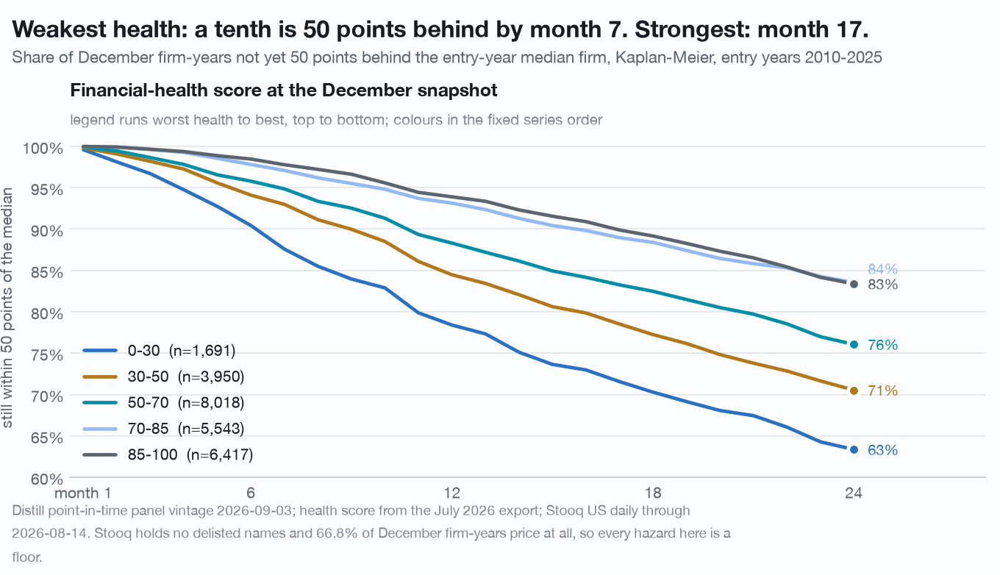

# Agentic Stock Research

A toolkit and worked studies for research on SEC filings and your own price
data, run by an AI agent. It measures base rates over cohorts and facts
companies exhibit in the data, and it does not rate, value or recommend any
security. Point-in-time fundamentals come from the
[Distill Markets](https://distillmarkets.com) API, over its hosted MCP server
or the client here. Prices come from a file on your own disk. The
library is the careful part between them, `AGENTS.md` is the brief that keeps
an agent honest, and the studies under `findings/` are what the two produced
together.

*General information from public SEC filings, not financial product advice. See
[Disclosure](#disclosure).*



**Weak companies fall sooner, not further.** Each line is a health bucket. A tenth of the weakest firms are 50 points behind the market within seven months; the strongest take seventeen. The average outcome is similar; the timing of the bad tail is not. [How it was measured](findings/survival-clock.md)


**Free price data leaves out the companies that failed.** A current-listings price file has no series for a third of SEC filer-years since 2010, because those firms later delisted. The missing share rises as financial health falls, so any backtest on that file is a survivor's result. [How it was measured](findings/ghost-cohort.md)

## Install

```
git clone https://github.com/distillmarkets/agentic-stock-research
cd agentic-stock-research
pip install -e ".[dev]"
cp .env.example .env      # add your Distill API key
```

A free key reaches today's snapshot of every filer, the filings, insider,
revisions and ownership endpoints, at 150 calls a day. Fundamentals history
needs an Analyst key; the point-in-time export that the longitudinal studies
start from needs Pro. Price joins need a daily US bundle from
[stooq.com](https://stooq.com/db/h/), unpacked where `STOOQ_DIR` points; the
toolkit reads it and never downloads it.

## First result

One call on a free key, and a question a price file cannot answer alone: how
much of the filer universe does your price file cover, and does that depend on
how healthy the firm is?

```python
import pandas as pd
from distill_toolkit import client, stooq

# Today's snapshot of every US filer, one call.
path = client.download("/api/v1/sec/screen/export", client.CACHE_DIR / "snapshot.csv")
snap = pd.read_csv(path).query("is_listed_equity").copy()

# Which of them has a series in the price file you hold? STOOQ_DIR points at it.
have = stooq.index()
snap["priced"] = snap.ticker.map(lambda t: stooq.stooq_key(t) in have)
snap["z"] = pd.qcut(snap.altman_z.rank(method="first"), 5,
                    labels=["weakest", "2", "3", "4", "strongest"])
print(snap.groupby("z", observed=True).priced.mean().round(2))
```

On today's snapshot the weakest fifth by Altman Z is priced less often than
the strongest, and the gap is a few points. On the point-in-time export a Pro
key returns, filter to the 2016-12-31 snapshot and the same lines give 39% for
the weakest fifth against 70% for the strongest, because the firms that later
delisted are still in the record and no longer in the price file. [findings/ghost-cohort.md](findings/ghost-cohort.md)
measures that; `python examples/passport.py NVDA` draws one company's filings,
revisions, share count and insider activity against its price.
[examples/README.md](examples/README.md) lists the rest.

## Run a study with an agent

An agent reads Distill two ways. For questions, the hosted MCP server serves
the same endpoints as typed tools, nothing to install:

```
claude mcp add --transport http distill https://mcp.distillmarkets.com \
  --header "X-Api-Key: dmk_your_key_here"
```

In claude.ai or Claude Desktop, add a connector at `mcp.distillmarkets.com`.

For studies, the agent works in this checkout. [AGENTS.md](AGENTS.md) is the
brief: what the two sources are for, the seventeen ways the join goes wrong,
what a finished study has to contain, and how to spend an API budget. Point
Claude Code, Codex, or any agent that reads `AGENTS.md` at the checkout and
ask the question. Two roles are defined in [agents/](agents/README.md): a
study agent that delivers a folder a reviewer can try to break, and the
reviewer that tries. In Claude Code they are subagents already; in Codex and
the rest you name the role file.

```
Using the cached panel and the toolkit, measure how often a firm with an
Altman Z below 1.8 stops filing within two years, whole record against the
priced subset. Follow AGENTS.md. Budget: 50 uncached calls.
```

Two switches keep an agent honest. `DISTILL_OFFLINE=1` makes the client refuse
any call not already on disk, so a reproduction cannot quietly refetch. The
cache manifest records what a run read, so a cache that moved under a study
shows up as a changed input.

## Extend it

A study is a folder under `research/` with a `study.py` that reproduces every
number from files on disk, a `README.md` that states the question, the vintage,
the n, the placebo and the match rate, and nothing else. Copy
[templates/study/](templates/study/) to start one. A study that survives an
adversarial re-run moves to `findings/`; one worked example of that loop is
kept under `research/`.

A new data source is a reader module, a terms entry and a coverage study;
[docs/adding-a-source.md](docs/adding-a-source.md) is the checklist. A helper
moves from a study into `distill_toolkit` when a second study needs it.
Tests are synthetic and live under `tests/`; `pytest` and
`python scripts/check_hygiene.py` must both pass before a push.

## What is here

| path | what it is |
|---|---|
| `distill_toolkit/` | the package: `client`, `stooq`, `joins`, `analysis`, `charts` |
| `examples/` | runnable scripts, from an endpoint sweep to a panel study |
| `findings/` | ten studies, each with its vintage; the reproducing script ships for one and is available on request for the rest. [Index](findings/README.md) |
| `CORRECTIONS.md` | the dated log of numbers and helpers that did not survive review |
| `docs/traps.md` | seventeen mistakes a fundamentals-to-prices join invites |
| `docs/adding-a-source.md` | how to add another file-on-disk source, the way the Stooq reader was added |
| `docs/agent-guide.md` | the long form of `AGENTS.md`: shapes, helpers, budget |
| `research/` | one worked example: a study, the review that broke two of its claims, and the corrected re-run. [Index](research/README.md) |
| `templates/study/` | the skeleton of a new study |
| `agents/` | the study and review roles, for Claude Code, Codex and any tool that reads `AGENTS.md` |

## Rules

- **No data in the repository.** No API responses, no price files, no notebook
  outputs. Each findings document states its vintage and the script that
  reproduces it. See [CONTRIBUTING.md](CONTRIBUTING.md).
- **No downloaders.** The Stooq reader reads a bundle you obtained yourself.
  Whether and how you may use it is between you and Stooq. See
  [NOTICE](NOTICE) and [docs/data-sources.md](docs/data-sources.md).
- **No advice.** Studies report base rates over cohorts and facts about named
  companies. Nothing here rates, values, or recommends a security.

## Disclosure

Distill Markets Pty Ltd, the publisher of this repository, operates the paid
data service the examples use. Authors and the publisher may hold positions in
securities named in any study here. Everything in this repository is general
information derived from public SEC filings and from files you supply. It is
not financial product advice, does not consider your objectives, financial
situation or needs, and past patterns do not guarantee future results. Distill
Markets Pty Ltd is an Australian company that holds no Australian Financial
Services licence and does not provide financial product advice.

## Licence

Apache-2.0. See [LICENSE](LICENSE) and [NOTICE](NOTICE). "Distill Markets" is
a trademark of Distill Markets Pty Ltd; the licence grants no right to use it.
