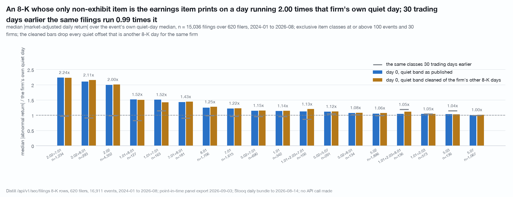
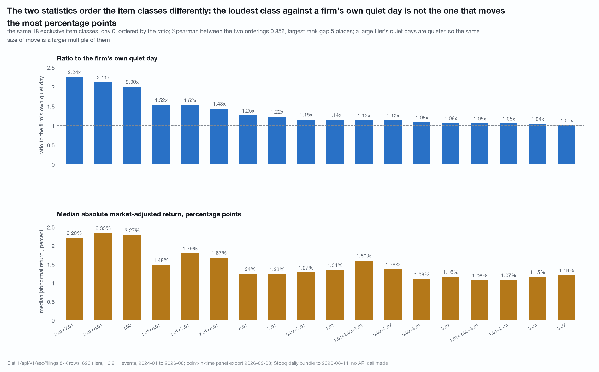
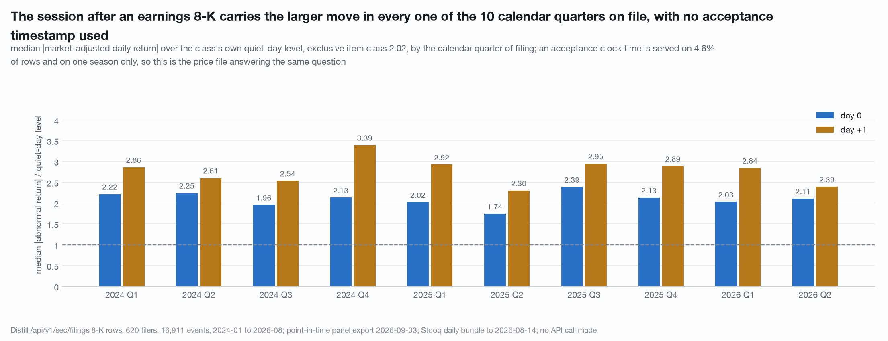
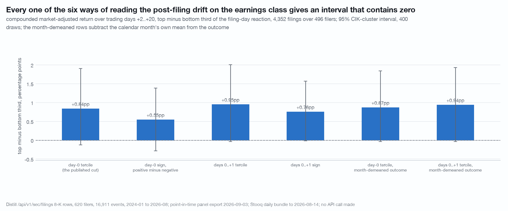
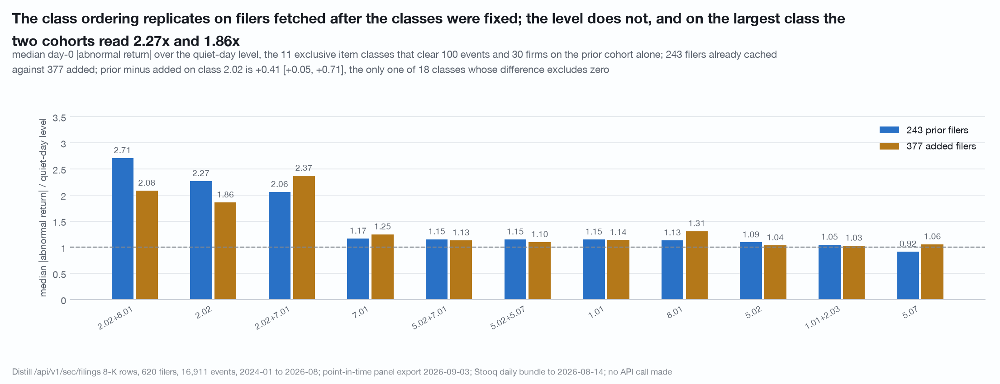

# Which 8-K items sit with a price move: the earnings item prints on a day running 2.00 times that firm's own quiet day, and seven of eighteen item classes are indistinguishable from a quiet day (n = 16,911 filings, 620 filers, 2024-01 to 2026-08)

An 8-K carries one or more numbered item codes, and the codes are served on the
filing row. Over 2024-01 to 2026-08, which codes print on a day whose absolute
market-adjusted return is elevated against the same firm's own quiet days, by
how much in each of the two available units, and does the record on file about
the firm at the time change that?

Descriptive association throughout. Nothing here identifies a direction of
causation, and no sentence here is about where a price goes next.

Data vintage: `/api/v1/sec/filings/{ticker}?filingType=8-K&limit=100`, 18,047
8-K rows over 620 tickers filed 2024-01-02 to 2026-09-03, pinned by a sweep
manifest; the Distill `screen/export` point-in-time panel of 2026-09-03; a Stooq
US daily bundle through 2026-08-14. Reproduce with
`./.venv/bin/python research/eightk-items-v2/study.py` from the repository root. The script is held by the publisher and available on request.
That run makes zero API calls, and it is enforced rather than asserted: the
client's network entry points are replaced with a function that raises before
anything else is imported, and the run's completion is the proof.

**What these got wrong.** [CORRECTIONS.md](../CORRECTIONS.md) is the
repository's dated log of numbers, helpers and caveats that did not survive an
adversarial re-run. A number that appears there is superseded wherever else it
appears, including here.

## Coverage, and the honest denominator

**Stooq match rate: 3,125 of the 4,054 distinct tickers carrying any panel
quarter-end from 2024-01 have a price series, 77.08%. 929 carry none at all.**
The pool this event set was drawn from was itself selected on being priced, so
the match rate computed inside it is 100% by construction and measures nothing.
A current-listings bundle deletes a delisted symbol rather than ending its
series, so a firm that stopped trading inside the window is absent rather than
present with a bad return. **Every ratio and share below is a rate for names
that still traded on 2026-08-14**, and nothing in this data bounds the
difference.

## Definitions

**Event.** Every 8-K row with a `filedAt`, a `cikNumber`, a Stooq series and a
complete daily abnormal-return path over trading-day offsets -60 to +20:
**16,911 events, 93.7% of rows, over 620 filers**. Day 0 is the first trading day
on or after the `filedAt` date, so the event set ends 2026-07-17 while the row
set ends 2026-09-03.

**Abnormal return.** The firm's bar-to-bar daily simple return minus the
benchmark's over the same two closes: the sector ETF on 99.5% of events and SPY
on the rest. Repeating the whole day-0 table on SPY for every event moves no
reported class by more than 0.259 ratio points, and the top three classes are
the same three on both benchmarks.

**The quiet band** is offsets -60 to -6 with -35 to -25 removed, 44 offsets, so
the placebo day is never inside its own denominator.

**Two statistics, both published everywhere.** The **ratio** is each event's own
absolute abnormal return on the day over its own median absolute abnormal return
across that band. The **raw median absolute return in percentage points** sits
beside it. They order the classes differently, and the section below says why.

**Exclusive class** is the item set with `9.01` removed, so `2.02` and
`2.02,9.01` are one class and an exhibit-only 8-K is its own class.

**The reporting bar** is n >= 100 events and >= 30 firms, enforced in code. A
class or code below it is a count and nothing else. 18 exclusive classes of 338
clear it, covering 15,036 of the 16,911 events. Intervals are 400-draw
CIK-cluster bootstraps; nulls are 200 draws.

---

## The item classes separate by a factor of two on day 0

The cleaned column is the same statistic on a quiet band with every offset that
is another 8-K day for the same firm removed. The placebo column is the same
statistic 30 trading days earlier.

| class | n | firms | median &#124;AR&#124; | **ratio** | 95% interval | cleaned ratio | signed median AR | share &#124;AR&#124; > 5% | placebo ratio |
|---|---:|---:|---:|---:|---|---:|---:|---:|---:|
| 2.02+7.01 | 1,234 | 197 | 2.20% | **2.24x** | [1.88, 2.52] | 2.24x | +0.02% | 25.6% | 0.97x |
| 2.02+8.01 | 293 | 110 | 2.33% | **2.11x** | [1.75, 2.84] | 2.16x | -0.04% | 25.6% | 0.92x |
| 2.02 | 4,352 | 496 | 2.27% | **2.00x** | [1.83, 2.16] | 2.01x | -0.03% | 27.4% | 0.99x |
| 1.01+8.01 | 127 | 86 | 1.48% | **1.52x** | [1.34, 1.91] | 1.51x | +0.03% | 17.3% | 0.83x |
| 1.01+7.01 | 163 | 129 | 1.79% | **1.52x** | [1.21, 1.87] | 1.43x | +0.20% | 20.9% | 1.15x |
| 7.01+8.01 | 181 | 91 | 1.67% | **1.43x** | [1.13, 1.69] | 1.45x | +0.19% | 17.7% | 0.91x |
| 8.01 | 1,706 | 437 | 1.24% | **1.25x** | [1.20, 1.33] | 1.28x | -0.03% | 11.1% | 0.99x |
| 7.01 | 1,615 | 366 | 1.23% | **1.22x** | [1.14, 1.32] | 1.23x | +0.05% | 10.7% | 0.97x |
| 5.02+7.01 | 690 | 328 | 1.27% | **1.15x** | [1.05, 1.23] | 1.16x | -0.38% | 10.1% | 0.96x |
| 1.01 | 342 | 201 | 1.34% | **1.14x** | [1.01, 1.27] | 1.15x | -0.22% | 9.1% | 0.96x |
| 1.01+2.03+7.01 | 100 | 70 | 1.60% | **1.13x** | [0.95, 1.44] | 1.21x | +0.26% | 9.0% | 0.87x |
| 5.02+5.07 | 291 | 224 | 1.36% | **1.12x** | [0.98, 1.26] | 1.13x | -0.18% | 9.6% | 1.04x |
| 5.02+8.01 | 134 | 85 | 1.09% | **1.08x** | [0.78, 1.35] | 1.09x | -0.34% | 6.7% | 1.02x |
| 5.02 | 1,896 | 554 | 1.16% | **1.06x** | [1.01, 1.14] | 1.08x | -0.15% | 6.5% | 0.99x |
| 1.01+2.03+8.01 | 136 | 92 | 1.06% | **1.05x** | [0.90, 1.24] | 1.12x | -0.34% | 5.1% | 1.19x |
| 1.01+2.03 | 573 | 302 | 1.07% | **1.05x** | [0.96, 1.11] | 1.05x | -0.10% | 4.4% | 1.04x |
| 5.03 | 136 | 108 | 1.15% | **1.04x** | [0.71, 1.31] | 1.03x | +0.24% | 3.7% | 1.15x |
| 5.07 | 1,067 | 514 | 1.19% | **1.00x** | [0.93, 1.08] | 1.02x | -0.09% | 6.7% | 1.00x |

Four facts hold across every class.

1. **The signed median is near zero everywhere**, from -0.38% to +0.26%. An 8-K
   sits with dispersion, not with a direction. Any statement about which way a
   price goes is not in this data.
2. **The placebo is flat.** Across the 18 reported classes the day -30 ratio runs
   0.83x to 1.19x with a median of 0.99x, against 1.00x to 2.24x on the filing
   day. The elevation is dated to the filing. Offset -30 is itself another 8-K
   day on 4.16% of events; dropping those events moves a class placebo by at most
   0.058 and the range stays 0.83x to 1.17x.
3. **Seven of the 18 classes have a day-0 interval that contains 1.0x**, a quiet
   day: `1.01+2.03`, `1.01+2.03+7.01`, `1.01+2.03+8.01`, `5.02+5.07`,
   `5.02+8.01`, `5.03` and `5.07`.
4. **The quiet-day denominator is contaminated and it does not move the table.**
   4.26% of quiet offsets are another 8-K day for the same firm; removing every
   one of them leaves a median of 42 offsets, minimum 29, with no event below 10,
   and moves the pooled quiet median from 1.0987% to 1.0862%, so the published
   denominator is 1.16% too large and every published ratio correspondingly too
   small. Spearman between the published and cleaned orderings is **0.9856**, the
   largest single move is **0.089** ratio points, and the published value sits
   inside the cleaned interval on 18 of 18 classes. Removing the other 8-K's day
   and the next session strips 8.30% of offsets and raises the largest move to
   0.132.

### The classes below the bar are counts and nothing else

320 exclusive classes hold the remaining 1,875 events, and 167 of them are a
single filing. The twenty largest, as counts only:

| class | n | firms | class | n | firms |
|---|---:|---:|---|---:|---:|
| 5.03+5.07 | 91 | 81 | 5.02+5.03 | 31 | 24 |
| 2.02+5.02 | 87 | 69 | 5.07+7.01 | 31 | 23 |
| 1.01+1.02+2.03 | 81 | 68 | 5.02+5.03+5.07 | 29 | 27 |
| 5.07+8.01 | 81 | 61 | 1.01+2.03+3.02+8.01 | 28 | 24 |
| 2.02+7.01+8.01 | 71 | 36 | 1.01+5.02+7.01 | 26 | 26 |
| 4.01 | 55 | 49 | 2.03 | 26 | 20 |
| 2.02+5.02+7.01 | 53 | 44 | 9.01 only, exhibits | 26 | 7 |
| 2.01+7.01 | 34 | 30 | 2.01 | 25 | 19 |
| 5.02+5.07+8.01 | 32 | 25 | 3.01 | 25 | 18 |
| 2.03+8.01 | 24 | 16 | 1.01+2.03+3.02 | 24 | 18 |

### Per item code, with the bar enforced

An event with three items appears in three rows here, so this view overlaps by
construction.

| code | n | firms | median &#124;AR&#124; | ratio | 95% interval | placebo |
|---|---:|---:|---:|---:|---|---:|
| `9.01` | 14,093 | 619 | 1.58% | 1.43x | [1.39, 1.48] | 0.99x |
| `2.02` | 6,300 | 613 | 2.25% | 2.03x | [1.88, 2.17] | 0.98x |
| `7.01` | 4,606 | 562 | 1.56% | 1.43x | [1.34, 1.51] | 0.97x |
| `5.02` | 3,477 | 601 | 1.23% | 1.12x | [1.05, 1.16] | 0.98x |
| `8.01` | 3,095 | 542 | 1.34% | 1.32x | [1.26, 1.38] | 0.98x |
| `1.01` | 2,025 | 544 | 1.35% | 1.16x | [1.10, 1.22] | 1.01x |
| `5.07` | 1,738 | 603 | 1.19% | 1.03x | [0.97, 1.09] | 0.98x |
| `2.03` | 1,158 | 473 | 1.15% | 1.05x | [0.97, 1.11] | 1.01x |
| `5.03` | 451 | 285 | 1.15% | 1.08x | [0.91, 1.21] | 0.98x |
| `3.02` | 222 | 117 | 1.96% | 1.31x | [1.05, 1.65] | 1.02x |
| `1.02` | 204 | 154 | 1.44% | 1.17x | [0.96, 1.37] | 0.87x |
| `2.01` | 183 | 133 | 1.58% | 1.17x | [0.98, 1.43] | 1.09x |
| `3.03` | 115 | 82 | 1.64% | 1.11x | [0.90, 1.33] | 0.85x |
| `2.05` | 94 | 74 | count only | | | |
| `3.01` | 61 | 40 | count only | | | |
| `4.01` | 60 | 53 | count only | | | |
| `2.06` | 26 | 23 | count only | | | |
| `4.02` | 15 | 15 | count only | | | |
| `2.04` | 13 | 10 | count only | | | |
| `5.01` | 13 | 12 | count only | | | |
| `1.05` | 11 | 11 | count only | | | |
| `5.05` | 11 | 10 | count only | | | |
| `5.08` | 10 | 8 | count only | | | |
| `1.04` | 9 | 4 | count only | | | |
| `5.04` | 5 | 5 | count only | | | |
| `1.03` | 1 | 1 | count only | | | |

A pre-registration fixed the reporting bar at 100 events before any statistic
was computed, so `2.05`, `3.01` and `4.01` carry their counts and nothing else,
and the bar is enforced in code rather than in prose. Item `9.01` rides along on nearly every earnings
8-K, which is why every exclusive class is defined with it removed.

---

## The two statistics order the classes differently, and the reason is the denominator

Spearman between the two orderings over the 18 reported classes is **0.856** and
the largest rank gap is **5 places**, on `5.07`, which is 18th of 18 on the ratio
and 13th of 18 on the size of the move. `8.01` and `7.01` are 7th and 8th on the
ratio and 11th and 12th on points.

The ratio divides by the firm's own quiet day, and a large filer's quiet days
are quieter, so the same size of move is a larger multiple of them. Cut on
within-year revenue terciles:

| class | tercile | n | median &#124;AR&#124; day 0 | median quiet day | ratio |
|---|---|---:|---:|---:|---:|
| 2.02 | bottom revenue | 1,548 | 2.23% | 1.36% | 1.59x |
| 2.02 | top revenue | 1,331 | 2.14% | 0.84% | 2.46x |
| 5.02 | bottom revenue | 606 | 1.44% | 1.43% | 1.02x |
| 5.02 | top revenue | 677 | 0.94% | 0.84% | 1.15x |
| 8.01 | bottom revenue | 565 | 1.85% | 1.32% | 1.37x |
| 8.01 | top revenue | 636 | 0.93% | 0.79% | 1.16x |
| 7.01 | bottom revenue | 474 | 1.43% | 1.25% | 1.27x |
| 7.01 | top revenue | 597 | 1.06% | 0.87% | 1.22x |

On `2.02` the two terciles' day-0 moves are **0.09 percentage points** apart
while their quiet days are 1.36% and 0.84%, so the ratio reads 1.59x against
2.46x for the same size of move. On `5.02` the small filers' move is 0.51pp
larger in points, on `8.01` 0.92pp larger and on `7.01` 0.37pp larger, and the
ratio difference orders the other way or not at all. **The pattern is in every
class, not only in the largest two.** Of the 18 bottom-minus-top
tercile differences in the ratio, two clear zero, on `2.02` at -0.87
[-1.29, -0.43] and on `8.01` at +0.21 [+0.02, +0.44], in opposite directions,
and the same split at the placebo day clears zero in 0 of 18. Re-cut on one
revenue per CIK-year rather than per event, so a filer with thirty 8-Ks in a
year does not cast thirty votes for the boundary, `2.02` is -0.79
[-1.25, -0.51] and `8.01` keeps its sign at +0.21 [+0.04, +0.44].

Neither statistic alone is complete. The ratio answers how loud a filing day is
against that firm's own noise; the points answer how far the price went. Both
are published in every table here.

---

## For the earnings classes the elevated session is the one after the filing date

Median absolute abnormal return over the class's own quiet-day level, by
trading-day offset:

| class | n | quiet day | -2 | -1 | **0** | **+1** | +2 | +3 |
|---|---:|---:|---:|---:|---:|---:|---:|---:|
| 2.02 | 4,352 | 1.08% | 1.01x | 1.07x | **2.11x** | **2.77x** | 1.50x | 1.27x |
| 2.02+7.01 | 1,234 | 0.98% | 0.99x | 1.12x | **2.26x** | **2.52x** | 1.39x | 1.28x |
| 2.02+8.01 | 293 | 1.01% | 1.06x | 1.17x | **2.32x** | **2.94x** | 1.52x | 1.26x |
| 8.01 | 1,706 | 0.99% | 1.13x | 1.06x | **1.25x** | 1.18x | 1.11x | 1.09x |
| 7.01 | 1,615 | 1.01% | 1.01x | 1.09x | **1.22x** | 1.21x | 1.06x | 1.06x |
| 5.02 | 1,896 | 1.08% | 0.99x | 1.01x | **1.07x** | 1.08x | 1.03x | 1.10x |
| 5.07 | 1,067 | 1.14% | 0.96x | 1.00x | **1.05x** | 1.03x | 1.03x | 1.01x |

**The acceptance-time gap.** A clock time is served on **824 of the 18,047 8-K
rows, 4.6%**, and every one of them is dated 2026-07-16 or later; the other
95.4% arrive at exactly midnight UTC. On that timed slice 62.1% were accepted at
or after 16:00 ET, and such a filing prints on the next session. The events with
a complete path end 2026-07-17, so only 24 of them sit inside the timed window
and the timed slice cannot be read off the event set alone.

The prices answer the same allocation question with no timestamp. Cutting the
`2.02` class by the calendar quarter of filing gives ten quarters of 415 to 446
events each, and **day +1 is larger than day 0 in 10 of 10**:

| season | n | quiet | day 0 | day +1 | share larger on +1 |
|---|---:|---:|---:|---:|---:|
| 2024 Q1 | 436 | 0.95% | 2.22x | **2.86x** | 53.7% |
| 2024 Q2 | 417 | 1.00% | 2.25x | **2.61x** | 51.3% |
| 2024 Q3 | 415 | 1.08% | 1.96x | **2.54x** | 53.7% |
| 2024 Q4 | 431 | 1.00% | 2.13x | **3.39x** | 54.1% |
| 2025 Q1 | 440 | 1.04% | 2.02x | **2.92x** | 53.9% |
| 2025 Q2 | 446 | 1.26% | 1.74x | **2.30x** | 57.2% |
| 2025 Q3 | 436 | 1.02% | 2.39x | **2.95x** | 53.4% |
| 2025 Q4 | 437 | 1.07% | 2.13x | **2.89x** | 55.6% |
| 2026 Q1 | 446 | 1.12% | 2.03x | **2.84x** | 52.2% |
| 2026 Q2 | 435 | 1.32% | 2.11x | **2.39x** | 51.5% |

The share of events whose absolute move is larger on +1 runs **0.513 to 0.572**
across the ten quarters, a 5.9-point band around a level consistent with the
57.5% after-16:00 share the timed `2.02` slice reports. All three years peak on
+1 for `2.02` and all **9 of 9** earnings-class year cells do. On the smaller
`2.02+7.01` class, about 120 events a quarter, the +1 peak holds in **7 of 10**
quarters, so the seasonal stability is a property of the large class. Among the
12 non-earnings year cells, 6 peak on +1 and 6 on day 0, all within 0.15x of
each other, so which day is not a meaningful question there.

### Days 0 and +1 together

| class | n | day 0 | days 0..+1 | 95% interval | median two-day &#124;AR&#124; | share > 5% |
|---|---:|---:|---:|---|---:|---:|
| 2.02+8.01 | 293 | 2.11x | **3.70x** | [3.14, 4.02] | 5.26% | 50.9% |
| 2.02 | 4,352 | 2.00x | **3.37x** | [3.22, 3.53] | 5.40% | **52.9%** |
| 2.02+7.01 | 1,234 | 2.24x | **3.26x** | [2.95, 3.52] | 4.50% | 46.4% |
| 7.01+8.01 | 181 | 1.43x | 1.67x | [1.20, 1.96] | 2.43% | 23.2% |
| 7.01 | 1,615 | 1.22x | 1.26x | [1.20, 1.36] | 1.88% | 17.2% |
| 8.01 | 1,706 | 1.25x | 1.25x | [1.15, 1.34] | 1.77% | 18.6% |
| 5.02 | 1,896 | 1.06x | 1.04x | [0.98, 1.10] | 1.66% | **13.7%** |
| 5.07 | 1,067 | 1.00x | 1.03x | [0.95, 1.08] | 1.78% | 12.8% |

**Over half the events in the two largest earnings classes carry a two-day
absolute market-adjusted return above 5%**: 52.9% on `2.02` and 50.9% on
`2.02+8.01`, against 13.7% of `5.02` events and 12.8% of `5.07` events on the
same measure. The three earnings classes rise by 1.02 to 1.59 ratio points when
the next session is added; the largest absolute move among the classes without
the earnings item is 0.233 ratio points, and **7 of 18 classes move down**, six
of them by more than 0.01.

---

## Four nulls

**Direction.** The signed median abnormal return runs -0.38% to +0.26% across
all 18 classes. The classes separate on dispersion and not on sign.

**The placebo at -30.** Every class statistic recomputed 30 trading days earlier
gives 0.83x to 1.19x with a median of 0.99x, against 1.00x to 2.24x on the
filing day.

**The record's distress flag.** Altman Z from the panel row in force at the
event, the latest row with an as-of date strictly before the filing date, is
present on 57.4% of events and 0% covered in Financials and Real Estate by
construction, so this is a narrower universe than the class table: 3,506
distressed (Z < 1.81), 1,764 grey, 4,443 safe, 7,198 with no Z.

| class | n distressed / safe | firms | median ratio, distressed | safe | difference | 95% interval |
|---|---:|---:|---:|---:|---:|---|
| 2.02 | 967 / 1,347 | 143 / 176 | 2.10x | 2.14x | **-0.04** | [-0.44, +0.45] |
| 5.02 | 432 / 528 | 133 / 172 | 0.96x | 1.10x | **-0.14** | [-0.28, +0.12] |
| 8.01 | 337 / 428 | 100 / 114 | 1.23x | 1.22x | **+0.01** | [-0.27, +0.21] |
| 7.01 | 259 / 381 | 82 / 106 | 1.33x | 1.24x | **+0.08** | [-0.35, +0.41] |
| 2.02+7.01 | 176 / 278 | 45 / 51 | 2.50x | 2.80x | **-0.30** | [-1.38, +0.70] |
| 5.07 | 247 / 281 | 134 / 156 | 1.04x | 1.07x | **-0.04** | [-0.32, +0.19] |

**Every one of the 16 estimable classes has an interval containing zero.** At the
placebo day the same split gives 15 of 16 intervals containing zero with a
median half-width of 0.351 against 0.455 on the event day, so the null is not an
artefact of the day chosen.

**Drift after the filing.** Compounded market-adjusted return over trading days
+2 to +20 on the earnings class, 4,352 events over 496 firms:

| reading, class 2.02 | spread | 95% CIK-cluster interval |
|---|---:|---|
| day-0 tercile, the published cut | +0.84pp | [-0.12, +1.91] |
| day-0 sign, positive minus negative | +0.55pp | [-0.28, +1.38] |
| days 0..+1 tercile | +0.95pp | [-0.03, +2.01] |
| days 0..+1 sign | +0.76pp | [-0.01, +1.57] |
| day-0 tercile, month-demeaned outcome | +0.87pp | [-0.04, +1.84] |
| days 0..+1 tercile, month-demeaned outcome | +0.94pp | [-0.03, +1.93] |
| placebo at -30, same statistic over -28..-10 | -0.55pp | [-1.40, +0.30] |

Every one contains zero, three of them by a hair. The calendar is not neutral to
the label: the +2 to +20 return has a month mean with a standard deviation of
1.56pp across the 31 months, range -1.75pp to +4.66pp, and the top-tercile share
by month runs 0.200 to 0.556 against a balanced 0.333. Four nulls, 200 draws
each:

| null, class 2.02 | mean | sd | 2.5th / 97.5th | draws at or beyond +0.84pp |
|---|---:|---:|---|---:|
| clustered, label to the wrong firm | -0.00pp | 0.45 | [-0.81, +0.94] | 14 of 200 |
| clustered, within the calendar month | -0.05pp | 0.48 | [-0.97, +0.83] | **15 of 200** |
| within-firm, label to the wrong event of the same firm | -0.15pp | 0.43 | [-0.95, +0.66] | 13 of 200 |
| label permuted inside the calendar month | -0.05pp | 0.47 | [-0.91, +0.87] | **16 of 200** |

Making the null respect the calendar widens it slightly and moves the tail count
from 14 to 15 and 16 of 200, the direction that makes the observed value less
exceptional. At 4,352 events over 496 firms in one three-year regime, a +0.84pp
nineteen-day spread is not separable from zero, and no construction of the null
makes it so. `5.02` is a null on all six readings and all four nulls: the
published cut is +0.11pp [-1.58, +1.78], the two-day version turns negative at
-0.79pp [-2.34, +0.85], the placebo is larger than the observed value at
+1.40pp, and 174 to 181 of 200 draws are at or beyond the observed spread on
every null.

---

## The cohort caveat: the ordering replicates, the level does not

The 620 filers split into 243 whose rows were cached before the class rule was
written and 377 fetched afterwards. The two cohorts share 0 tickers and 0 CIKs,
and the rule predates the added data by 24 seconds on the file clock.

**The list does not predate it.** Sizing every reported class on the prior cohort
alone, only **11 of the 18** clear the bar; seven do not, so for those rows the
added column is not out of sample with respect to which classes are shown.
Restricting to the 11 selectable before the widening, the Spearman between the
cohorts is **0.827** against **0.686** on all 18, and the mean absolute
difference falls from 0.199 to 0.172 ratio points. The top three classes are the
same three in both cohorts.

| class | n prior | ratio prior | n added | ratio added | prior minus added | 95% interval |
|---|---:|---:|---:|---:|---:|---|
| 2.02 | 1,690 | **2.27x** | 2,662 | **1.86x** | **+0.41** | [+0.05, +0.71] |
| 2.02+7.01 | 531 | 2.06x | 703 | 2.37x | -0.31 | [-0.90, +0.31] |
| 2.02+8.01 | 104 | 2.71x | 189 | 2.09x | +0.62 | [-0.77, +1.84] |
| 8.01 | 586 | 1.13x | 1,120 | 1.31x | -0.18 | [-0.33, +0.02] |
| 7.01 | 765 | 1.17x | 850 | 1.25x | -0.08 | [-0.28, +0.08] |
| 5.02 | 772 | 1.09x | 1,124 | 1.04x | +0.06 | [-0.08, +0.18] |
| 5.07 | 403 | 0.92x | 664 | 1.06x | -0.14 | [-0.31, +0.01] |
| 1.01+2.03 | 232 | 1.05x | 341 | 1.03x | +0.02 | [-0.14, +0.19] |

`2.02` is **the only one of 18 classes whose cohort difference excludes zero**.
The pooled **2.00x is therefore a pooled figure and a weak base rate**: the two
cohorts sit +0.27 and -0.14 ratio points from it, and the gap between them is
41% of the pooled figure's own distance to a quiet day.

---

## What would break it

- **The unpriced 929.** 22.9% of the tickers with a 2024-or-later panel row carry
  no price series, and a current-listings bundle deletes rather than ends a
  delisted symbol. Every ratio and share here is a rate for names that still
  traded on 2026-08-14, and nothing in this data bounds the difference.
- **The headline level is cohort-dependent.** A split across filers alone moved
  class `2.02` by 0.41 ratio points with an interval excluding zero. A different
  620 filers would give a different level. The ordering is what replicated.
- **The class list was fixed on pooled data.** 7 of the 18 reported classes could
  not have been selected on the prior cohort alone, so the out-of-sample reading
  is honest for 11 of them.
- **The ticker set is not a universe.** It is 620 names drawn from a pool built on
  revenue over $300m and a price series. Small filers, recent listings and
  anything that stopped filing are absent by construction, and item mix and
  quiet-day volatility both plausibly differ there.
- **Acceptance time is unobservable on 95.4% of rows.** The season test makes the
  day 0 against day +1 allocation stable across ten quarters without a timestamp,
  so the missing field costs two published windows rather than a wrong
  conclusion. The two-day total does not depend on the allocation.
- **A ratio normalises by the same firm's quiet days, which is a choice**, and it
  is the choice that makes a large filer's earnings day 2.46x and a small filer's
  1.59x while their absolute moves are 0.09pp apart. Both statistics are
  published; they order the classes differently at Spearman 0.856.
- **The exclusive class is a construct.** `2.02` means an 8-K whose only
  non-exhibit item is the earnings item. Any co-filed item moves the event to a
  different class, which is why 320 classes hold 1,875 events.
- **Item 5.02 is a mixture of a departure and an appointment**, and the served row
  cannot separate them. Its 1.06x is an average over two events that plainly are
  not the same event.
- **One regime.** The corpus floor on `/sec/filings` is 2024-01. Every number here
  is 2024-2026 and the cohort split is a split across filers, never across time.
- **Altman Z excludes two sectors entirely**, so the distress null is a null over
  the 57.4% of events where the record carries a Z at all.
- **Multiple classes, multiple cuts.** Eighteen classes times two windows times
  three splits is a lot of intervals over one event set, and two of eighteen
  clearing zero on the revenue split is what one would expect at 5% by chance
  alone. An individual cell's interval is not a test.
- **The abnormal-return matrix has been independently rebuilt only at day 0.** A
  second construction from the price bundle found it element-for-element
  identical and recomputed day 0 for 600 of the 16,911 events with a largest
  difference of exactly zero, but offsets -60 to -6 and +1 to +20 have never been
  rebuilt by independent code. A defect in the offset arithmetic away from day 0
  would sit inside every quiet median and every day+1 number here.
- **The within-month null depends on how its shuffle is built.** It is computed
  against `analysis.clustered_shuffle` with an integer month key; a different
  construction of that shuffle would move the 15-of-200 and 16-of-200 counts. It
  would take a very large move to change the reading, since the observed value is
  inside all four nulls.
- **Price returns only, no dividends**, so a dividend ex-date landing on an event
  day is inside the abnormal return.

## Limits of the data as published

A filing row carries a clock time on 4.6% of rows and midnight UTC on the rest,
so whether an event's reaction belongs to day 0 or day +1 cannot be read off the
data and has to be inferred from the prices themselves; that is what the ten
quarters of the season table are doing, and the missing field costs two published
windows rather than a conclusion. Item 5.02 arrives as one code covering both a
departure and an appointment, and nothing in the served row separates them, so
its 1.06x is an average over two events that plainly are not the same event
across 1,896 filings. An 8-K row names no period, so the 6,300 events here
carrying the earnings item cannot be tied to the quarter they report. The filings
corpus begins in January 2024, so the +1 allocation, the class ordering and the
drift null can be split by filer and never by period. And the price file is a
current-listings bundle with no dividends and no delisted issuers, which is what
leaves the survivorship caveat unbounded and makes revenue the only size proxy
available.

## Disclosure

No company is named.

Distill Markets Pty Ltd, the publisher of this repository, operates the paid data
service this study uses. Authors and the publisher may hold positions in
securities of the kind described. Everything above is general information derived from
public SEC filings and from a price file the author holds. It is not financial
product advice, does not consider your objectives, financial situation or needs,
and past patterns do not guarantee future results. See [NOTICE](../NOTICE).
