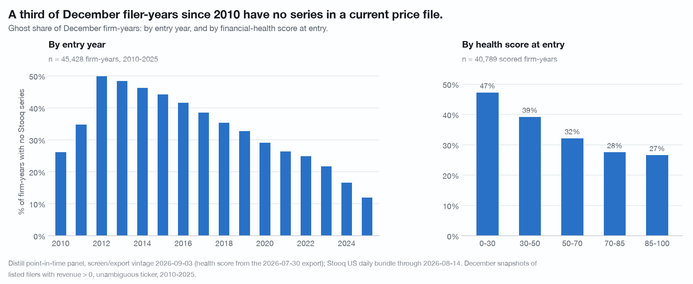
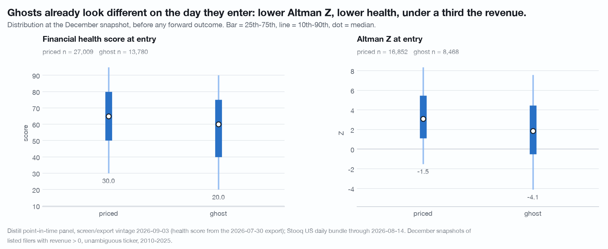
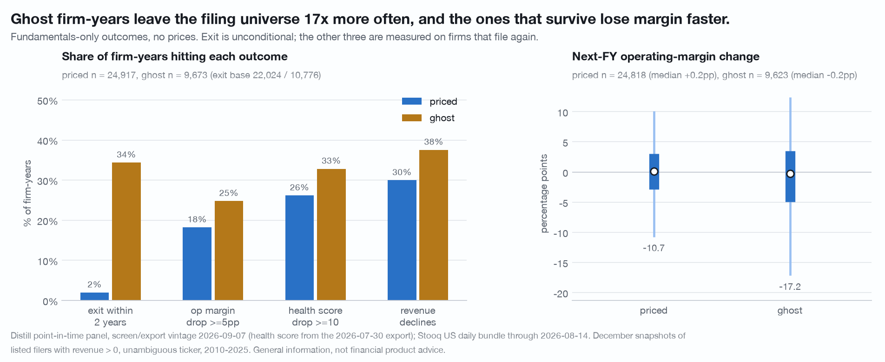
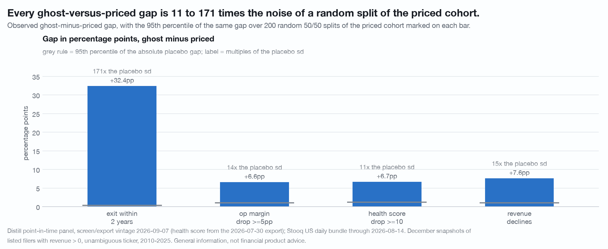
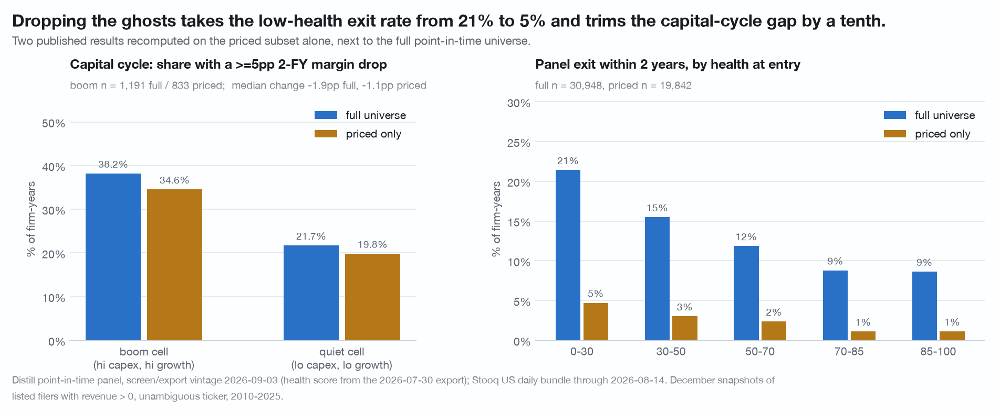
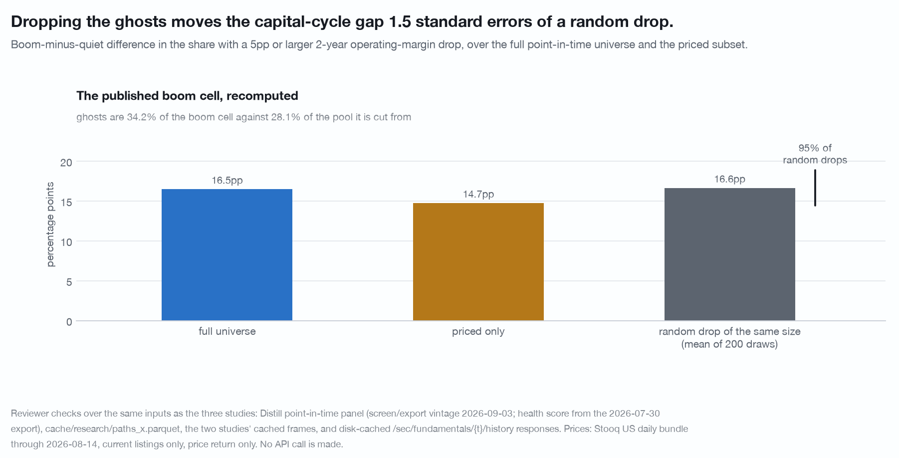

# A current-listings price file discards a third of the filer-years: 15,076 of 45,428 December firm-years 2010-2025, 2,833 CIKs, against a Stooq bundle of August 2026

Distill's point-in-time panel holds every listed filer at every December
snapshot, including the ones that later stopped existing. A Stooq daily bundle
holds prices for names that still traded in August 2026. Firm-years with no
series in the price file are the **ghost cohort**. This document is about how
large it is, who is in it, what happens to those firms in the filings alone, and
how far two already-published results move when the ghosts are dropped.

Data vintage: Distill `screen/export` panel of 2026-09-03, Stooq US daily bundle
through 2026-08-14. Reproduce with
`./.venv/bin/python research/ghost-cohort/study.py` from the repository root. The script is held by the publisher and available on request.
Claims that did not survive an adversarial re-run are recorded in
[CORRECTIONS.md](../CORRECTIONS.md) and are not restated here.

## Size and shape

**66.81%** of the panel's 45,428 December firm-years 2010-2025 (5,960 CIKs) have
a series under the panel's ticker. Only **63.40%** also have a close within 14
days of the snapshot date, which is the test the forward-paths builder applies,
so the coverage a price study actually gets is 3.4pp below the coverage the file
listing promises. The ghost cohort is **15,076 firm-years (33.19%) over 2,833
CIKs**. The flag is effectively a firm attribute: only 7 of 5,960 CIKs change
status across their years.

Ghost share by entry year:

| entry year | 2012 | 2015 | 2018 | 2021 | 2023 | 2025 |
|---|---|---|---|---|---|---|
| ghost share | 49.9% | 44.2% | 35.4% | 26.4% | 21.7% | 11.9% |

Within 2025 the residual is a size gradient: the bottom revenue decile matches
69.1% and the top matches 97.1%, n = 314 per decile. The nine top-decile misses
in 2025 are named in the study's output. They are not a random sample of large
caps but a mix of filers off the three exchanges the bundle carries, one symbol
the price file names differently, and firms whose December 2025 snapshot
precedes a 2026 corporate event by up to eight months. **Nothing in this data
separates those causes, which is the point.** In 2012 the smallest revenue
tercile was 64.6% ghost against 30.5% for the largest.

Ghost share by health score at entry runs monotonically from 47.2% at 0-30
(n = 5,223) down to 26.6% at 85-100 (n = 6,831). By sector it runs from Energy
45.2% (n = 2,228) and Communication Services 42.5% (n = 2,158) to Utilities
16.6% (n = 924).

## Why a firm is a ghost

**80.7% of ghost firm-years (12,160) belong to a CIK absent from the panel's
final snapshot: it stopped filing.** 19.3% (2,916 firm-years, 352 CIKs) still
file. A bounded probe of 300 profile calls, 150 for each group, reads SEC's own
exchange record:

| sampled ghost CIKs | n | SEC still names a NYSE or Nasdaq listing | SEC names no exchange |
|---|---|---|---|
| stopped filing | 150 | 0.7% | 99.3% |
| still filing | 150 | 18.7% | 80.0% |

**That 18.7% is an upper bound on join failure, not a measurement of it.** SEC's
`exchanges` field carries no date, and every one of the 28 firms behind it has a
December 2025 panel row and no series in a price file current to 2026-08-14,
which is the shape of a 2026 delisting whose SEC record has not been cleared as
much as it is the shape of a bad key. The mechanism a join failure would need,
a panel ticker that is not the traded common, can be measured directly:
**none of the 300 sampled ghost CIKs has any SEC-named ticker present in the
Stooq bundle**, which bounds that mechanism below 2% of still-filing ghosts and
below 0.4% of ghost firm-years.

298 of the 300 tickers resolve to the same CIK the panel gave them. The two that
do not are ticker collisions: `FMCC` resolves to CIK 0000038009 while the panel
gives 0001026214, and `ME` resolves to 0001022345 against the panel's
0001804591. Ticker recycling is small but not zero.

A panel ticker can resolve to a security that is not the firm's common stock.
Two such rows were found by hand, and neither is in the 300-CIK sample, so the
probe does not measure how often it happens:

| CIK | panel ticker | SEC `tickers` | Stooq carries | what the panel row is keyed to |
|---|---|---|---|---|
| 0000936340 DTE Energy | `DTB` | `DTE, DTW, DTB, DTG, DTK` | `DTE`, 14,274 bars from 1970 | a baby bond, not the common |
| 0001137774 Prudential Financial | `PFH` | `PRU, PFH, PRH, PRS` | `PRU`, 6,204 bars from 2001 | a preferred, not the common |

Both are firm-years that cannot be priced because the key names a security other
than the common stock. Nothing served on the panel row states a security type,
so a study on this data can only find such rows by hand and count them as ghosts
alongside the genuine ones.

## Ghosts already look different on the day they enter

Medians at the December snapshot, before any outcome, n = 30,352 priced and
15,076 ghost:

| at entry | priced | ghost |
|---|---|---|
| revenue | $1,066m | $296m |
| Altman Z (n = 16,852 / 8,468) | 3.11 | 1.87 |
| health score (n = 27,009 / 13,780) | 65 | 60 |
| operating margin | 7.8% | 2.9% |
| net margin | 5.0% | 0.8% |
| Piotroski F | 5 | 4 |
| accruals ratio | -4.8% | -6.3% |
| asset growth | 5.0% | 2.9% |
| **capex intensity** | **2.93%** | **2.79%** |

Revenue at the 10th, 50th and 90th percentile is $48m / $1,066m / $14,062m
priced against $23m / $296m / $3,438m ghost. **Capex intensity is the one metric
on this list that does not separate the cohorts**, which is what decides the
first of the two consequences below.

The gap widens over the sample: median Altman Z at entry was 4.06 priced against
3.16 ghost in 2012 and 2.32 against 0.08 in 2025, and the median ghost operating
margin turns negative from 2021 onward.

## Followed forward in the filings, with no prices at all

| next fiscal year, or 2-year exit | priced | ghost |
|---|---|---|
| panel exit within 2 years | **2.37%** (n = 22,265) | **31.83%** (n = 12,084) |
| median operating-margin change | +0.16pp | -0.27pp |
| share with a 5pp or larger operating-margin drop | 18.21% | 25.11% |
| median revenue growth | +6.04% | +4.22% |
| share with declining revenue | 30.02% | 37.75% |
| share with a health-score drop of 10 or more | 26.21% (n = 22,436) | 33.00% (n = 9,859) |

The base is **25,108 priced and 10,812 ghost one-year transitions**; the two
margin rows are measured on the **25,006 / 10,759** of those with a next-year
operating margin on file. Ghost firm-years leave the filing universe **13.4x**
more often, and **87.9% of all 4,374 panel exits in the base are ghost
firm-years**. The margin, revenue and health rows are measured only on firms
that filed again, so they describe the survivors of the ghost cohort and the
true ghost distribution is worse than the table shows.

**Placebo.** 200 random 50/50 splits of the priced cohort. The mean placebo gap
is 0.02pp or smaller on every metric, and the observed ghost-minus-priced gaps
are 9 to 138 times the placebo standard deviation: exit 137.6x, margin drop
15.0x, revenue decline 13.7x, health drop 11.7x, median revenue growth 10.3x,
median margin change 9.3x. Every observed gap is **more than five times** the
95th percentile of the absolute placebo gap; the smallest ratio, on the median
margin change, is 5.03x.

**Out of sample.** Entry-year halves agree. 2010-2017 (n = 17,391 transitions):
ghost exit 26.3% against priced 2.2%, margin drop 22.6% against 14.5%.
2018-2025 (n = 18,529): 38.7% against 2.5%, and 29.6% against 20.9%.

**Strict ghosts.** Dropping the 19% of ghost firm-years whose CIK still files
(n = 8,555 remaining ghost transitions) changes nothing qualitative: exit 38.4%
against 2.4%, margin drop 25.7% against 18.2%, median margin change -0.34pp
against +0.16pp.

**Size and sector.** The median ghost is just over a quarter the size of the
median priced firm, so the gaps were re-averaged inside year by revenue-quintile
cells (and year by size by sector, 777 cells, n = 35,047) that hold both
cohorts. The margin-drop gap falls from 6.91pp raw to 4.96pp and then 4.53pp;
the revenue-decline gap rises from 7.73pp to 8.78pp; the exit gap is 30.08pp
against 29.46pp raw. About a third of the margin gap is size and sector
composition and the rest is not.

## Two consequences, failing in opposite directions

### The capital-cycle boom cell survives pricing, with a caveat

Top-quintile capex intensity and top-quintile asset growth, two fiscal years
forward:

| | n | median change in operating margin | share with a 5pp or larger drop |
|---|---|---|---|
| full universe | 1,191 | -1.91pp | 38.2% |
| priced only, re-ranked | 833 | -1.12pp | 34.6% |
| priced only, full-universe cuts | 784 | -1.03pp | 34.8% |
| ghost only, re-ranked | 355 | -3.47pp | 45.1% |

Dropping the ghosts moves the median by +0.79pp and the 5pp-drop frequency by
-3.6pp. The boom-versus-quiet gap in that frequency goes from **+16.5pp to
+14.7pp**, an 11% attenuation.

**That attenuation is not clearly a survivorship effect.** Dropping 200 random
subsets of the same size and recomputing the gap the same way gives
**16.64pp ± 1.25**, a 95% range of 14.4 to 18.9pp. The observed priced-only gap
of 14.74pp sits at **z = -1.52**, and 5% of random drops land at or below it. At
this n the capital-cycle base rate is **not measurably damaged by
survivorship**, which is a weaker statement than saying it is robust to it.
Ghosts are 34.2% of the boom cell against **28.1% of the two-year transition
pool the cell is cut from**, so they are over-represented in it by 6.1pp, and
the cell is not reweighted enough to reverse.

### The low-health exit rate collapses, and that is close to arithmetic

| health at entry | full universe | priced only | ghost only |
|---|---|---|---|
| 0-30 | 21.4% (n = 3,968) | 4.7% (n = 1,929) | 37.2% |
| 30-50 | 15.5% | 3.0% | 32.6% |
| 50-70 | 11.9% | 2.4% | 30.2% |
| 70-85 | 8.8% | 1.1% | 28.3% |
| 85-100 | 8.6% | 1.1% | 29.3% |

The low-health two-year exit rate falls from **21.4% to 4.7%, a factor of
0.22**. The relative gradient survives and steepens (bottom over top goes from
2.5x to 4.2x), but the level is unrecoverable: a priced-only sample reports that
one in twenty distressed filers disappears where the panel says one in five
does.

**This one is close to arithmetic and is not an independent test.** A firm that
leaves the panel almost always leaves the price file, so the ghost definition
and the exit outcome share most of their information, and 87.9% of exits are
ghosts. The genuinely independent parts of this document are the entry profile,
the margin and revenue outcomes among survivors, and the boom cell.

The two results fail in opposite ways for the same reason: survivorship
attenuates a result exactly to the degree the outcome correlates with the ghost
flag. Capex intensity does not correlate with it, so the capital-cycle base rate
survives. Disappearance is what the ghost flag is, so the exit rate does not.

## What would break it

1. **The ghost flag is measured in August 2026 and applied to snapshots back to
   2010.** It embeds the future relative to every entry date. Nothing here is
   predictive and none of it is a screen: this is a description of what a join
   discards.
2. **Panel exit is not distress.** An acquisition produces the identical
   footprint, and closings between the last snapshot and the file edge are
   visibly in the cohort. Nothing here resolves that.
3. **Forward outcomes are conditional on filing again.** For the ghost cohort
   that condition removes about a third of the group within two years, and it
   removes the worst of it.
4. **The join key is the panel's ticker**, and it is neither point-in-time nor
   always the common stock. The two rows named above are the shape of that, and
   the probe cannot measure how common they are because neither is in its sample.
5. **Nothing here separates delisting from the price bundle's own composition.**
   The bundle carries nasdaq, nyse and nysemkt only, so a filer that moved to
   OTC while continuing to file is a ghost for a reason that has nothing to do
   with the panel.
6. **Coverage ramps before 2012** (421 firm-years in 2010, 1,213 in 2011 against
   about 3,100 a year afterwards), so the 2010-11 shares rest on small n and a
   different filer mix.
7. **The health score used here is a July 2026 export joined onto a September
   panel** on (as_of_date, CIK), covering 89.0% of priced and 91.4% of ghost
   firm-years. The near-identical coverage means the join does not itself sort
   the cohorts. The score is dated per snapshot rather than broadcast from one
   date; see [survival-clock.md](survival-clock.md) for what its vintage can and
   cannot contaminate.

## Limits of the data as published

Every price join in this repository runs through the panel's ticker, and that
ticker is neither dated nor marked with a security type, so a study on this data
cannot separate a firm that stopped trading from one whose key names a preferred
or a baby bond without going to SEC's own exchange record ticker by ticker.
Nothing served dates a delisting or states why it happened, so an acquisition, a
going-private and a deregistration after a deficiency notice arrive as the same
event, and that difference is the entire economic content of the distress result.
(Since 2026-09-07 the export carries `listed_until` and `listing_end_source`,
on 97 of the 3,553 firms that leave the panel; this study predates the column.)
The price file holds no series for a delisted issuer, not even a final close or a
cumulative return stub to the delisting date, so the survivorship gap can be
described from the filings but never closed from inside this data. And "panel
exit" is itself an inference from a CIK's last row rather than a served
first-filing and last-filing date, which is why acquisition and failure cannot be
told apart anywhere above.

## Disclosure

Companies are named only as facts they exhibit in this data.

Distill Markets Pty Ltd, the publisher of this repository, operates the paid data
service this study uses. Authors and the publisher may hold positions in
securities named here. Everything above is general information derived from
public SEC filings and from a price file the author holds. It is not financial
product advice, does not consider your objectives, financial situation or needs,
and past patterns do not guarantee future results. See [NOTICE](../NOTICE).
