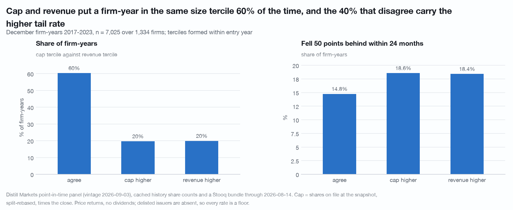
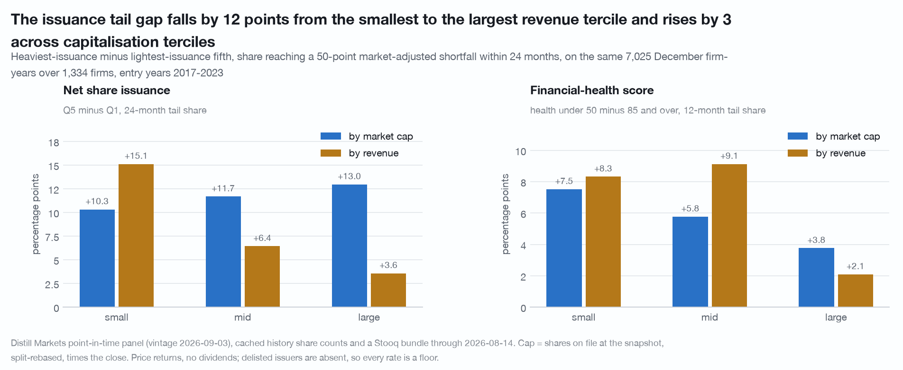
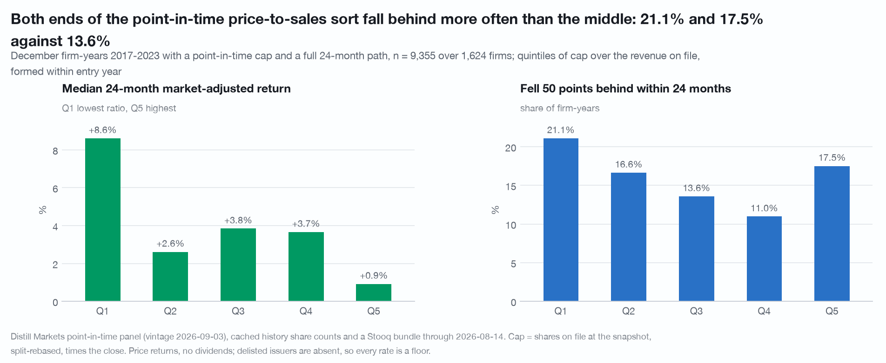
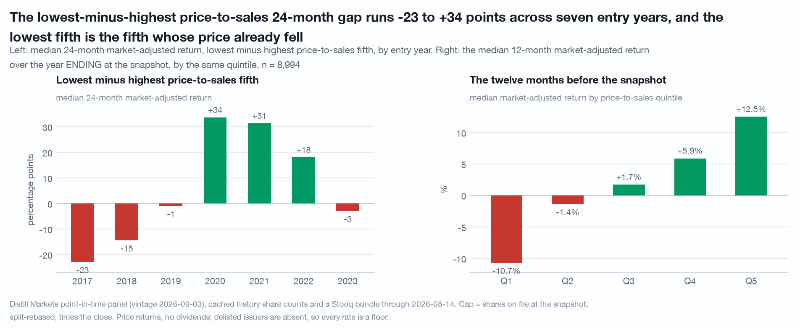

# A point-in-time market cap, and what it changes: 12,706 priced December firm-years over 1,744 firms, 2017-2025, built from a never-restated share count and a split-adjusted close

The point-in-time panel carries revenue, margins and ratios and no share count
and no price, so every size decomposition published on it proxies size with
revenue. Revenue conflates scale with business model. This document is about the
capitalisation built to test that, how far it can be trusted, what it changes
about the size reading, and the one value result it enables, which turns out not
to be a base rate.

Data vintage: Distill `screen/export` point-in-time panel of 2026-09-03, the
`/sec/fundamentals/{t}/history` responses on disk (2,081 tickers, 20,032
filer-years, fiscal years 2006-2026), and a Stooq US daily bundle through
2026-08-14. Reproduce with
`./.venv/bin/python research/market-cap-value/study.py` and re-run the
independent checks with `./.venv/bin/python research/review-market-cap/study.py`,
both from the repository root and both making no API call. Both scripts are held
by the publisher and available on request.

**What these got wrong.** [CORRECTIONS.md](../CORRECTIONS.md) is the repository's
dated log of numbers, helpers and caveats that did not survive an adversarial
re-run. Entry 20 is this study's: `joins.corroborate_flags` took a NaN share
count as a baseline, so the package's verdicts on this corpus were reported as 92
corroborated, 125 contradicted and 7 untestable; with absent counts treated as
absent the base rate is **95 / 82 / 47**, and **3,243 of 20,032 cached filer-years
carry no share count at all**. A number that appears in that log is superseded
wherever else it appears, including here.

## Coverage, and the two denominators that matter

**Stooq match rate: 66.81%** of the 45,428 December firm-years over 6,038 tickers
2010-2025 carry a price series, and **2,904 of 6,038 tickers (48.1%) carry no
price at all**. That is the first selection. The second is larger and is specific
to this asset:

| gate | firm-years | tickers | share of the December universe |
|---|---:|---:|---:|
| December universe, 2010-2025 | 45,428 | 6,038 | 100% |
| a Stooq series exists | 30,352 | 3,134 | 66.81% |
| in the paths file | 28,803 | 2,967 | 63.40% |
| carries a capitalisation | **12,706** | **1,744** | **27.97%** |

The cached `/history` set is the toolkit's own sweep pool, 2,047 tickers chosen
for being priced with revenue over $300m in 2019-2025. **98.69% of capped
firm-years are sweep-pool tickers**, and 78.84% of sweep-pool rows in 2017-2025
carry a capitalisation, so the capitalisation panel is the sweep pool with a
share count. The selection is on outcome as well as on scale: inside the same
within-year revenue decile the capped rows carry the **lower 24-month tail rate in
9 of 10 deciles**, and in the bottom decile it is 25.21% against 41.75%. Exit
within eight quarters runs 12.98% on the December universe with runway, 2.51%
priced, 3.84% priced without a capitalisation and **0.30% with one**. Every rate
computed on this pool is a floor twice over.

## 1. The asset

`cap` is the `sharesOutstanding` of the fiscal year the panel says was on file at
the December snapshot, rebased onto the price file's split basis, times the Stooq
close on or within 14 days before the snapshot. `cap.parquet` is written to
`cache/research/market-cap-value/` keyed on `(cik, year)`.

**The share basis is the load-bearing part.** `sharesOutstanding` is never
restated and steps at every split; a Stooq close is adjusted for every split up
to the bundle's right edge. Multiplying one by the other mis-states the
capitalisation by the product of every split in between, and the error looks like
a company rather than like a defect: before any gate the largest product in the
frame is $704 trillion, a 2017 snapshot pairing an adjusted close of $34.7m per
share with a pre-split count. The repair reads the fingerprint the two served
share series leave, since a filer restates `weightedAverageSharesDiluted` about
two fiscal years back from the first annual filing after a split and no further.
113 splits over 106 firms are inferred, **95.58% of the factors landing within
10% of a declared split ratio**; 556 filer-years are rebased and 774 carry a
break that could not be resolved and are dropped.

Rebasing is not cosmetic. Left unrebased the headline value gap in section 3
reads +14.79pp instead of +7.69pp and its tail gap flips sign, from +3.58pp to
-1.01pp.

**Four things a second, independent construction of the asset establishes.**

- **The arithmetic reproduces, twice.** 40 firm-years drawn uniformly and
  recomputed from the cached JSON and from `stooq.bars` with an as-of rule
  written independently: the share count matches on 40 of 40, the close on 40 of
  40, the product on 40 of 40 and the period end on 40 of 40. Because only 422 of
  12,706 rows (3.32%) carry a rebasing factor, a second 40 was drawn from those
  422, and share counts and closes match on 40 of 40 there too.
- **The repair beats the package route on the price file's own evidence.** On the
  same 10,848 consecutive December pairs, the implied year-over-year share growth
  `(cap[y+1]/cap[y]) / (1 + r_12)` sits beyond 2x on **0.97%** of pairs as filed,
  **0.58%** under the package route and **0.29%** under this repair. 0.29% is the
  residual bound on undetected basis error inside the panel.
- **The factor estimator is fragile.** It snaps the geometric mean of a
  diluted-count factor and the outstanding count's own step. The two ingredients
  disagree by more than 10% on 34 of 113 splits, and **snapping the outstanding
  step alone lands on a different declared ratio on 26 of 113**. The snap rate is
  95.58% under either estimator, so it verifies that a number is a plausible
  split ratio and not that it is the right one. For 19 of the 113 there is no
  December capitalisation on both sides of the split year, so nothing ranks them.
- **211 firm-years (1.66%) carry a capitalisation above 20 times point-in-time
  revenue on more than $50m of revenue.** That screen is an **upper bound** on
  defective rows and not a defect rate: it mixes development-stage issuers with
  basis failures, and only the largest were read by hand. Those four are a
  depositary-share bundling ratio of about 13 that nothing in the response
  carries, a reverse split that leaves no fingerprint because both served series
  sit on the same pre-split basis, a restatement visible in the diluted series and
  invisible to the gate because the outstanding count is absent in exactly the two
  years that would show it, and a row with no consecutive-year neighbour for the
  continuity check to see. Separately, 201 capped firm-years (1.58%) have at least
  one year with no outstanding count between the source year and the newest, which
  is exactly the year a split's fingerprint would need.

Magnitude is the coarse check and it passes: after every gate the largest
capitalisation is $4.56tn and the smallest $3.2m, the median is $3.83bn, and the
largest three at December 2024 are $3.76tn, $3.36tn and $3.13tn, which are the
publicly reported values of the three largest US-listed companies at that date to
within a per cent.

**Fiscal alignment is the trap this had to avoid, and it holds.** The share
count's fiscal year equals the fiscal year the panel's own December row names on
**100.0000% of the 12,706 rows**, and the snapshot date matches the panel row's
date on 100.0000%. It is not the newest year on file: had the newest been used,
its period would have ended **after the snapshot on 88.47% of rows, a median
1,186 days after**. The lag from period end to snapshot has a median of 365 days,
p10 184 and p90 366. One exposure remains and is not measurable here: the fiscal
**year** is point-in-time and the **value** is whatever `/history` serves today,
and `/history` carries no filing date. On the one field where both vintages exist,
revenue, 6.45% of firm-years differ by more than 1%.

## 2. The size reading it corrects

Capitalisation and point-in-time revenue have Spearman **0.7388** pooled and
place a firm-year in the same within-year size tercile on **62.02%** of
firm-years, disagreeing by two terciles on 2.69%. The disagreeing 38% is where
the two are different variables rather than noisy copies: median price-to-sales
is 7.86 where the capitalisation tercile is the higher and 0.57 where the revenue
tercile is.

On the 7,025 firm-years of the share-issuance pool that carry a capitalisation
(entry years 2017-2023, 1,334 firms), the heaviest-minus-lightest issuance
quintile 24-month tail gap cut both ways:

| pool | n | by revenue tercile | by capitalisation tercile |
|---|---:|---|---|
| all sectors | 7,025 | +15.13 / +6.44 / +3.58pp | +10.32 / +11.69 / +12.97pp |
| excluding healthcare and technology | 5,089 | +12.95 / +4.06 / +2.13pp | **+11.61 / +7.67 / +5.68pp** |
| excluding those two and real estate | 4,571 | +13.52 / +7.14 / +2.36pp | +10.55 / +8.15 / +8.48pp |
| healthcare and technology only | 1,936 | +24.18 / +12.20 / +10.95pp | +12.43 / +22.13 / +19.34pp |

**A rising gap across capitalisation does not hold.** Read as rising, the
capitalisation cut is +10.32 / +11.69 / +12.97pp with the odds ratio running 1.71
to 3.94. Those levels reproduce exactly, and the ordering does not carry an
interval: the largest-minus-smallest capitalisation difference of gaps is
**+2.64pp [-5.28, +10.96]** and does not clear zero, while the
smallest-minus-largest revenue difference is +11.55pp [+2.34, +20.46] and does.
Excluding the two sectors with the highest capitalisation-to-revenue medians the
capitalisation cut runs the other way, so the apparent rise is a
sector-composition effect of 1,936 firm-years. The statement that survives is
narrower and still useful: **the issuance gap falls with revenue and is flat
across capitalisation on these rows**, so revenue is a business-model axis as much
as a size axis, and which variable an author calls "size" changes whether a
published effect is concentrated at the small end or spread across the range.

The continuous controls point the same way on the same 7,025 rows: the implied
gap is +14.45pp with no size control, +9.30pp with log revenue (64% left) and
+11.69pp with log capitalisation (81% left). Reweighting says it again: giving the
heaviest quintile the lightest quintile's mix leaves 46.7% of the gap on revenue
terciles and 85.8% on capitalisation terciles. Two cautions travel with that. The
comparison is descriptive, both terciles being measured on the same row as the
treatment, and capitalisation contains the price while revenue does not, so a
capitalisation control removing less is also consistent with it being the worse
control. And the cells that separate the two measures are thin: the two off-corner
cells hold **109 and 126 firm-years** of 7,025, and the 126-row cell's +46.27pp
gap rests on **6** low-issuance rows.

## 3. The value sort is not a base rate

Pool: priced December firm-years 2017-2023 carrying a capitalisation and a full
24-month path, **9,355 firm-years over 1,624 firms**. Price-to-sales is the
capitalisation over the panel's point-in-time revenue of the fiscal year on file.
Quintiles are formed within entry year.

Pooled, the lowest price-to-sales fifth's median 24-month market-adjusted return
exceeded the highest fifth's by **+7.69pp [+2.87, +13.61]**. That number is an
average of two regimes and not a rate:

| entry year | 2017 | 2018 | 2019 | 2020 | 2021 | 2022 | 2023 |
|---|---:|---:|---:|---:|---:|---:|---:|
| gap | -22.95pp | -14.53pp | -1.01pp | +33.53pp | +31.25pp | +17.96pp | -2.97pp |
| n | 1,090 | 1,135 | 1,263 | 1,368 | 1,397 | 1,518 | 1,584 |

The two halves of the window are **-16.78pp [-23.92, -8.02]** on 2017-2019 and
**+21.58pp [+13.53, +26.98]** on 2020-2023: both intervals exclude zero and they
have opposite signs. The positive leg is not one entry year, since 2020-2023
without 2020 is +16.63pp [+9.13, +24.57] on 4,499 rows. The **pooled** result is
one entry year: **excluding 2020 entirely leaves +4.47pp [-1.67, +10.04]** on
7,987 rows. Taking the entry year rather than the firm as the unit, the seven
gaps have mean +5.90pp and standard deviation **22.09pp**, so the standard error
over years is 8.35pp and **t = 0.71**. Seven entry years is not enough to call
either regime the usual one.

**The tail is a U and the top-minus-bottom contrast reads it wrong.** Both extreme
price-to-sales quintiles sit +5.73pp [+3.41, +8.35] above the middle quintile on
the 24-month tail share, on 3,746 against 1,871 firm-years, while the same
contrast on the 24-month return is -0.05pp [-4.22, +3.35], a null. The pooled
low-minus-high tail gap of +3.58pp is composition: inside the mid and large
capitalisation terciles it reverses to -9.04pp [-14.33, -3.85] and -7.26pp
[-12.26, -2.24].

**The tail gap does not clear its own within-firm null and the return gap does.**
A within-firm shuffle, which keeps every firm-level property and destroys all
timing, reproduces **272%** of the price-to-sales tail gap and 204% of the
price-to-book one, with 200 of 200 draws at or beyond the observed value. A
reproduction above 100% is only readable against a calibration, so one was
built: on a frame where the label and the outcome are one firm constant the
same null reproduces **100.0%** of the observed gap, and on a frame where the
label sorts the outcome inside every firm and has no firm-level content it
reproduces **17%**. Above 100% therefore says two things at once. Firm identity
alone produces more than the observed gap, and the actual assignment of years runs
against the firm-level effect. Sorting on a firm's mean price-to-sales over all
its pool years, a label with no timing content, gives a tail gap of +6.62pp
against the dated +3.58pp. The clustered shuffle, which moves a firm's whole label
series to another firm and keeps the entry year, reproduces essentially none of
any of these, so none of them is entry-year composition.

**Price-to-book is a null on the return.** Built from `stockholdersEquity` on a
latest-filing-wins endpoint because the panel carries no balance-sheet levels, its
low-minus-high 24-month return gap is **-0.75pp [-5.26, +3.13]**, and 430 rows
(4.60%) carrying equity at or below zero are excluded from every price-to-book
table.

**The value quintile is largely a trailing-price quintile.** The lowest
price-to-sales fifth's median market-adjusted return over the twelve months
**ending** at the snapshot was -10.73%, against the highest fifth's +12.48%, and
60.33% of the lowest fifth had fallen over that year against 30.65% of the
highest. Decomposing the cross-sectional variance of log price-to-sales into its
two legs, **68.2%** is the covariance with log capitalisation and 31.8% with minus
log revenue. That share is an accounting identity rather than a result, and it is
a pooled share rather than a within-entry-year one: demeaning by entry year gives
68.22% against the pooled 68.24%.

Only the share basis moves the headline in the robustness table: swapping the
served revenue for the panel's point-in-time revenue moves it from +7.69pp to
+7.64pp, requiring a 60-day fiscal lag to +7.74pp, dropping the twelve
continuity-break firm-years to +7.74pp, snapping factors from the outstanding step
instead to +7.73pp, and dropping the 171 pool rows above 20 times revenue to
+6.53pp [+1.17, +12.09].

## What would break it

- **The pool is a survivor of two selections and the second is the larger.** A
  capitalisation exists only for firms already in a sweep drawn on being priced
  with over $300m of revenue in 2019-2025, and the capped rows carry the lower
  tail rate in 9 of 10 revenue deciles, so the selection is on outcome as well as
  scale. The 0.30% eight-quarter exit rate inside the pool is the symptom.
- **Seven entry years, and the sign changes inside them.** `/history` returns ten
  fiscal years, which is what caps the panel at entry year 2017 and leaves the
  value test with two regimes and no third. Nothing here is out of sample: every
  check reuses the same window.
- **The share basis is repaired, not solved.** 774 filer-years carry an unresolved
  break and are dropped, and reverse splits follow price collapses, so the drop is
  concentrated in the cell the tail result is about: 205 of 277 flagged filer-years
  have a reverse-split shape against 72 with a forward one. Two of twelve
  externally checked names remain more than 3x from an independently dated count,
  and a split after the newest fiscal year on file leaves no fingerprint at all.
- **The two size measures are compared descriptively**, on cells that are thin
  where they disagree, and capitalisation contains the price while revenue does
  not.
- **Price-to-book uses a restated balance sheet**, with the size of that exposure
  measurable only through the revenue proxy.
- **Price returns omit dividends**, and the low end of a value sort is the
  dividend-paying end.
- **Six of the fifty largest 2024 filers by panel revenue have no December row at
  all** in the export, which bounds every December-anchored study here and not
  only this one.

## Limits of the data as published

The panel row carries no share count and no price, so a point-in-time
capitalisation is a construction rather than a join: the only share count
available is a never-restated, period-end figure served per ticker over ten
fiscal years, which is what caps the window at entry year 2017 and at 44.1% of
the priced paths file. Nothing served marks a split, a share class or a
depositary ratio, so the basis repair in section 1 is an inference from the
fingerprint two share series leave, and the largest single defect found is a
count quoted in a different unit from the one the price is quoted in. `/history`
carries no filing date or accession per fiscal year, so "was this knowable in
December" is tested through the period end rather than measured, and the
restatement exposure can only be sized on revenue, the one field where both
vintages exist. Price-to-book is built from a latest-filing-wins balance sheet
because the panel carries no balance-sheet levels, which leaves it the one number
here with a known lookahead and no way to measure it. And the price file is a
current-listings bundle carrying no dividends and no delisted issuers, so every
return here is a price return for a survivor.

## Disclosure

No company is named.

Distill Markets Pty Ltd, the publisher of this repository, operates the paid data
service this study uses. Authors and the publisher may hold positions in
securities of the kind described. Everything above is general information derived from
public SEC filings and from a price file the author holds. It is not financial
product advice, does not consider your objectives, financial situation or needs,
and past patterns do not guarantee future results. See [NOTICE](../NOTICE).
