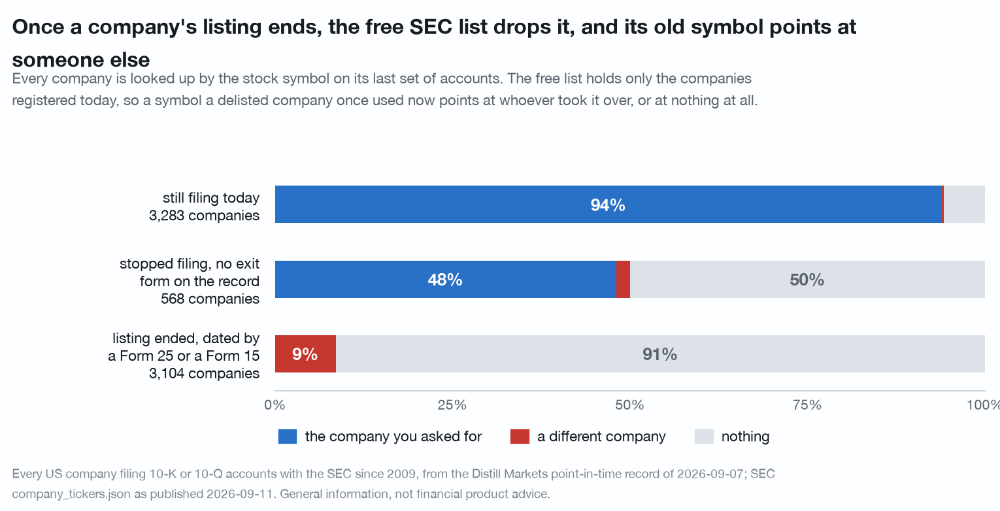
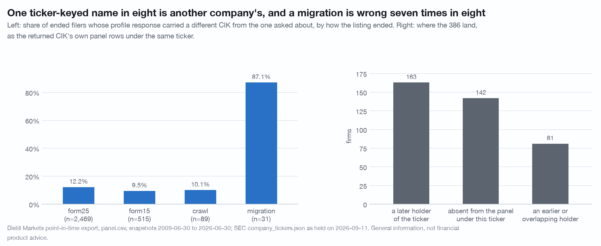

# Naming a company that stopped trading: the free SEC list holds 95.3% of filers still filing and 0 of the 3,104 whose listing has ended, and a ticker lookup returns a different company for 266 of them

A price is not the first thing a join to an outside dataset needs. A name is.
Trial registries, patent assignees, procurement awards, court dockets, press
archives and most commercial datasets are keyed by company name or by ticker
and almost never by CIK, so a filer that cannot be named cannot be joined to any of them.
This document is a census of whether the 6,955 filers in Distill's
point-in-time panel can be named from the free sources, and of what comes back
when they cannot.

Survivorship bias in prices is the known problem, and
[ghost-cohort.md](ghost-cohort.md) measures it on this same panel. This is the
same hole one layer earlier, in identity, and it bites before a single price is
fetched.

**Leaving the panel is leaving the corpus, not failing. A Form 25 follows an
acquisition, a going-private and an exchange deficiency alike, and nothing in
this data separates them. That sentence belongs under every table here.**

Data vintage: Distill `screen/export` panel rebuilt 2026-09-07, 197,332 rows
over 6,955 CIKs, snapshots 2009-06-30 to 2026-06-30; SEC `company_tickers.json`
as published 2026-09-11, 10,407 ticker rows over 8,013 CIKs; 3,104 cached
`/api/v1/sec/profile/{ticker}` responses fetched 2026-09-11; 3,104
`data.sec.gov/submissions/` responses fetched 2026-09-11. No price appears
anywhere in this study, so there is nothing to market-adjust and nothing here is
about where a price goes next.

Two scripts reproduce it, and the split is the point. The original tables come
from `./.venv/bin/python research/naming-the-dead/study.py`; the cohorts, the
lookup outcomes and the SEC-submissions census come from the adversarial review
that followed, `./.venv/bin/python research/review-naming-the-dead/study.py`.
Both ship in this checkout and both run under `DISTILL_OFFLINE=1` from files on
disk. Where the two disagree the review supersedes the study, and
[CORRECTIONS.md](../CORRECTIONS.md) entries 22, 23 and 24 record each of those.

**This is a census, not a sample.** Every rate below is a population rate over
the whole panel, so none carries a sampling interval and none needs a placebo:
there is no label to shuffle. The comparison that carries the finding, 95.3%
against 0.0%, is a difference between two complete cohorts.

## The three cohorts, and why the obvious two are not enough

The panel's `listed_until` column dates the end of a listing from a Form 25, a
Form 15, a crawl of SEC's submissions index or a CIK migration. The obvious
split is: the column is set, or it is not.

That split is wrong, and the review found it. A firm with no `listed_until` is
not necessarily still trading; it may simply have stopped appearing, with no
exit form on the record. **568 of the 3,851 firms the first draft called "still
listed" have no row at the panel's final snapshot.** They belong in their own
cohort:

| cohort | n | nameable from the free file | share |
|---|---|---|---|
| **still filing** at 2026-06-30 | 3,283 | 3,129 | **95.3%** |
| **stopped filing**, no exit form on the record | 568 | 286 | **50.4%** |
| **listing ended**, dated by a form or a crawl | 3,104 | 1 | **0.0%** |

Nameable means the firm's CIK is a key in `company_tickers.json`, which carries
a `title` on every row it holds, so presence is nameability. The CIK is the key
that survives a rename and a symbol change, which is why the join is made on it.

The middle cohort sits between the two clean ones, at almost exactly the
midpoint, which is what an undated mixture of departures and stragglers would
look like. Its nameable share falls the further back its last row sits: firms
whose last panel row is 2013 are 12.5% nameable (n = 48), 2018 26.7% (n = 30),
2022 73.0% (n = 37). **282 of the 436 misses in the first draft's "still listed"
pool, 64.7% of them, are firms that stopped filing.** Only 154 of the 3,283
genuinely current filers, 4.7%, are absent from the SEC's list.

Reported in the first draft as 88.7% against 0.0%; the pooled figure was
diluted by the 568. The corrected contrast is wider, not narrower.

## What comes back when you ask by the key you actually hold

A caller joining an outside registry does not hold a CIK. They hold a name or a
ticker. Asking the same free file by ticker has three outcomes, and the caller
can tell them apart from the outside:

*Leaving the panel is leaving the corpus, not failing.*

| cohort | n | the company you asked for | a different company | nothing |
|---|---|---|---|---|
| still filing | 3,283 | 3,084 (93.9%) | 7 (0.2%) | 192 (5.8%) |
| stopped filing, no exit form | 568 | 273 (48.1%) | 11 (1.9%) | 284 (50.0%) |
| **listing ended** | 3,104 | **0 (0.0%)** | **266 (8.6%)** | 2,838 (91.4%) |

For 266 of the 3,104 ended filers the last ticker IS in the current file, and in
**none of the 266** does it point at the filer that held it. A ticker join to
this file answers "who holds that symbol today", which for a symbol freed by a
delisting is by construction someone else. 8.6% of the ended cohort comes back
named, and every one of those names is wrong.

That is the shape of the failure worth internalising. The 91.4% that return
nothing are a coverage problem, and a coverage problem announces itself. The
8.6% are a correctness problem, and it does not.

## The claim this study does not support

The free bulk file is not the only free SEC route to a name, and the difference
decides what a reader should build.

`https://data.sec.gov/submissions/CIK##########.json` is served per CIK, free,
and carries `name`, `formerNames`, `tickers` and `exchanges`. Asked once for
each of the 3,104 ended firms, it named **3,104 of 3,104**:

| how the listing ended | n | named | share |
|---|---|---|---|
| Form 25 | 2,469 | 2,469 | **100.0%** |
| Form 15 | 515 | 515 | **100.0%** |
| crawl | 89 | 89 | **100.0%** |
| migration | 31 | 31 | **100.0%** |

It is better than a bare name. **1,741 of the 3,104 (56.1%) carry former names**,
for the company actually asked about rather than for a successor. And the file
says the company is gone rather than pretending otherwise: only **4 of the 3,104
still list a ticker and 3 still name an exchange**, because SEC clears those
fields when a registration ends. Where the bulk file simply omits the row, the
per-CIK file states the fact.

So **"a delisted company cannot be named from free data" is false**, and this
study never measured it. What the census above measures is one file, and every
rate in it should be read as a fact about `company_tickers.json` rather than
about SEC.

**The direction of the lookup is the whole finding.** The per-CIK file answers
"what is CIK 1288776 called", and to ask it you must already hold the CIK. A
caller joining an outside registry holds a name or a symbol and is trying to
*find* the CIK, and in that direction there is no free route for a company whose
listing has ended: the bulk file is the only free symbol-to-CIK map SEC
publishes, it carries current registrants only, and the table above puts it at
0 of 3,104. The escape hatch opens only for someone who already holds the thing
they were looking for.

Two consequences follow for anyone building on this.

1. **Key identity on the CIK and the free layer is adequate.** Hold a CIK and
   SEC will name the company, name what it used to be called, and tell you it is
   no longer listed, at one request each and no cost.
2. **Key identity on a ticker or a name and no free layer exists.** Not a poor
   one, none. That is the gap this document is about, and it is where a
   symbol-to-CIK history with dates belongs.

## The publisher's own lookup, and the defect in it

Asked for all 3,104 ended firms by ticker, Distill's `/sec/profile/{ticker}`
returned a name for **3,104 of 3,104**, with no errors. That is the coverage
claim, and it holds.

**The identity claim does not. The CIK returned matched the CIK asked about for
2,718 of 3,104, so 386 responses (12.4%) carried another company's name.** That
is a defect in the publisher's own API. It is stated here rather than in a
footnote, because a coverage number is worth nothing without it.

| how the listing ended | CIK agrees | n | share differing |
|---|---|---|---|
| Form 25 | 2,168 | 2,469 | 12.2% |
| Form 15 | 466 | 515 | 9.5% |
| crawl | 80 | 89 | 10.1% |
| migration | 4 | 31 | **87.1%** |

**The mechanism is visible in the response itself.** Every profile response
carries a `source` field naming the path that resolved it, and the defect is
concentrated in one of the three:

| resolver `source` | n | CIK agrees | share differing |
|---|---|---|---|
| `submissions-dead-crawl` | 2,748 | 2,618 | 4.7% |
| `ticker-history-fallback` | 111 | 100 | 9.9% |
| `sec-edgar` | 245 | **0** | **100.0%** |

`sec-edgar` behaves as a lookup of whoever holds the symbol now: on this census
it never once returned the CIK that was asked about, 245 responses out of 245.
It is the path taken when the other two have nothing to offer, which is exactly
the case for a company that is gone. It accounts for 245 of the 386 mismatches;
the other 141 come from the two paths that are usually right.

Until that path checks the CIK it returns, the rule for a caller is: **compare
`cikNumber` in the response against the CIK you asked about, and treat any
response whose `source` is `sec-edgar` as a symbol lookup rather than an
identity.** Both fields are served, so the check costs nothing.

*Leaving the panel is leaving the corpus, not failing.*

## The 386 are three situations, not one

Flattening them into "the endpoint is wrong" would be inaccurate. The 87.1% on
`migration` in particular is not a random error: a migration is a CIK moving, so
the endpoint is exposing a real successor relationship rather than losing one.

Where the 386 land, as geometry against the returned CIK's own panel rows under
the same ticker:

| how the listing ended | later holder | earlier or overlapping holder | absent from the panel |
|---|---|---|---|
| Form 25 | 119 | 74 | 108 |
| Form 15 | 16 | 6 | 27 |
| crawl | 6 | 1 | 2 |
| migration | 22 | 0 | 5 |
| **all** | **163** | **81** | **142** |

**165 of the 386 return a company that is still listed today.** For the 163
later holders the median gap from the asked firm's listing end to the returned
company's first panel row under that ticker is 763 days (10th to 90th percentile
78 to 3,119); 70 are inside a year and 40 are more than five years out.

The geometry does not separate the three situations. The following are
**hand-classified against the filings, not computed**:

| what it is | asked | listing ended | name returned | gap |
|---|---|---|---|---|
| **successor after a reorganisation** | `GOOG` | 2015-10-02 | Alphabet Inc. | 181 d |
| | `ETN` (migration) | 2012-11-14 | Eaton Corp plc | 137 d |
| | `DIS` | 2019-03-20 | Walt Disney Co (the new CIK) | 286 d |
| | `DOW` | 2017-09-01 | DOW INC. | 942 d |
| | `DELL` | 2013-10-29 | Dell Technologies Inc. | 1,249 d |
| **unrelated company that took the symbol later** | `BEAM` | 2014-05-02 | Beam Therapeutics Inc. | 2,890 d |
| | `APC` | 2019-08-09 | ARKO Petroleum Corp. | not in the panel |
| **predecessor** | `DTV` | 2015-10-30 | DIRECTV GROUP INC | not in the panel |

Timing does not sort them. Alphabet at 181 days and Eaton Corp plc at 137 are
successors; so are Dow Inc at 942 days and Dell Technologies at 1,249. A rule
that called anything inside a year a successor would keep Alphabet and Eaton and
lose Dow and Dell, which sit out where the unrelated reissues are. The successor
relationship is real and is worth having, but it is a different fact from the
one the caller asked for, and nothing in the response says which of the two it
just returned.

## One sector, on the honest denominator

The last Healthcare row per CIK with revenue of at least $10m: 1,167 firms, 649
still listed and 518 with a listing end. This is the shape a sector study meets,
and it is where the identity hole turns into a selection.

| cohort | revenue tercile | n | nameable | share |
|---|---|---|---|---|
| still listed | small | 216 | 187 | 86.6% |
| still listed | mid | 216 | 196 | 90.7% |
| still listed | large | 217 | 204 | 94.0% |
| still listed | **all** | 649 | 587 | **90.4%** |
| with a listing end | small | 173 | 0 | 0.0% |
| with a listing end | mid | 172 | 1 | 0.6% |
| with a listing end | large | 173 | 0 | 0.0% |
| with a listing end | **all** | 518 | 1 | **0.2%** |

The still-listed half carries a size gradient, 86.6% to 94.0%, so a name-keyed
join is already biased toward larger firms inside the surviving half. The ended
half is flat at zero across all three terciles: size does not buy a delisted
company its name back.

A researcher who builds a Healthcare cohort by joining names to any outside
registry gets 588 firms out of 1,167, all but one of them survivors, and nothing
in the joined frame says the other 579 existed.

**Which way this biases a result.** Every name-keyed study built on the free
bulk file is a study of companies that are still listed, plus a mild tilt to the
larger ones among them. That is the same direction as the price-file bias in
[trap 3](../docs/traps.md) and it stacks with it: the price file drops the dead,
and the identity file drops them again before the price join is even attempted.

The terciles above are cut on the still-listed and ended halves separately; the
first draft keyed this pool on the ticker rather than the CIK, which collapsed
reused Healthcare symbols and lost 10 ended firms. The shares are unchanged to
the decimal; the counts moved from 1,157 and 508.

## What did not hold

- **"Still listed" as the complement of a dated listing end.** 568 of those
  3,851 firms have no row at the final snapshot. Split out, the headline is
  95.3% against 0.0%, not 88.7% against 0.0%.
- **"Join on the ticker instead" as a repair.** It returns names for 266 ended
  filers and every one of them is a different company.
- **The API lookup as an identity.** It is a coverage success and an identity
  failure at 12.4%, and its own `source` field says where.
- **Any timing rule for separating a successor from a reissue.** The
  distributions overlap and the named cases cross in both directions.
- **Size as protection.** The ended half is at zero in every revenue tercile.
- **The scope of the headline.** SEC's own per-CIK file names 3,104 of 3,104.
  This is a fact about one free file, and about which direction a lookup runs,
  not about free data.

## What would break it

1. **The free file is read once, on 2026-09-11, and applied to a panel whose
   snapshots run back to 2009.** It carries no date and SEC serves only the
   current copy. Every rate here is "as the file stands today", and a rate
   measured on a file saved in 2014 would be a different number that nobody can
   now compute. That is the study's own argument in one sentence.
2. **`listed_until` is the publisher's own column**, and the three cohorts are
   cut on it. The 568 firms in the middle cohort are the visible residue of that
   column being incomplete; there is no outside source here that independently
   dates a listing end, so the cohort boundaries are Distill's and not SEC's.
3. **The API half is read from cached responses fetched on one day** with one
   key. It was not re-fetched by the review, so the 12.4% is verified against
   those responses and not independently re-measured.
4. **Nameability is presence in a file, not a correct name.** A row present
   under the right CIK is counted nameable without checking that the title
   matches the filings. Nothing here audits the strings themselves.
5. **A name is not a join.** Even a correct name fails against an outside
   registry that spells it differently, and this study measures whether a name
   exists, never whether a name-to-name match succeeds. The rates here are a
   ceiling on a name-keyed join, not an estimate of one.

## What data was wished for

- **A name on the panel row.** The export carries the ticker and the CIK. A name
  column would make this study unnecessary for anyone holding the panel.
- **A CIK-keyed identity route.** Every defect in the profile section is the
  consequence of asking by ticker, which is not a stable identifier. A route
  keyed on the CIK could not return the wrong company by construction.
- **A successor pointer.** The endpoint already resolves a successor in the
  migration cases and cannot say so. A `succeeded_by_cik` would turn an
  unlabelled substitution into a stated relationship.
- **A dated vintage of the free file.** Capturing `company_tickers.json` daily
  costs nothing and cannot be done retroactively.

## Disclosure

Companies are named only as facts they exhibit in this data.

Distill Markets Pty Ltd, the publisher of this repository, operates the paid
data service this study uses, and one section above reports a defect in that
service's own endpoint. Authors and the publisher may hold positions in
securities named here. Everything above is general information derived from
public SEC filings and from public-domain SEC files the reader holds. It is not
financial product advice, does not consider your objectives, financial situation
or needs, and past patterns do not guarantee future results. See
[NOTICE](../NOTICE).
