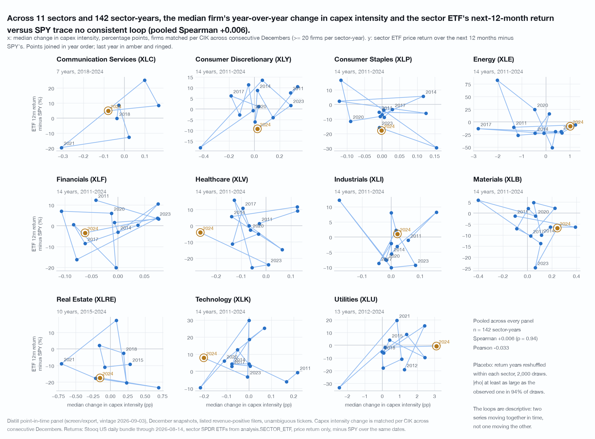
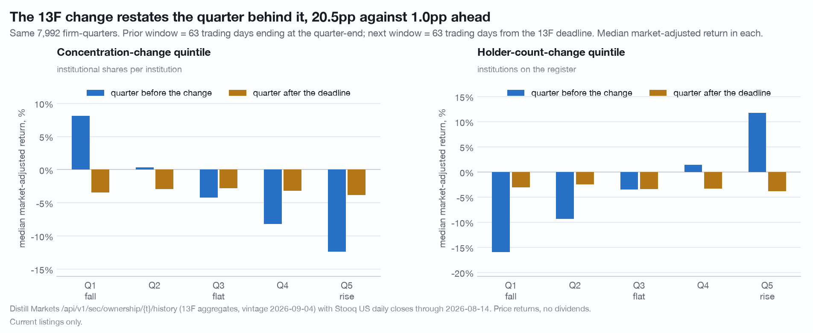
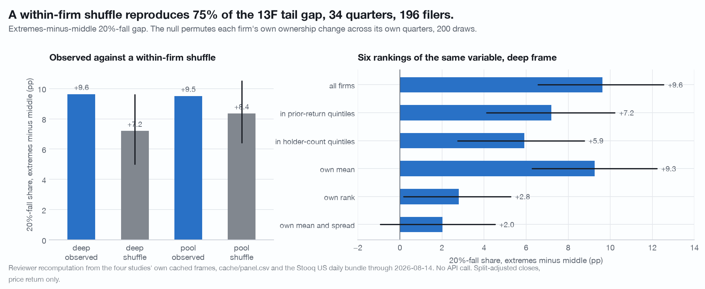
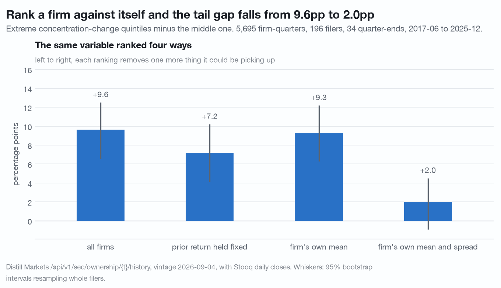
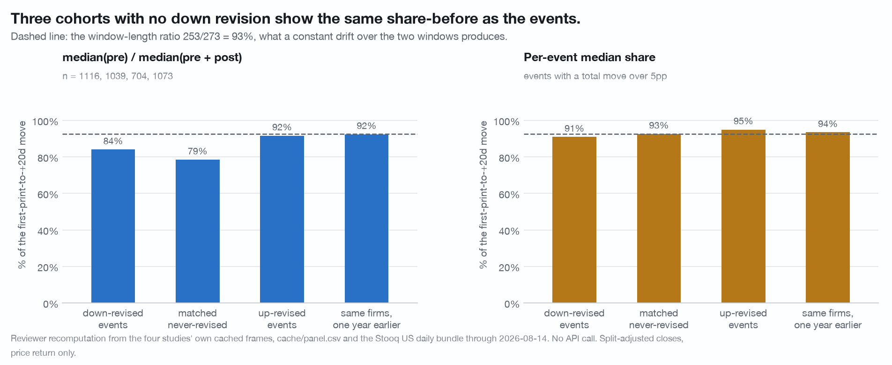
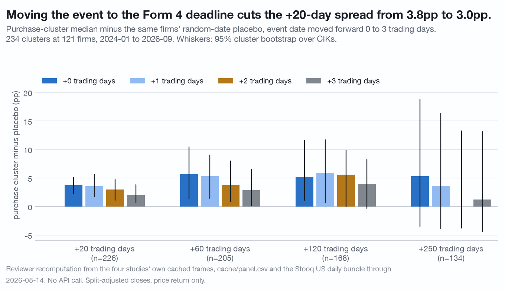
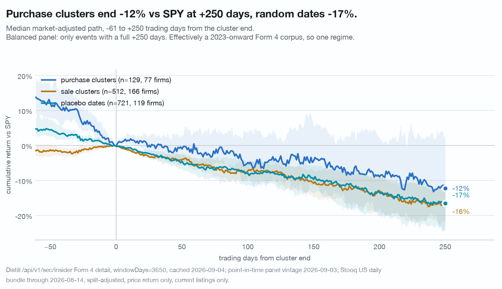
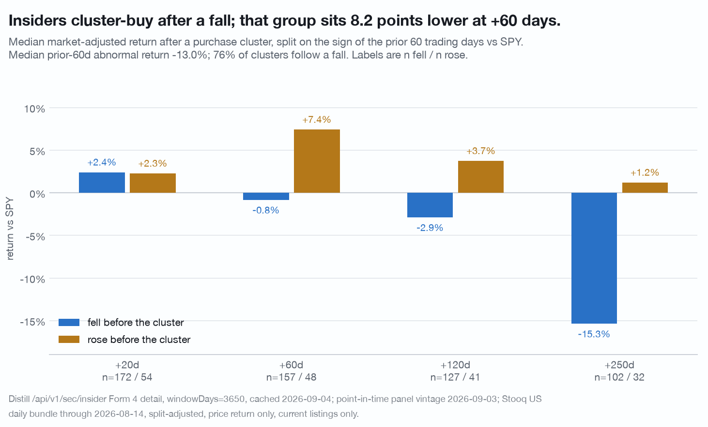

# Six worked nulls, and the control that turned each one into a null

Every result below started as a number that looked like a finding. Each is
published because the check that removed it is more useful than the number would
have been. They are grouped by the method lesson rather than by topic: benchmark
before you correlate, rank a firm against itself before you rank it against the
cross-section, place a placebo window that cannot overlap the event window,
separate the transaction date from the publication date, count events in the
unit the filer emits them, and date the period a filed number covers before
calling either side a lead.

Data vintages: Distill `screen/export` panel of 2026-09-03, per-ticker responses
cached 2026-09-04, Stooq US daily bundle through 2026-08-14. Sources are
`research/artifacts/`, `research/crowding/`, `research/market-knew/`,
`research/insider-paths/`, `research/fundamental-momentum/` and
`research/price-leads-record/`. Reproduce each with
`./.venv/bin/python research/<name>/study.py` from the repository root; none
makes a network call. Those scripts are held by the publisher and available on
request. What changed under an adversarial re-run is in
[CORRECTIONS.md](../CORRECTIONS.md).

A property shared by all six: the priced pool behind them was selected on
having a price series, so its 100% match rate is a construction and not a
measurement. The honest denominator is **66.8% of the panel's 45,428 December
firm-years**. Every drawdown rate, every tail share and every fall count below
is a floor, and nothing in this data bounds by how much.

---

## 1. The sector capex clock: +0.21 raw, +0.006 against the market

**The null.** Across 11 sectors and **142 sector-years, 2011-2024**, the median
firm's year-over-year change in capex intensity and the sector ETF's next
twelve-month return versus SPY trace no consistent loop. Pooled Spearman
**+0.006 (p = 0.94)**, Pearson -0.033. Per sector no correlation reaches
significance at n = 7 to 14. Reshuffling the return years within each sector,
2,000 draws, produces an absolute correlation at least as large as the observed
one in **94% of draws**. Split in half, 2011-2017 gives +0.072 (n = 65) and
2018-2024 gives -0.062 (n = 77): the sign flips and neither half is
distinguishable from zero.

**Why it matters for method.** Against the **raw** ETF return the pooled
Spearman is **+0.208 (p = 0.013, n = 142)**. Subtracting SPY over the same dates
takes it to +0.006. The raw number was the market's own year, shared by every
sector at once, and it survives every check a researcher runs on a single
series. A cross-sector study that reports a raw correlation reports the calendar.

Two things bound even the null. The x axis is a median of a ratio over a cohort
that is a survivor of two consecutive filings as well as of the price file, and
`capex_intensity` is null for 10.7% of December rows. And
eleven sectors over fourteen years, one ETF each, gives at most 14 independent
draws per panel against correlated benchmarks, so the pooled n of 142 is
optimistic. That cuts against reading anything into the larger per-sector
correlations rather than against the null.

---

## 2. 13F concentration change: a forward null, a large reverse-causality effect, and a tail gap that is a firm property

**The forward null.** Next-quarter market-adjusted return by quintile of the
quarter-over-quarter change in institutional shares per institution:

| frame | Q5 minus Q1 | 95% CI |
|---|---|---|
| pool, 8,000 firm-quarters / 2,005 filers, 4 quarter-ends | -0.50pp | [-2.49, +1.47] |
| holder-count change, same frame | -0.77pp | [-2.30, +1.04] |
| deep, 5,695 firm-quarters / 196 filers, 34 quarter-ends | -0.60pp | [-2.66, +1.36] |
| deep, out of sample 2017-2024, 29 quarter-ends | -1.39pp | [-3.33, +1.02] |

Every interval spans zero. The extremes-minus-middle version is also null (pool
-0.76pp, [-2.10, +0.70]). A firm-clustered shuffle agrees: the observed pool
return gap of -0.50pp sits against a null of -0.08 ± 0.80pp, z = -0.5, with
56.5% of 200 shuffled draws at least as extreme. **There is no forward return
here.**

**The largest effect in the study runs backwards.** The 63 trading days
**ending** at the quarter-end, before any 13F filing exists:

| quintile of concentration change | Q1 | Q2 | Q3 | Q4 | Q5 |
|---|---|---|---|---|---|
| median market-adjusted return, prior quarter | +8.10% | +0.33% | -4.24% | -8.20% | -12.38% |
| median market-adjusted return, next quarter | -3.43% | -2.95% | -2.78% | -3.16% | -3.80% |

A **20.49pp [+18.79, +22.06]** monotone spread behind (n = 7,992 firm-quarters,
2,079 clusters), strictly monotone in **400 of 400** clustered draws, against
**+0.37pp [-1.44, +2.11]** ahead. Holder-count change is sharper still, 27.8pp
behind and 1.4pp ahead. The mechanism is visible: Spearman between concentration
change and holder-count change is **-0.71**. When a price falls, institutions
leave the register, the count drops, and the shares that remain are divided
among fewer holders, so measured concentration rises. **The quarter-end 13F
aggregate is largely a lagged, coarse restatement of a price move that has
already happened, at roughly twenty times the magnitude of anything that follows
it.**

**The tail gap, and the control that removes it.** Firm-quarters in the extreme
quintiles of the concentration change fell 20% or more 35% of the time against
26% in the middle quintile, a gap of **+9.51pp [+6.71, +12.24]** on 3,202
against 1,600 firm-quarters. That gap is almost entirely a property of **which
firms**, not **which quarters**.

Permuting each firm's own concentration change across its own quarters, which
keeps every firm-level property and destroys all timing, reproduces
**+8.35pp ± 1.00** of it on the pool frame, where **13% of 200 draws** are at or
above the observed value, and +7.20pp ± 1.29 on the deep frame. A firm's own
**standard deviation** of the change, one number per firm with no timing content
whatsoever, sorts the same 20%-fall share by **+20.03pp [+16.60, +23.33]**, more
than twice the gap it is supposed to explain.

A ladder of rankings of the same variable on the deep frame:

| ranking | extremes minus middle, 20%-fall share | 95% CI |
|---|---|---|
| across all firms in the quarter | +9.63pp | [+6.57, +12.53] |
| inside prior-return quintiles | +7.19pp | [+4.13, +10.21] |
| inside holder-count quintiles | +5.92pp | [+2.75, +8.76] |
| against the firm's own mean | +9.25pp | [+6.29, +12.21] |
| against the firm's own rank | **+2.80pp** | [+0.17, +5.27] |
| against the firm's own mean and spread | **+2.02pp** | [-0.93, +4.52] |

**The honest within-firm range is +2.0 to +2.8pp**, not the +2.0 to +9.3pp a
demeaned ranking suggests: demeaning leaves the high-variance firms free to fill
both extreme quintiles, and the within-firm shuffle reproduces +7.20pp of its
+9.25pp, so it demonstrably fails to remove the composition. The z-scored rung
is not an over-correction, because a rank-within-firm version, which divides out
no scale and assumes no shape, lands next to it at +2.80pp. Ranking inside
holder-count quintiles instead leaves +5.92pp, so about 4pp of the raw gap is
how thinly a name is held.

Read plainly: **firms whose 13F aggregates move a lot have prices that move a
lot**, and the extra content in an unusually large move for a given firm is at
most a couple of points on a 21% base rate.

**Why it matters for method.** Two lessons and one endpoint fact.

- **Q5 minus Q1 is the wrong summary for a two-sided variable.** The relation is
  U-shaped, and the directional contrast reports a small null while the size
  contrast reports 9.5pp.
- **Any cross-sectional cut on the size of a 13F move measures firm
  volatility.** Rank within firm from the start.
- **The ownership history used here is 38 quarters, back to a corpus floor of
  2017-03-31**, requested as `?quarters=40`; the default window is 8 quarters.
  Without the longer history this study would have reported a +9.5pp tail
  finding on four quarter-ends that it does not support.

The measure itself is a proxy: institutional shares per institution, built from
`totalShares` and `holdersCount`, because the history response carries no
concentration field at any date. Against the real top-10 share read from 39
tickers at two quarter-ends, the Spearman is **+0.43** and the Pearson +0.49, so
it moves with genuine top-holder concentration and explains under a quarter of
its variance. Every result here is a result about average position size across
all 13F filers.

---

## 3. The correcting filing is a null, and "85% of the move came first" is a window-length ratio

**Event set.** Every cached revisions response for the pool: material downward
revisions of five result concepts, `relDelta <= -0.10`, **counted per filing**,
one row per (CIK, revising accession) keeping the largest fact in that filing.
**1,247 events over 763 firms**; 1,164 have a usable first-print date and
**1,116 events over 702 firms price cleanly.**

**The statistic that does not survive.** The raw decomposition is: median
SPY-adjusted return from the first print to the day before the correcting filing
**-7.40pp [-10.74, -5.37]**, and over the 20 trading days after it
**-0.92pp [-1.67, -0.50]**, so the share of the total occurring before the
filing reads 84.6%, or 91.0% per event on the 963 events whose total move
exceeds 5pp.

**That share is the ratio of the two window lengths.** The pre window is a
median of **253 trading days** and the post window is fixed at **20**, so a
constant drift over both produces 253/273 = **92.7%**. Three cohorts containing
no down revision at all reproduce it:

| cohort | n | pre | post | share before | per-event share, moves over 5pp |
|---|---|---|---|---|---|
| down-revised events | 1,116 | -7.40pp | -0.92pp | 84.1% | **91.0%** |
| matched never-revised control | 1,039 | -4.63pp | -0.81pp | 78.5% | **92.7%** |
| up-revised events | 704 | -3.33pp | -0.35pp | 91.7% | 95.0% |
| the same firms, one year earlier | 1,073 | -8.10pp | -0.58pp | 92.4% | 93.5% |

**The share statistic carries essentially no information about revisions and is
withdrawn.** What replaces it is the paired comparison.

**The paired result.** Against controls matched on fiscal year, sector and
nearest revenue, drawn only from (CIK, fiscal year) pairs that appear in no
revision row, priced over the event's own calendar window:

| | median | 95% CI |
|---|---|---|
| paired excess, first print to the filing (n = 1,002 pairs, 639 event firms) | **-3.35pp** | [-6.76, -0.07] |
| paired excess, 20 days after the filing | **+0.08pp** | [-0.68, +1.00] |

**The correcting filing itself is a clean null.** Down-revised firms lose an
extra 3.35pp before it and nothing at all in the twenty days after it. There is
also no run-down into the filing date: the last 20 trading days before it are
-0.31pp [-0.93, +0.17]. Up-revised events overlap the matched placebo's
intervals in both windows.

Two caveats belong next to the pre-filing number. Its upper interval end is
-0.07pp, so the sign is barely resolved over a window of about 253 trading days.
And **1,039 control paths come from 761 control firms, one of which serves as
many as 6 events**, while the paired bootstrap resamples event firms only, so
correlation induced through a shared control is not in the interval.

**The date placebo, placed where it cannot overlap.** Moving both filing dates
back one year reproduces the pre-filing drift almost exactly (-8.10pp against
-7.40pp) and reproduces the severity gradient. But **59.9% of paired events have
a one-year placebo window that overlaps the event window** (median overlap 50%),
because the median correction gap is 368 days. Repeated at two years back, where
no overlap is possible:

| shift | n | firms | placebo pre | paired excess pre | 95% CI | placebo, cuts >=50% | placebo, cuts 10-50% |
|---|---|---|---|---|---|---|---|
| 1 year | 1,073 | 677 | -8.10pp | -2.27pp | [-4.99, +0.77] | -12.18pp | -5.68pp |
| **2 years** | **1,013** | **639** | **-6.68pp** | **-2.49pp** | **[-5.66, +0.55]** | **-10.10pp** | **-5.65pp** |
| 3 years | 969 | 610 | -5.00pp | -4.49pp | [-7.88, -1.99] | -4.10pp | -5.35pp |

(Event-window pre for the same two severity groups: -11.72pp and -5.96pp.)

At two years the placebo still produces -6.68pp of the observed -7.40pp, the
paired excess is still a null, and the severity gradient is still there.
**The pre-filing drift is a persistent property of firms that later revise, not
anticipation of the correction.** At three years back that stops holding: the
placebo weakens, the excess reaches -4.49pp [-7.88, -1.99] and the gradient
reverses in the placebo, so the claim holds over roughly two years before the
correction and not indefinitely. The three-year sample is also 969 of 1,116
events and needs three extra years of price history, which is its own selection.

**Why it matters for method, and the ambiguity that cannot be resolved here.**
A ratio of two medians over windows of different lengths is a window-length
ratio until a cohort without the event says otherwise. And a placebo window
placed one period back may still sit inside the event window; measure the
overlap before trusting it.

The event set carries an ambiguity no control can remove. **The median
correcting filing arrives 368 days after the first print** (p25 364, p75 728),
and it is normally the next annual report re-presenting the prior year alongside
a fresh year of results, not a standalone restatement announcement. A 20-day
window around it measures the reaction to a whole annual report. The revisions
response carries `changedAccession` but not the form type, so a 10-K/A filed to
correct is indistinguishable from a 10-K that re-presents a prior year in its
comparative columns. **A null on a bundled event is a null about a bundled
event**, and it does not establish that a cleanly isolated restatement
announcement would also be a null; there is no such isolated event in this data.

One more scope note: `relDelta` is measured original-to-latest while
`changedFiled` is the first filing to change the value, so where a fact was
revised more than once the magnitude and the date describe slightly different
steps.

---

## 4. Insider purchase clusters: a fundamentals-context null, and a spread that is one regime

**This is a one-regime study and not a base rate.** Form 4 transaction detail in
this corpus is effectively 2023-onward however long a window is requested:
across 235 sampled tickers the median first transaction of any kind is
2024-01-11, 90% of tickers return nothing before 2023-10-06, and only 22 of
15,259 open-market transactions are dated before the 2023-06-29 wall. Not one
qualifying purchase cluster falls before 2024-01-04. Every number below sits
inside one stretch of about 2.7 years in which **the median sampled filer lost
16% to SPY over 250 trading days from any date**.

Sample: 235 tickers, **240 purchase clusters at 121 firms** and 889 sale
clusters at 193 firms. Counts below differ by window: 234 of the 240 purchase
clusters have a close within seven days before the event, and 229 have a full
60-day prior path. An episode is a cluster when it has two or more distinct
insiders or a single transaction of at least $1m at a price the filing did not
flag unreliable.

**The fundamentals-context null.** Median +120-day market-adjusted return after
a purchase cluster, by the health score of the most recent December snapshot:
health 0-50 **-2.0%** (n = 37 events, 19 firms), health 50-85 **-4.3%** (n = 65,
37 firms), health 85+ **+1.1%** (n = 27, 20 firms, below the 30-event floor and
not reported as a finding). The 0-50 minus 85+ difference is -3.1pp
[-36.3, +30.7] at +120d and -3.2pp [-9.9, +1.5] at +20d. **Health bucket spreads
the path by 5.4 points inside intervals that overlap completely.**

The M-Score flag is unusable at this n: only **4 purchase clusters at 3 firms**
carry it, against 163 that do not. No number is quoted for the flagged group.
Within-year revenue terciles order monotonically at +120d (low +4.8% n = 50, mid
+3.0% n = 46, high -8.2% n = 51) and do not clear their interval: low minus high
is +13.0pp [-6.8, +26.0], with 86.9% of bootstrap draws above zero.

**The spread that is there, reported with its date-lag caveat.** Purchase
clusters minus five random dates per cluster drawn inside the same firm's own
Form 4 coverage window:

| shift applied to the event date | +20d | +60d | +120d | +250d |
|---|---|---|---|---|
| none (transaction date) | +3.75pp [+2.19, +5.08] | +5.65pp [+1.29, +10.47] | +5.22pp [+1.10, +11.53] | +5.32pp [-3.52, +18.80] |
| +2 trading days | **+3.00pp** [+1.11, +4.74] | **+3.79pp** [+0.85, +7.96] | +5.59pp [-0.07, +9.87] | **+0.00pp** [-3.75, +13.23] |

**The event date is the transaction date, and Form 4 is due within two business
days.** The response carries `accessionNumber` but no `filedAt`, so the first
days of the +20-day window partly precede the filing that made the transaction
public. Measured directly, the purchase-minus-placebo spread over **trading days
0 to 2 alone is +1.41pp [+0.97, +2.21], 38% of the +3.75pp twenty-day spread**.
Moving every event forward two trading days, the crudest available
approximation of publication, leaves the +20 and +60 day results at about 80%
and 67% of their size; **the +120 and +250 day results do not survive it.**

So the honest statement is: **in 2024-2026, purchase clusters ran roughly 4 to
6 percentage points ahead of random dates at the same firms at +20 to +60
trading days, one regime, with about 38% of the +20-day component sitting in the
days before the filing was public.** It is not a base rate, and the absolute
paths are negative past +60 days.

Two alternative explanations were tested and neither works. Reweighting the
placebo dates to the events' own decile distribution of the prior 60-day
abnormal fall makes the +20-day spread **larger** (+3.86pp), so short-term
reversal is not the mechanism. Reweighting to the events' calendar-quarter
distribution leaves +3.60pp against +3.75pp, so calendar tilt is not the
mechanism either. A calendar-preserving shuffle that reassigns whole firms'
event dates gives a larger spread than the placebo does. Dropping the busiest
firms **raises** the spread at every step (+4.02 / +4.22 / +4.21 / +4.48pp after
dropping 1 / 3 / 5 / 10 firms), so no small group carries it.

**The cleanest thing in this study needs no filing-date correction**, because it
is measured entirely before the event:

| set | median prior-60d abnormal return | share negative |
|---|---|---|
| purchase cluster (n = 229) | **-13.0%** [-16.2, -10.1] | 75.6% |
| placebo date, same firms (n = 1,159) | -5.4% [-7.6, -3.3] | 61.5% |
| sale cluster (n = 853) | +2.2% [+0.6, +3.9] | 44.9% |

Purchase clusters follow a drawdown **7.6 points deeper** than a random date at
the same firm ([-10.3, -5.5], 100% of draws below zero). Three quarters of them
follow a fall. Conditioning the forward path on that prior sign does not show
the falls being recovered: clusters that followed a fall run -0.8% at +60d,
-2.9% at +120d and -15.3% at +250d, and the fell-minus-rose difference is
-8.2pp [-16.7, -2.2] at +60d.

Sale clusters in this data follow a +2.2% 60-day abnormal return against -13.0%
for purchase clusters, so the two sides are drawn from different price
histories, and a purchase-minus-sale spread mixes that in.

**Why it matters for method.** A Form 4 row carries the **transaction** date.
Any event study that treats it as the date the market could know the transaction
attributes the pre-publication days to the event. Where the response carries no
filing timestamp, measure the days-0-to-2 component explicitly and report the
shifted result next to the unshifted one.

---

## 5. Count revisions per filing: counting facts inflates events 4.26x

**The base rate.** Over **707 tickers** with a cached revisions response, 621
(88%) have at least one annual fact revised by 1% or more, and **10,878 revised
facts arrive in 2,552 revising filings**. Counting facts instead of filings
inflates the event count by **4.26x**. Facts per revising filing: mean 4.26,
median 2, maximum 44, p90 per-ticker inflation 7.67. 33% of revising filings
revise exactly one fact, so the inflation is driven by a minority of large
recasts rather than spread evenly. Removing the five tickers with the most facts
(4.1% of all facts) gives **4.16x**, so it is not a few names.

The count is robust to the dedupe key: 2,552 distinct revising filings by
accession and 2,551 by filed date.

**Why it matters for method.** The revisions endpoint returns one row per
revised fact and a single annual report can recast dozens. Any study that treats
a revision as an event and does not dedupe on `changedAccession` reports four
times as many events as the filer made, and the inflation is concentrated in
exactly the firms with the largest recasts, so it is not a uniform scaling. The
same trap appears in the other direction downstream: `relDelta` describes the
original-to-latest step while `changedFiled` names the first filing that changed
the value.

**Scope.** The 707-ticker manifest is 65% tickers beginning A, B or C, and the
473-ticker history manifest is A, B, C, D and one more name: both are the
leading alphabetical prefix of a 2,047-ticker pool that is itself 2019-2025,
revenue over $300m and priced. These are base rates over an alphabetically
truncated slice of a survivorship-filtered set of large filers.

---

## 6. Neither the record nor the price leads the other, on annual data

**The null.** Rank December firm-years on the change in a filed metric over the
year ending at the snapshot and read the next twelve months of market-adjusted
return. Over **11,166 to 20,704 December firm-years from 1,425 to 2,336 firms,
2011-2025**, depending on which metric's coverage is being used, the Spearman
rank correlation runs **-0.05 to +0.01** across seven metrics: revenue growth
+0.0083, operating-margin change +0.0121, FCF-margin change -0.0020, Piotroski
change -0.0040, Altman Z change -0.0051, net dilution -0.0465, health-score
change -0.0110, each with a 400-draw CIK-cluster interval. **Five of the seven
intervals cover zero.** The two that do not, net dilution and the health-score
change, are **negative**: the decile whose filed record improved most over the
year ending at the snapshot had the **lower** market-adjusted return over the
next twelve months, which is the opposite of the direction the sort was built to
test. Cut as quintile spreads instead of correlations the same thing holds: ten
of ten intervals cross zero at the December anchor and five of five at a
record-refresh anchor, on 47,266 refresh events over 6,091 CIKs.

**The number that looked like the other direction.** Rank on the price instead,
over the twelve months **ending** at the snapshot, and read the next filed
change, and the same estimator on the same rows gives **+0.05 to +0.28 with
every one of the seven intervals excluding zero**. Read as spreads: the worst
decile of the trailing return went on to file a year whose revenue grew 15.53
points less than the best decile's [-17.05, -14.04], whose operating margin fell
5.90 points further [-6.53, -5.40] and whose health score fell 13.66 points
further [-14.98, -12.30], on 21,184 and 18,948 firm-years. Both directions on
one estimator, one row set and one axis is the whole of the comparison, and the
asymmetry is real at that scale.

**The control that turns it into a null.** A fiscal year is a label, not a
period. Dating every fiscal period from `periodEnd` in the history endpoint, on
the 85.6% of horizon-1 rows that are datable, **72.4% of them carry a filed year
that the price window ran through completely** and only 1.5% carry one that
began after the window closed. Requiring the filed period to end before the
price window starts takes the same seven correlations to **-0.10 to +0.06**:
revenue growth falls from +0.2541 to +0.0645 and the other five turn negative,
the largest of them the operating margin at -0.0972 [-0.112, -0.082].

The load-bearing version holds the firms fixed and moves only which filed year
is read. Step 1 is the filed year the price window overlaps by a mean of 0.87;
step 3 is a filed year both of whose endpoints begin after the window closed:

| bottom minus top decile of the trailing return | step 1 | step 3 |
|---|---|---|
| revenue growth | -15.53pp [-17.06, -14.17] | **-4.46pp** [-5.68, -3.38] |
| operating margin change | -5.87pp [-6.47, -5.39] | **+1.93pp** [+1.33, +2.32] |
| FCF margin change | -2.83pp [-3.51, -2.23] | **+1.13pp** [+0.59, +1.80] |
| Piotroski change | -1.02 [-1.16, -0.89] | +0.46 [+0.31, +0.61] |
| Altman Z change | -1.16 [-1.32, -1.03] | +0.10 [-0.04, +0.20] |
| health score change | -13.61 [-14.98, -12.35] | **+4.64** [+3.36, +5.91] |
| n | 21,019 | 16,123 |

**Four of the six reverse sign by step 3**, and the reversals are not noise: the
operating margin's +1.93pp sits against a within-firm null of +0.01 sd 0.15 with
0 of 200 draws at or beyond it. The one metric that keeps its sign is revenue
growth at **-4.46pp**, 29% of the horizon-1 figure, and it does not clear its
own within-firm null: permuting each firm's decile across its own years
reproduces **-4.22 sd 0.57, 95% of it**, with 34% of 200 draws at or beyond the
observed value. Rows survive from step 1 to step 3 at 76.0% to 78.5% by decile
with the worst decile highest, so the clean frame is not visibly depleted of the
decile the result is about.

**Where the anchor sits relative to publication, measured rather than assumed.**
The record-refresh anchor, the first quarter end at which a fiscal year appears
in the point-in-time panel, sits a median of **+37 days after the 10-K** (p10
+20, p90 +52) and **99.0% of anchors fall after it**, on 679 anchor-to-filing
pairs over 244 CIKs recovered by joining the cached `/sec/filings` corpus to
reconstructed period ends. So a backward window ending at that anchor contains
the reaction to the filing, and a forward window from it begins after
publication. Ending the backward window 45 days early, before publication rather
than after it, makes the correlation **larger** (operating margin +0.2285 to
+0.2717), and the 45 days that contain publication carry +0.016 to +0.045 on
their own, so the backward correlation is the price year and not the filing
reaction.

**The one forward interval that excludes zero is a January effect, not a filing
effect.** At the December anchor the operating-margin quintile spread is
**-1.94pp [-2.95, -1.08] over days 0 to 45**, -0.35pp [-1.50, +0.97] over days
45 to 135 and **+1.67pp [+0.18, +3.05] over days 90 to 180**, on 30,229 December
firm-years. A 10-K on a 31 December period end is filed a median of 53 days
later, so days 45 to 90 are where the next annual report lands. The negative
interval sits entirely before it.

**Why it matters for method.** Two traps, both paid for here.
[docs/traps.md](../docs/traps.md) trap 15: a "next" filed fiscal year is usually
the one the price already ran through, so a lead-lag claim needs `periodEnd` on
both sides before either side can be called first. Trap 16: a December panel
row's annual block is a median of **275 days old**, because a fiscal year enters
the panel at 74% of March quarter-ends and 8% of December ones, so a
December-anchored sort on a change in the record is a sort on information the
record has carried for three quarters.

**What survives the same review as descriptive.** Two things, both stated as
what they are. Purchase clusters in the worst quintile of the trailing return
run **+9.24pp [+0.78, +18.42]** ahead of the best quintile on the six-month
purchase-cluster rate, on **615 firm-years over 210 firms** once the names
reporting partial Form 4 parse coverage are dropped; the worst quintile carries
13.6% such names against the best quintile's 3.0%, and Form 4 transaction detail
in this corpus is effectively a 2023-onward regime, so this is one stretch of
about three years and not a base rate. And the selling side of the same
cross-section is the larger and cleaner gradient: the share of tickers with at
least one distinct seller runs 47.8% in the worst decile against 82.9% in the
best, a gap of **-35.13pp [-45.55, -26.27]** that holds at **-33.44pp**
conditional on at least one Form 4 filing in the window and is **largest in the
biggest firms**, -18.54pp in the smallest revenue tercile against -70.72pp in
the largest. What this data cannot separate is an open-market sale from a
sell-to-cover after vesting, because the response carries no transaction code.

---

## Disclosure

Companies are named only as facts they exhibit in this data.

Distill Markets Pty Ltd, the publisher of this repository, operates the paid data
service this study uses. Authors and the publisher may hold positions in
securities named here. Everything above is general information derived from
public SEC filings and from a price file the author holds. It is not financial
product advice, does not consider your objectives, financial situation or needs,
and past patterns do not guarantee future results. See [NOTICE](../NOTICE).
