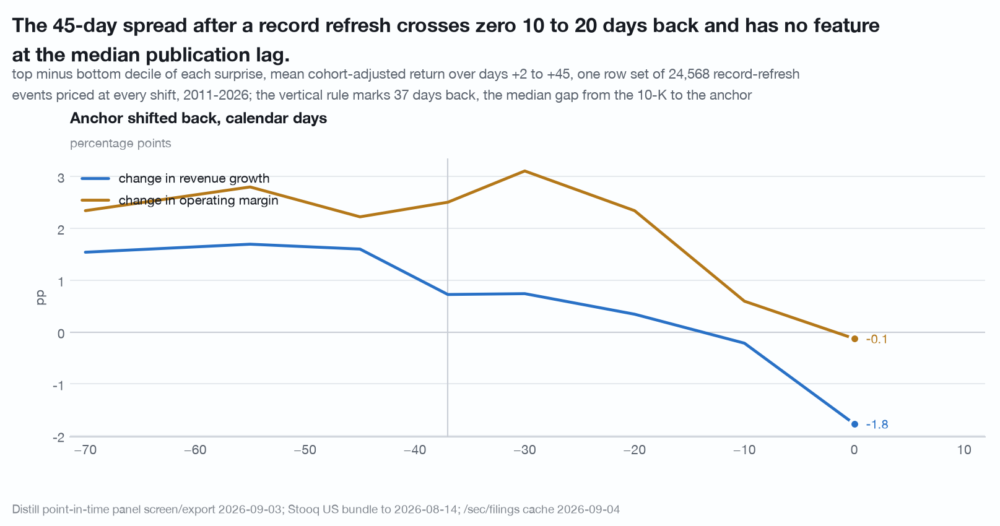
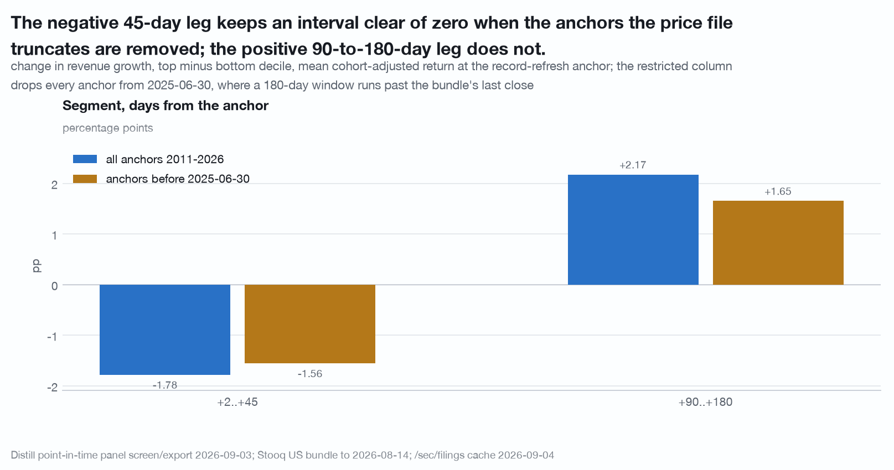
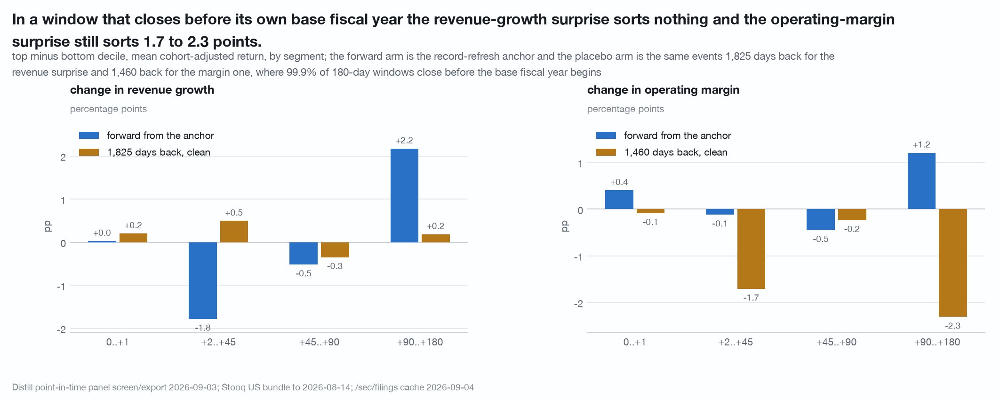

# After a weak revenue print enters the record: the 45 days that follow carry a -1.78pp top-minus-bottom decile spread (n = 24,589 events, 2,699 firms, 2011-2026)

One question, one number, and six checks that bound it. At the quarter end
where a fiscal year first enters the point-in-time record, does a change in the
filed accounting series sort the market-adjusted return that follows, and where
is that return relative to the annual report's publication?

The answer is one small negative leg. Cutting deciles of the change in revenue
growth inside each anchor cohort, the top decile's mean cohort-adjusted return
over days +2 to +45 runs **1.78 percentage points below the bottom decile's**,
[-3.54, -0.15], over 24,589 record-refresh events from 2,699 firms, 2011-2026.
The sign says the decile whose revenue growth decelerated most ran ahead of the
decile whose revenue growth accelerated most over that window, and nothing more
than that.

"Enters the record" is a statement about a date on a panel row and not about
cause. This is a descriptive association over cohorts. Nothing here identifies a
direction of causation, and no sentence here is about where any price goes next.
In particular the leg is **not** dated to the publication of the report: the
section on the shift curve is the evidence that it is not.

Data vintage: Distill `screen/export` point-in-time panel of 2026-09-03 (rows
2009-06-30 to 2026-06-30), `/api/v1/sec/filings` 10-K rows cached 2026-09-04,
joined to a Stooq US daily bundle through 2026-08-14. Reproduce with
`./.venv/bin/python research/quarterly-drift-v2/study.py` from the repository
root. The script is held by the publisher and available on request. It makes no API call: the client's `get`, `post`, `request`, `get_paged`
and `download` are replaced with a raiser before any toolkit module is imported,
so no number here can reach the network.

A pre-registration fixed eleven tables, the estimator and two decision rules
before any outcome statistic was computed.

**What these got wrong.** [CORRECTIONS.md](../CORRECTIONS.md) is the
repository's dated log of numbers, helpers and caveats that did not survive an
adversarial re-run. A number that appears there is superseded wherever else it
appears, including here.

## Coverage, and the denominator that matters

The quarterly universe is every panel row that is `is_listed_equity`, has
`revenue > 0`, and carries a ticker resolving to exactly one CIK across the
export: **190,586 quarter-end snapshots over 6,103 CIKs and 6,191 tickers**.

- **Stooq match rate: 66.34%** of those snapshots have a ticker with a series at
  all.
- **62.84%** also have a close within 14 days before the snapshot, which is the
  entry test a forward path needs.
- **2,937 of 6,191 distinct tickers carry no price series at all.**

By year the usable-entry rate runs 44.33% in 2012, 51.94% in 2016, 66.03% in
2020, 79.92% in 2024 and 87.95% in 2026. That is the shape of a current-listings
file, which deletes what stopped trading rather than ending its series, and not
a coverage improvement. **Every spread below is computed on the surviving two
thirds and is a floor**, and nothing in this data bounds by how much. The match
rate inside the priced frame is 100% by construction and is not a result
([docs/traps.md](../docs/traps.md) trap 9).

## The asset the study is computed on

`cache/research/quarterly-drift/paths_q.parquet` is **119,765 priced quarterly
snapshots over 3,092 CIKs**, one row per (CIK, quarter end) that passes the
14-day entry test, with cumulative price returns `r_1..r_24` and market-adjusted
`x_1..x_24`. The adjustment is the **median return of the same-quarter cohort of
priced rows** and nothing else, so it is a cross-sectional adjustment on the
quarter grid rather than a benchmark subtraction. Censoring runs by date, so a
cohort median at the file's right edge is not taken over a surviving subset of
its own quarter.

It was rebuilt rather than trusted, in
`research/review-quarterly-drift/study.py`. A 500-row sample rebuilt straight from the Stooq text files, without the toolkit's
own reader, matches `r_3` and `r_12` at **0.00e+00** on 489 and 461 priced
pairs, agrees with the file's NaN pattern on 100% of rows, and reproduces the
14-day entry test on all 500. The market-adjustment identity, `x_k` equals `r_k`
minus the median `r_k` of its own quarter end, holds at **0.00e+00 on all
119,765 rows**, and four cohorts rebuilt end to end give medians identical to
six decimals. The universe rebuilds to the row, at 190,586 snapshots against the
coverage file's 190,586, and the file carries no duplicate (CIK, as-of date) or
(ticker, as-of date) pair.

Two caveats travel with it. **11,193 rows** have a twelve-month horizon past the
bundle's last close and none of them carries a number, which is the behaviour
claimed; but **14 rows, 0.012% of the file**, run past their own ticker's last
close and are priced 5 to 43 days early by the builder's 45-day slack. And
**2,611 of 30,733 priced refresh anchors, 8.50%, are the firm's own first row in
the panel**, where the record did not refresh: the firm arrived. That second
caveat is measured below and does not bind.

Rebuild it with `./.venv/bin/python research/quarterly-drift/build_paths_q.py`,
which reads `cache/panel.csv` and the Stooq bundle and makes no API call.

---

## 1. One small negative leg

Anchors are R, the record refresh: the first quarter end at which a
`(cik, fiscal_year)` pair appears in the point-in-time panel, 2011 to 2026. Two
surprises: `s_rev`, the change in revenue growth over three consecutive fiscal
years on file, and `s_opm`, the change in operating margin over two, both inside
plus or minus 100%. Both are changes in a filed accounting series against the
prior year on file, with no expectation subtracted. Four contiguous
non-overlapping segments, each compounded off its own start price
([docs/traps.md](../docs/traps.md) trap 17): days 0..+1 on trading days, then
+2..+45, +45..+90 and +90..+180 on calendar days. A segment whose endpoint falls
after the ticker's last close is NaN, never truncated to the last close.

Deciles are cut within the anchor cohort on ranks; the outcome is the segment
return minus the cohort median; the statistic is the top decile mean minus the
bottom decile mean; the interval is a 400-draw CIK-cluster bootstrap. The two
market adjustments available, the cohort median and SPY over identical dates,
agree to **0.017pp** on the largest of the eight cells, so the tables quote the
cohort version.

| segment | change in revenue growth | n / firms | change in operating margin | n / firms |
|---|---|---:|---|---:|
| days 0..+1 | +0.03pp [-0.29, +0.33] | 24,597 / 2,699 | +0.41pp [+0.17, +0.68] | 25,517 / 2,630 |
| days +2..+45 | **-1.78pp [-3.54, -0.15]** | 24,589 / 2,699 | -0.12pp [-1.58, +1.39] | 25,509 / 2,629 |
| days +45..+90 | -0.52pp [-1.63, +0.55] | 24,420 / 2,690 | -0.45pp [-1.41, +0.48] | 25,343 / 2,620 |
| days +90..+180 | +2.17pp [+0.31, +4.23] | 22,438 / 2,608 | +1.21pp [-0.62, +3.09] | 23,483 / 2,521 |

The one cell that clears every pre-registered test is the revenue-growth
surprise over days +2..+45. Against a **firm-clustered shuffle**, which moves a
surprise to another firm at the same anchor, **0.5% of 200 draws** reach or pass
it; against a **within-firm shuffle**, which permutes a firm's own surprises
across its own anchors and so keeps every firm-level property while destroying
the timing, **0.5% of 200 draws** do. Deciles are recut inside every draw.

Four sensitivities, none of which moves it far.

- **Split in half**: -1.73pp [-3.21, -0.13] on 6,525 anchors from 2011 to 2017
  and -1.79pp [-4.09, +0.30] on 18,064 anchors from 2018 to 2026. The same point
  estimate, and an interval that covers zero in the larger half.
- **Right-edge removed**: on anchors before 2025-06-30, where no segment is lost
  to the bundle's last close, -1.56pp [-3.02, -0.12] on 21,932 events over 2,585
  firms.
- **Restatement lookahead**: the surprise is built from the last panel value of
  each fiscal year, which on a point-in-time panel can be a restated one. Revenue
  moves more than 1% between first and last serving on 0.84% of 51,785 (CIK,
  fiscal year) pairs. Rebuilt from **first-served** values the cell moves
  **0.19pp**, to -1.59pp, with a Spearman of 0.984 between the surprise and its
  first-served twin; the largest movement over all eight cells is 0.25pp.
- **First panel rows**: dropping the 8.50% of refresh anchors that are the firm's
  own first panel row moves the cell by **0.00pp**, because **0 of those 2,611
  rows carry either surprise**. A firm's first panel row has no prior fiscal year
  on file, so it was never in a cell.

## 2. The leg is not dated to publication

The 10-K sits a median of **37 days before** the refresh anchor (p10 21, p90 52,
n = 677 filings over 244 firms, 2024-01-24 to 2026-06-26); on a separate join of
679 such pairs over 244 CIKs, printed by `research/review-direction/study.py`,
99.0% of anchors fall after the filing. The sign flip between the unshifted
anchor and an anchor shifted back 37 days is **not** evidence that the negative
leg sits after publication.

Holding one row set of **24,568 events priced at every one of eight shifts**,
days +2..+45, top minus bottom decile, cohort-adjusted:

| anchor shifted back, calendar days | 0 | 10 | 20 | 30 | 37 | 45 | 55 | 70 |
|---|---|---|---|---|---|---|---|---|
| change in revenue growth | **-1.77** | -0.22 | +0.34 | +0.74 | +0.72 | +1.60 | +1.69 | +1.54 |
| change in operating margin | -0.13 | +0.59 | +2.34 | +3.11 | +2.50 | +2.22 | +2.80 | +2.34 |

Percentage points. The revenue surprise changes sign between 10 and 20 days of
shift and the margin surprise between 0 and 10; both are flat from 45 to 70 days
back. **Nothing happens at 37.** The value there, +0.72pp on the revenue
surprise, sits between its neighbours at 30 (+0.74) and 45 (+1.60), so a window
starting two days after the median publication date is not distinguishable from
one starting 33 days before it. The flip is a smooth function of where the
window is placed and is not dated by the report.

The only arm that carries real publication dates disagrees with the proxy in
sign. At the 10-K `filedAt` itself, deciles of about 64 filings cut within the
filing year, days +2..+45 is **-3.61pp [-8.02, +0.38]** on the revenue surprise,
n = 642 over 236 firms, and -2.97pp [-8.37, +1.26] on the margin one, n = 644
over 239. That is the sign of the **unshifted** refresh anchor and the opposite
of the 37-day shift's +0.72pp. **Fifteen of the sixteen decile and quintile
intervals in that arm cross zero**, so it cannot confirm or refute the refresh
arm at this n; what it carries is a sign, and it is not the proxy's.

## 3. The positive 90-to-180-day leg is not established

The +90..+180 segment loses **2,475 of 30,720 priced events, 8.06%**, and 100%
of the losses are anchored 2025-06-30 or later, where a 180-day window runs past
the bundle's last close.

| anchor set | days +2..+45 | days +90..+180 | n / firms |
|---|---|---|---:|
| all anchors 2011-2026 | -1.78pp [-3.54, -0.15] | +2.17pp [+0.31, +4.23] | 24,589 / 2,699 and 22,438 / 2,608 |
| anchors before 2025-06-30 | -1.56pp [-3.02, -0.12] | **+1.65pp [-0.30, +3.46]** | 21,932 / 2,585 |
| anchors 2018 to 2025-06-29 | -1.48pp [-3.35, +0.46] | +1.93pp [-0.94, +4.37] | 15,407 / 2,567 |

On a row set where every event has both segments, the negative leg's interval
excludes zero and the positive leg's does not. The positive leg is reported as
**not established**.

## 4. Three clearing cells against a calibrated chance of 0.43

Eight distinct cells sit at the refresh anchor, two surprises by four segments.
Three of them clear both shuffled nulls at 5%: the revenue surprise over days
+2..+45 (0.5% and 0.5%), the revenue surprise over days +90..+180 (0.5% and
0.0%), and the margin surprise over days 0..+1 (0.0% and 1.5%). The other five
do not.

Standing a shuffled draw in for the data and scoring it against both nulls the
same way, over 200 draws, the number of cells clearing by chance has **mean 0.43
of 8, standard deviation 0.63, 5th to 95th percentile [0, 2] and a maximum of 2.
No draw of 200 produced three.** 35.5% of draws produce at least one clearing
cell, so a single clearing cell anywhere carries close to no information, and
three at one anchor is outside the calibrated null. Over the whole reported
family of 32 spreads across four anchors a nominal 5% rate gives 1.6 expected
false cells with a binomial 95% interval of [0, 4].

That is why the negative leg is not read as a multiplicity artefact. The
calibration is an exceedance below 0.5% on 200 draws and not a p-value.

## 5. A clean date placebo, and the surprise it removes

A window is clean for a surprise only if it closes before the earliest fiscal
year that surprise reads begins. A year labelled Y ends inside calendar year Y
and so begins no earlier than 1 January of Y-1, which makes a 180-day window
closing before 1 January of Y-1 clean by construction. Placebos at 365 and 730
days back sit inside those years and are not nulls.

| placebo | clean share | days 0..+1 | days +2..+45 | days +45..+90 | days +90..+180 | n / firms |
|---|---:|---|---|---|---|---:|
| revenue surprise, anchor -1,825 days | 99.9% | +0.20 [-0.22, +0.59] | +0.50 [-0.93, +2.00] | -0.35 [-1.32, +0.62] | +0.19 [-1.53, +1.63] | 21,855 / 2,390 |
| margin surprise, anchor -1,460 days | 99.9% | -0.09 [-0.39, +0.21] | **-1.71 [-3.39, -0.23]** | -0.24 [-1.28, +0.78] | **-2.31 [-4.01, -0.56]** | 23,026 / 2,422 |
| margin surprise, anchor -1,825 days | 100.0% | -0.08 [-0.57, +0.30] | -0.39 [-1.86, +1.21] | -1.36 [-3.08, +0.23] | **-2.34 [-4.32, -0.53]** | 22,099 / 2,257 |

**The revenue-growth surprise, which carries the one leg reported here, sorts
nothing in all four segments of a window that closes four to five years before
its own base fiscal year.** The operating-margin surprise sorts -1.7 to -2.3
points there. A sort that separates returns five years before the years it is
computed from is a persistent firm-type property and not a dated association, so
**every operating-margin cell is dropped from the headline**, including its
+0.41pp two-day reaction, which is one of the three cells that clears both
shuffles.

## 6. The anchor swap: real over 45 days, a row-set difference over 180

**21,091 (CIK, fiscal year) pairs** are priced at both the 31 December anchor and
the record-refresh anchor and carry both surprises.

| segment | surprise | December | refresh | n December / refresh |
|---|---|---|---|---:|
| days +2..+45 | revenue growth | -0.60pp [-2.03, +0.79] | -1.45pp [-2.98, -0.00] | 21,070 / 21,004 |
| days +2..+45 | operating margin | -2.60pp [-4.00, -1.20] | -0.54pp [-1.80, +0.80] | 21,070 / 21,004 |
| days +90..+180 | revenue growth | +0.87pp [-0.86, +2.61] | +1.94pp [+0.44, +3.75] | 21,051 / 20,985 |
| days +90..+180 | operating margin | +2.28pp [-0.16, +4.66] | +2.01pp [-0.10, +4.06] | 21,051 / 20,985 |

Over days +2..+45 which surprise carries the leg does change with the anchor.
Over days +90..+180 it does not: the margin surprise is +2.28pp at December and
+2.01pp at the refresh anchor on the same rows, two overlapping intervals,
against the +1.21pp the same cell reads on the study's own larger frame. **The
apparent loss of that leg at the refresh anchor is a row-set difference and not
an anchor difference.** On this restricted row set the headline cell is -1.45pp
with an upper end of -0.00pp, which is the same cell measured on 3,585 fewer
rows.

## One consistency check, and what it is not

Median absolute daily abnormal return versus SPY on a 10-K filing day, divided
by its median over the quiet offsets (absolute offset at least 6) inside
-70..+20, is **1.67x [1.44, 1.87] on 675 events over 243 firms**. That sits
beside the 1.68x reported in [findings/what-moves.md](what-moves.md). It is not
a second measurement: **all 660** of that study's events are inside this event
set, 100% of that set and 97.8% of this one, the ratio on the shared 660 is
1.68x, and the 15 events this arm adds give 1.21x, which is the whole of the
difference between the two published figures. Two code paths agreeing on one
event set is worth having and is not independent confirmation.

---

## What would break it

- **One leg carries the study.** Its interval's upper end is -0.15pp on the full
  anchor set and -0.12pp on the right-edge-restricted one, and it covers zero on
  the 2018-2026 half alone. A different decile rule, a different cohort key, or
  one more year of prices could move it across zero.
- **The unpriced third.** 33.66% of quarterly snapshots carry no series and
  37.16% no usable entry price, and 2,937 of 6,191 tickers are absent entirely.
  Every number here is a survivor's number and a floor.
- **The match rate is time-varying**, 44.33% usable entry in 2012 against 87.95%
  in 2026, so the two eras in the halves test are not two draws from one
  population.
- **The exact-date arm is one regime**: 677 filings over 244 firms, all
  2024-2026, from a `/sec/filings` corpus whose floor is January 2024, and its
  tickers are the ones a prior sweep chose rather than a random sample.
- **200 shuffle draws** bound the family-wise calibration loosely. "No draw of
  200 reached three" is an exceedance below 0.5%, not a p-value.
- **Placebo cleanliness is inferred from a fiscal-year label**, not from a period
  end, because the panel carries no period end. A filer whose label is offset
  from its period-end year by one would have some windows counted clean that are
  not.
- **The clean placebo changes the sample.** It needs a price series 1,825 days
  before the anchor, so it runs on 21,855 rows over 2,390 firms and tilts toward
  older listings.
- **The anchor is a quarter-grid construction.** The +37-day median gap from the
  10-K is validated on 677 filings from 2024-2026 and on nothing earlier.
- **The surprise is not a surprise against an expectation.** It is the change in
  a filed accounting series against the prior year on file, on a corpus where
  most headline numbers were published in an earnings release days before the
  10-K, and there is no point-in-time consensus in this data to difference
  against.
- **The surprise mixes economics with restatement.** The first-served rebuild
  bounds the restatement part at 0.25pp per cell; it does not separate the two.
- **Price returns only, no dividends**, everywhere.

## Limits of the data as published

The panel row carries no filing date and no period end for the annual block, so
neither of the two things this study most needs to know can be read off it: where
publication sits relative to the anchor has to be reconstructed by a shift curve,
and whether a placebo window is clean has to be inferred from a fiscal-year
label, which a filer whose label is offset by one year would defeat. Real
publication dates exist only from January 2024 onward, two and a half years
against the fifteen the refresh anchor spans, and over that short arm they
disagree in sign with the proxy that stands in for them. Nothing in this data is
a consensus expectation, so the sort here is a change in a filed accounting
series against the prior year on file rather than a surprise, on a corpus where
most headline numbers were published in an earnings release days before the 10-K.
First-served and last-served values per (CIK, fiscal year) are not served side by
side, so the restatement exposure has to be rebuilt by grouping the whole panel
twice; it bounds at 0.25pp per cell and it does not separate economics from
restatement. And the price file is a current-listings bundle with no dividends
and no delisted issuers, which is what makes the unpriced third unbounded rather
than measurable.

## Disclosure

No company is named.

Distill Markets Pty Ltd, the publisher of this repository, operates the paid data
service this study uses. Authors and the publisher may hold positions in
securities of the kind described. Everything above is general information derived from
public SEC filings and from a price file the author holds. It is not financial
product advice, does not consider your objectives, financial situation or needs,
and past patterns do not guarantee future results. See [NOTICE](../NOTICE).
