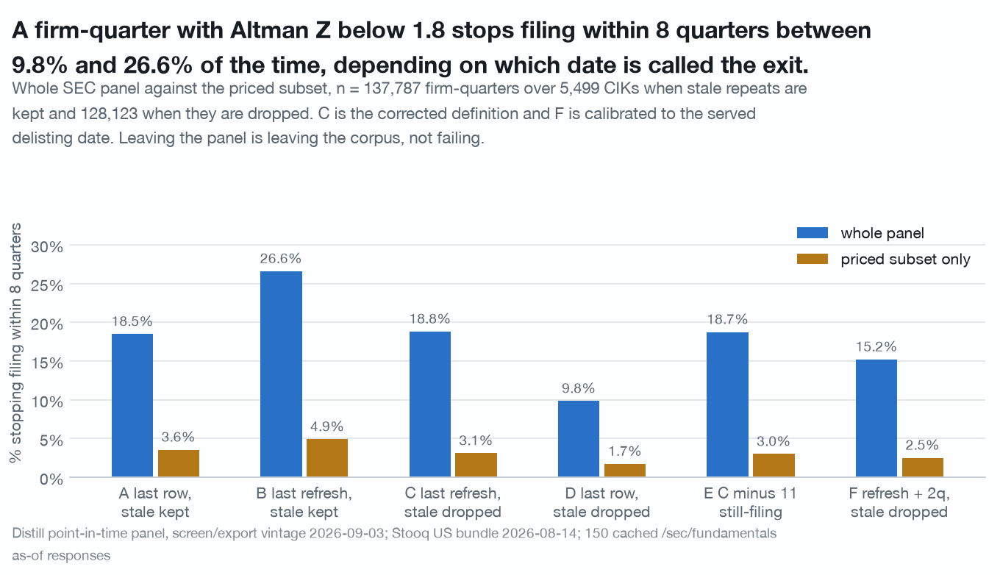
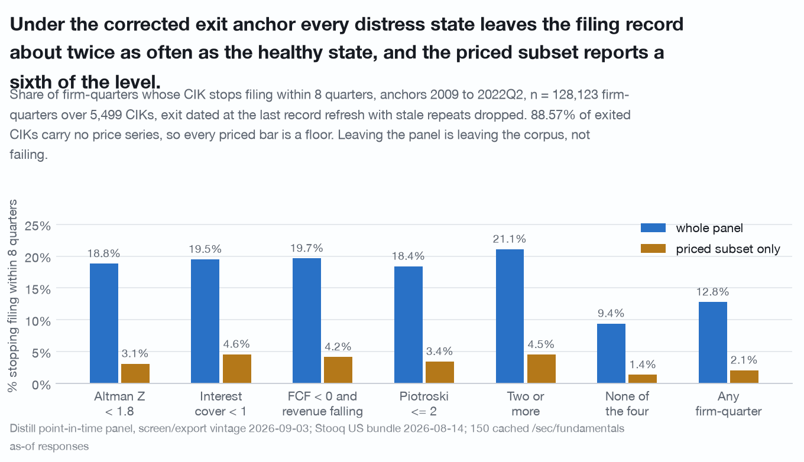
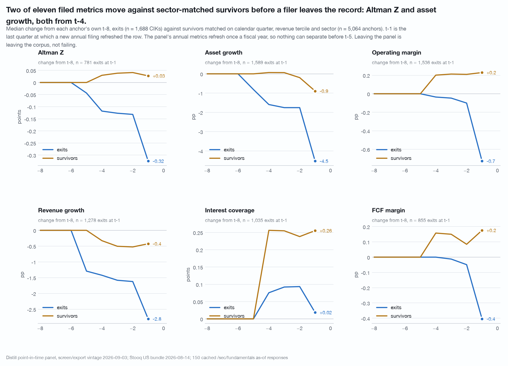
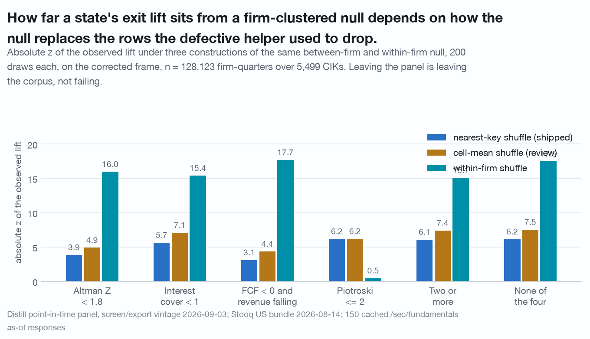

# What the record shows before a company stops filing: 2,555 of 6,103 CIKs leave the panel, and a distressed firm-quarter's exit rate is a range from 9.83% to 26.60% depending on which date is called the exit

Distill's point-in-time panel carries one row per filer per quarter. A CIK that
stops appearing has left the filing record, and the panel's last row for it is
the closest thing the data holds to an exit date. This document is about how
often a firm-quarter in an observable distress state precedes such an exit, how
far that number moves when the exit date is defined differently, which filed
metrics separate from matched survivors before the record goes stale, and which
of those results clear a placebo.

**Leaving the panel is leaving the corpus, not failing: acquisition, going
private, deregistration, exchange deficiency and bankruptcy arrive as one event.
That sentence belongs on every table in this document, and it is repeated under
each one.**

Data vintage: Distill `screen/export` panel of 2026-09-03, final quarter
2026-06-30, 206,957 rows; Stooq US daily bundle through 2026-08-14, used only to
mark a ticker priced or not; 150 cached `/sec/fundamentals/{t}/as-of/2026-09-03`
responses from 2026-09-04 for the `delistedAt` probe. Reproduce with
`./.venv/bin/python research/pre-exit-signature-v2/study.py` from the repository
root. Claims that did not survive an adversarial re-run are recorded in
[CORRECTIONS.md](../CORRECTIONS.md) entries 16 to 19 and are not restated here
except where a withdrawal is itself the finding.

**No return is computed anywhere in this study, so there is nothing to
market-adjust.** The only price-derived quantity is the match rate.

## Universe, and the match rate on the honest denominator

Panel rows with `is_listed_equity`, `revenue > 0`, and a ticker mapping to
exactly one CIK anywhere in the export: **190,586 firm-quarters over 6,103
CIKs**, 2009Q2 to 2026Q2. A CIK exits when its last panel row is at least eight
quarters before the panel's final quarter: **2,555 exits, 41.86% of CIKs**,
3,548 still present.

| denominator | n | with a Stooq series |
|---|---|---|
| firm-quarters | 190,586 | 66.34% |
| distinct CIKs | 6,103 | 53.22% |
| **exited CIKs** | **2,555** | **11.43%** |
| unpriced CIKs that exited | 2,855 | 79.26% |

**88.57% of exited CIKs carry no price series at all.** Every priced-subset
number below is a floor computed on a nine-in-ten-missing denominator, and
nothing in this data bounds by how much. This is the same join and the same
bundle as [ghost-cohort.md](ghost-cohort.md), read on a quarterly rather than a
December frame.

## The export's last row is a staleness drop, not a filing date

Exits run at roughly 200 a year from 2013 on: 230, 224, 183, 213, 219, 190, 196,
214, 190, 192, 226, 224 for panel-drop years 2013 to 2024, with 2011 (8) and
2012 (46) inside the panel's coverage ramp. The drop dates cluster:

| drop quarter | Q1 | Q2 | Q3 | Q4 |
|---|---|---|---|---|
| exits | 195 | 1,860 | 137 | 363 |

**72.8% of drops fall in a June quarter.** The gap between the last record
refresh, meaning the first quarter carrying a CIK's final fiscal year, and the
drop is a **median 5 quarters** for exits (mean 4.57, IQR 4 to 5) against a
median 1 for CIKs still present, and **74% of exits carry a last row whose
`as_of` year is two years past its `fiscal_year`**. The shape is a retention
rule, not an event.

A bounded probe of 150 sampled exited CIKs, at most one call each, all cached,
reads the API's own `delistedAt`:

| probe result | count | share |
|---|---|---|
| resolve to the panel's own CIK | 141 of 150 | 94.0% |
| resolve to another CIK (ticker recycling) | 9 of 150 | 6.0% |
| carry a `delistedAt` | 130 of 141 | 92.2% |
| panel last row **follows** `delistedAt` | 121 of 130 | 93.1% |
| last record refresh **precedes** `delistedAt` | 122 of 130 | 93.8% |
| carry no `delistedAt` | 11 of 141 | 7.8% |
| of those, still filing (annual dated 2026-02-27 or later) | 8 of 141 | 5.7% |

The panel's last row follows the served `delistedAt` by a **median +2.92
quarters** (IQR +2.00 to +4.22); the last record refresh precedes it by a median
1.83 quarters (IQR +0.71 to +3.00). The binomial 95% interval on 11 of 141 is
roughly +/- 4.4pp. The probe reads a date and never a reason.

*Leaving the panel is leaving the corpus, not failing.*

## The base rate is a range, because the exit anchor is a choice

Six exit definitions run side by side on the same universe. `fresh_qi` is the
last quarter at which a new annual filing refreshed the row; `last_qi` is the
last panel row, which is the staleness drop above. Rows after `fresh_qi` are
stale repeats of a filing already on file.

| tag | anchor | rows after `fresh_qi` | n |
|---|---|---|---|
| A | last panel row | kept | 137,787 over 5,499 CIKs |
| B | last record refresh | kept | 137,787 over 5,499 CIKs |
| **C** | **last record refresh** | **dropped** | **128,123 over 5,499 CIKs** |
| D | last panel row | dropped | 128,123 over 5,499 CIKs |
| E | C minus the 11 probe CIKs with no `delistedAt` | dropped | 128,010 over 5,488 CIKs |
| F | last refresh + 2 quarters (probe-calibrated) | dropped | 128,123 over 5,499 CIKs |

The stale repeats are not neutral. **9,664 of frame A's rows (7.01%) fall after
their CIK's last record refresh, all 9,664 belong to an exiting CIK and none to
a survivor.** In the Altman cell those repeats are 9.6% of 27,919 rows and
**51.9% of the 5,161 rows labelled as exiting under anchor A, 100.0% of them
positive by construction.**

Share of firm-quarters in each state whose CIK stops filing within eight
quarters, **whole panel**. *Leaving the panel is leaving the corpus, not
failing.*

| state | n (A, B) | n (C, D, F) | A | B | **C** | D | E | F |
|---|---|---|---|---|---|---|---|---|
| Altman Z < 1.8 | 27,919 | 25,240 | 18.49% | 26.60% | **18.81%** | 9.83% | 18.74% | 15.21% |
| interest coverage < 1 | 31,604 | 28,422 | 19.59% | 27.60% | **19.50%** | 10.58% | 19.38% | 15.77% |
| FCF margin < 0 and revenue falling | 8,293 | 7,623 | 17.87% | 26.14% | **19.65%** | 10.65% | 19.66% | 15.77% |
| Piotroski <= 2 | 17,472 | 15,824 | 18.59% | 26.10% | **18.40%** | 10.11% | 18.38% | 14.89% |
| two or more of the four | 22,156 | 19,880 | 20.48% | 29.20% | **21.09%** | 11.37% | 21.01% | 17.03% |
| none of the four | 81,292 | 76,820 | 10.00% | 14.40% | **9.42%** | 4.76% | 9.40% | 7.52% |
| any firm-quarter | 137,787 | 128,123 | 13.21% | 18.90% | **12.79%** | 6.66% | 12.75% | 10.27% |

**Priced subset only**, same cells on the priced denominator (13,122 of 25,240
in the Altman cell under C; 82,610 of 128,123 overall). *Leaving the panel is
leaving the corpus, not failing.*

| state | A | B | **C** | D | E | F |
|---|---|---|---|---|---|---|
| Altman Z < 1.8 | 3.55% | 4.91% | **3.10%** | 1.72% | 3.00% | 2.51% |
| interest coverage < 1 | 4.65% | 6.63% | **4.59%** | 2.57% | 4.38% | 3.68% |
| FCF margin < 0 and revenue falling | 3.16% | 5.47% | **4.17%** | 1.82% | 4.08% | 2.96% |
| Piotroski <= 2 | 3.93% | 5.20% | **3.44%** | 2.16% | 3.38% | 2.89% |
| two or more of the four | 4.53% | 6.55% | **4.54%** | 2.47% | 4.36% | 3.60% |
| none of the four | 1.62% | 2.20% | **1.36%** | 0.79% | 1.36% | 1.11% |
| any firm-quarter | 2.33% | 3.22% | **2.08%** | 1.18% | 2.04% | 1.68% |

Firm-clustered 95% intervals under C: Altman Z < 1.8 whole panel 18.81%
[17.63, 20.11] and priced 3.10% [2.33, 3.74]; any firm-quarter 12.79%
[12.28, 13.31] and 2.08% [1.82, 2.36].

The headline, with C as the corrected reference and F as the probe-calibrated
point:

> A firm-quarter with an Altman Z below 1.8 stops filing within eight quarters
> **between 9.83% and 26.60% of the time across four defensible exit definitions
> (A to D), 18.81% under the corrected definition C, and 15.21% under the
> probe-calibrated definition F**, on n = 25,240 to 27,919 firm-quarters. The
> priced subset reports 1.72% to 4.91% for the same cell.

The two corrections cancel. Re-anchoring on the last record refresh alone moves
the Altman cell **+8.12pp**; dropping the stale repeats alone moves it
**-8.65pp**; doing both moves it **+0.33pp**. A study that fixed only one of the
two would have published a number 8pp wrong while looking like it had improved
its method.

### What survives the anchor

**Ordering** holds in all six definitions: every distress state sits above the
healthy state, whole panel and priced subset. **Lift over the healthy state**
for the Altman cell is 1.85x (A), 1.85x (B), 2.00x (C), 2.07x (D), 1.99x (E),
2.02x (F), so the relative statement is stable across a range that moves the
level by a factor of 2.7. The **whole-panel over priced ratio** for the Altman
cell is 5.20x, 5.42x, 6.06x, 5.71x, 6.25x, 6.07x, and across the states under C
it runs **4.25x to 6.90x**, with the largest ratio on the healthiest state.

Horizon sweep, anchor A against corrected C, whole panel / priced subset.
*Leaving the panel is leaving the corpus, not failing.*

| h | state | n (C) | anchor A | corrected C |
|---|---|---|---|---|
| 4 | Altman Z < 1.8 | 28,371 | 10.40% / 2.09% | 11.05% / 1.75% |
| 4 | two or more of the four | 22,137 | 11.68% / 2.57% | 12.69% / 2.55% |
| 4 | any firm-quarter | 140,780 | 7.68% / 1.40% | 7.52% / 1.24% |
| 8 | Altman Z < 1.8 | 25,240 | 18.49% / 3.55% | 18.81% / 3.10% |
| 8 | two or more of the four | 19,880 | 20.48% / 4.53% | 21.09% / 4.54% |
| 8 | any firm-quarter | 128,123 | 13.21% / 2.33% | 12.79% / 2.08% |
| 12 | Altman Z < 1.8 | 22,284 | 25.94% / 5.05% | 26.11% / 4.38% |
| 12 | two or more of the four | 17,602 | 28.76% / 6.73% | 28.75% / 6.36% |
| 12 | any firm-quarter | 115,800 | 18.24% / 3.16% | 17.54% / 2.80% |

Out of sample, splitting anchors at the median year, h = 8, whole / priced.
*Leaving the panel is leaving the corpus, not failing.*

| split | state | n (C) | anchor A | corrected C |
|---|---|---|---|---|
| 2009-2015 | Altman Z < 1.8 | 8,657 | 17.91% / 3.97% | 19.08% / 3.76% |
| 2009-2015 | two or more of the four | 6,625 | 21.54% / 4.09% | 23.03% / 4.95% |
| 2009-2015 | any firm-quarter | 52,021 | 12.79% / 2.24% | 13.04% / 2.20% |
| 2016-2022 | Altman Z < 1.8 | 16,583 | 18.78% / 3.38% | 18.67% / 2.84% |
| 2016-2022 | two or more of the four | 13,255 | 19.95% / 4.69% | 20.12% / 4.38% |
| 2016-2022 | any firm-quarter | 76,102 | 13.49% / 2.39% | 12.61% / 2.01% |

Every state keeps its sign and its order in both halves under both anchors.

### The still-filing bound

The probe says 7.8% of sampled exits carry no served `delistedAt` and 5.7% still
file. Applied two ways on frame C (n = 128,123). *Leaving the panel is leaving
the corpus, not failing.*

| application | Altman Z < 1.8 | two or more | none of the four | any firm-quarter |
|---|---|---|---|---|
| C, as published | 18.81% | 21.09% | 9.42% | 12.79% |
| minus the 11 named probe CIKs (definition E) | 18.74% (-0.070pp) | 21.01% | 9.40% | 12.75% (-0.035pp) |
| minus 7.8% of exit CIKs at random, 200 draws | **17.36% +/- 0.161** | 19.46% +/- 0.187 | 8.68% +/- 0.061 | **11.79% +/- 0.036** |

Eleven CIKs are 0.4% of the 2,555 exits, so a named-CIK drop cannot carry the
probe's rate and the rate has to be applied as a bound. **The bound costs the
Altman cell about 1.45pp and the unconditional rate about 1.00pp**, which is
small next to the 2.7-fold anchor range and is not this study's main
uncertainty.

## The sector-matched signature is a level, not a slope, on seven of eleven

Each exit with eight quarters of history before its anchor (**1,688 CIKs**) is
matched to three survivor firm-quarters from the same calendar quarter, the same
revenue tercile and the same sector: **5,064 control anchors over 1,914 CIKs, 0
exits unmatched**. Adding sector costs nothing in unmatched exits and drops the
sector total-variation distance between the cohorts from **0.107 to 0.000**.
Intervals are a firm-clustered bootstrap, 300 draws.

Median gap at t-8 and t-1, exits minus matched survivors, sector in the cell.
`at t-8` is the share of the t-1 gap already on file two years out. *Leaving the
panel is leaving the corpus, not failing.*

| metric | gap at t-8 | gap at t-1 | at t-8 | n exit / control at t-1 |
|---|---|---|---|---|
| revenue growth | -0.025 [-0.035, -0.011] | -0.031 [-0.042, -0.023] | 83% | 1,631 / 4,992 |
| operating margin | -0.037 [-0.044, -0.028] | -0.048 [-0.058, -0.039] | 77% | 1,615 / 4,936 |
| FCF margin | -0.029 [-0.037, -0.021] | -0.025 [-0.035, -0.017] | 115% | 1,050 / 3,239 |
| interest coverage | -1.707 [-2.146, -1.202] | -2.340 [-3.053, -1.817] | 73% | 1,169 / 3,439 |
| Altman Z | -1.661 [-2.171, -1.272] | -1.919 [-2.329, -1.449] | 87% | 909 / 3,075 |
| Piotroski F | -0.258 [-0.384, -0.150] | -0.356 [-0.480, -0.234] | 72% | 1,467 / 4,402 |
| M-Score (5 var) | +0.001 [-0.033, +0.031] | -0.040 [-0.070, -0.004] | -2% | 1,476 / 4,428 |
| accruals ratio | -0.012 [-0.018, -0.005] | -0.016 [-0.025, -0.009] | 75% | 1,154 / 3,463 |
| asset growth | -0.024 [-0.033, -0.013] | -0.045 [-0.056, -0.036] | 53% | 1,673 / 5,034 |
| net dilution | +0.001 [-0.000, +0.003] | +0.001 [-0.000, +0.003] | 105% | 1,186 / 3,611 |
| DSO | +0.589 [-1.886, +3.118] | -2.135 [-5.084, +0.444] | -28% | 1,442 / 4,467 |

**Most of the gap is already on file two years out on seven of the eleven
metrics, at 72% to 115%.** Those seven are revenue growth, operating margin, FCF
margin, interest coverage, Altman Z, Piotroski F and the accruals ratio. Under
the tercile-only cell those same seven sit inside 80% to 105%; with sector in
the cell the band widens to 72% to 115% and only **2 of 11** metrics stay inside
80% to 105%. The direction survives sector matching; the tight band does not.

Difference in differences, each anchor's change from its own t-8, exits minus
controls, sector in the cell. A star means the 95% interval excludes zero.
*Leaving the panel is leaving the corpus, not failing.*

| metric | first separating quarter | t-4 | t-1 | n exit / control at t-1 |
|---|---|---|---|---|
| revenue growth | **t-5** | -0.011* | -0.024* | 1,278 / 4,120 |
| Altman Z | **t-4** | -0.148* | **-0.352** [-0.511, -0.177] | 781 / 2,672 |
| asset growth | **t-4** | -0.017* | **-0.036** [-0.053, -0.023] | 1,589 / 4,911 |
| M-Score (5 var) | **t-4** | -0.022* | -0.047* | 1,418 / 4,353 |
| interest coverage | **t-4 (unstable)** | -0.181* | -0.237 [-0.490, +0.015] | 1,035 / 3,141 |
| operating margin | t-3 | -0.002 | -0.010* | 1,536 / 4,794 |
| DSO | t-1 | +0.055 | -0.513* | 1,370 / 4,348 |
| FCF margin | never | -0.002 | -0.006 | 855 / 2,733 |
| Piotroski F | never | -0.086 | -0.091 | 1,405 / 4,308 |
| accruals ratio | never | +0.000 | +0.001 | 956 / 2,968 |
| net dilution | never | +0.000 | +0.001 | 1,008 / 3,231 |

**Altman Z and asset growth separate from t-4 in 5 of 5 control-draw seeds**
(seeds 7, 11, 13, 17, 23; Altman t-1 values -0.352, -0.300, -0.234, -0.309,
-0.317; asset growth -0.036, -0.032, -0.036, -0.036, -0.033).
**Interest coverage separates in only 3 of 5 seeds** (t-4, t-2, never, t-4,
never; t-1 values -0.237, -0.262, -0.148, -0.239, -0.201) and is reported as
unstable rather than as a finding. **FCF margin, Piotroski F, the accruals ratio
and net dilution never separate** under either matching cell. Sector matching
moves interest coverage from never to t-4, operating margin from t-1 to t-3 and
M-Score from t-3 to t-4.

**t-4 is close to the earliest quarter this design can answer.** The statistic is
each anchor's change from its own t-8, and the panel's metrics refresh once a
fiscal year, so that change is exactly zero for most rows early in the window:

| share of rows whose change from t-8 is exactly zero | t-7 | t-6 | t-5 | t-4 |
|---|---|---|---|---|
| Altman Z | 90.2% | 75.3% | 12.8% | 0.8% |
| asset growth | 90.8% | 76.8% | 11.8% | 0.4% |
| operating margin | 90.6% | 76.5% | 11.9% | 0.7% |
| revenue growth | 90.4% | 75.9% | 9.3% | 0.0% |
| Piotroski F | 90.7% | 78.7% | 28.6% | 19.0% |

**Ten of the eleven metrics have a difference in differences of exactly
0.000 [0.000, 0.000] at t-7, and ten of eleven again at t-6.** The early part of
the trajectory is a structural zero produced by annual refresh, not a measured
null ([CORRECTIONS.md](../CORRECTIONS.md) entry 17). "Separates at t-4" means "one
annual filing before the last one on file", and the design cannot resolve finer.

## Placebos: the null is construction-dependent, and one state fails under each frame

The statistic is the **lift**, a state's exit rate minus the exit rate over all
firm-quarters in the same frame. Three constructions of the same null, 200 draws
each, all under a `clustered_shuffle`
that drops no row, so the shuffled and observed rates share a denominator
([CORRECTIONS.md](../CORRECTIONS.md) entries 16 and 18). The **within-firm** null
permutes a firm's own state flag across its own quarters, keeping every
firm-level property and destroying only timing; it does not call
`clustered_shuffle` at all.

Frame A, n = 137,787 firm-quarters over 5,499 CIKs, overall rate 13.21%.
*Leaving the panel is leaving the corpus, not failing.*

| state | n | observed lift | between-firm null | z | x p95 | cell-mean null | z | within-firm null | z |
|---|---|---|---|---|---|---|---|---|---|
| Altman Z < 1.8 | 27,919 | +5.28pp | +1.66 +/- 1.01 | **3.6** | 1.6 | +0.63 +/- 0.91 | 5.1 | +4.10 +/- 0.08 | 14.3 |
| interest coverage < 1 | 31,604 | +6.38pp | +1.46 +/- 0.81 | 6.1 | 2.3 | +0.49 +/- 0.74 | 8.0 | +5.02 +/- 0.08 | 16.4 |
| FCF margin < 0 and revenue falling | 8,293 | +4.67pp | +2.50 +/- 1.34 | **1.6** | **1.0** | +0.88 +/- 1.17 | 3.2 | +1.28 +/- 0.25 | 13.3 |
| Piotroski <= 2 | 17,472 | +5.38pp | -0.20 +/- 0.80 | 6.9 | 3.5 | +0.05 +/- 0.75 | 7.1 | +5.07 +/- 0.16 | **2.0** |
| two or more of the four | 22,156 | +7.27pp | +1.65 +/- 0.99 | 5.7 | 2.2 | +0.61 +/- 0.89 | 7.5 | +5.40 +/- 0.13 | 14.8 |
| none of the four | 81,292 | -3.20pp | -0.70 +/- 0.40 | -6.2 | 2.4 | -0.26 +/- 0.36 | -8.1 | -2.65 +/- 0.04 | -14.7 |

Under the repaired shuffle the observed lifts run **z = 1.6 to 6.9** and clear
the 95th percentile of the absolute shuffled lift by **1.0 to 3.5 times**.
**The state "FCF margin below zero and revenue falling", +4.67pp on 137,787
firm-quarters over 5,499 CIKs, does not clear its between-firm null on frame A**:
z = 1.6, 1.0 times the 95th percentile. The other five clear at 1.6x to 3.5x.
This is [CORRECTIONS.md](../CORRECTIONS.md) entry 19.

Frame C, n = 128,123 firm-quarters over 5,499 CIKs, overall rate 12.79%.
*Leaving the panel is leaving the corpus, not failing.*

| state | n | observed lift | between-firm null | z | x p95 | cell-mean z | within-firm z | within x p95 |
|---|---|---|---|---|---|---|---|---|
| Altman Z < 1.8 | 25,240 | +6.02pp | +1.43 +/- 1.19 | 3.9 | 1.8 | 4.9 | 16.0 | 1.24 |
| interest coverage < 1 | 28,422 | +6.71pp | +1.36 +/- 0.95 | 5.7 | 2.4 | 7.1 | 15.4 | 1.23 |
| FCF margin < 0 and revenue falling | 7,623 | +6.86pp | +2.30 +/- 1.47 | 3.1 | 1.5 | 4.4 | 17.7 | 2.22 |
| Piotroski <= 2 | 15,824 | +5.61pp | -0.15 +/- 0.93 | 6.2 | 3.4 | 6.2 | **0.5** | **0.97** |
| two or more of the four | 19,880 | +8.30pp | +1.52 +/- 1.11 | 6.1 | 2.5 | 7.4 | 15.1 | 1.28 |
| none of the four | 76,820 | -3.37pp | -0.61 +/- 0.45 | -6.2 | 2.6 | -7.5 | -17.5 | 1.20 |

Two things change when the frame is corrected. The FCF-and-falling-revenue state
**clears on frame C** (z = 3.1) where it fails on frame A, because dropping the
stale repeats raises its observed lift from +4.67pp to +6.86pp. **Piotroski <= 2
stops clearing the within-firm null on frame C** (z = 0.5, 0.97 times the 95th
percentile, against z = 2.0 on frame A). **One of the six states fails one of the
three nulls under each frame, and it is a different state in each case.**

The within-firm null is the stronger test and the one that binds, because most of
a state's information is about which firm rather than which quarter: on frame C it
reproduces **+4.70pp of the +6.02pp** Altman lift, **+5.30 of +6.71** for interest
coverage and **+5.54 of +5.61** for Piotroski. Knowing which firm you are looking
at reproduces essentially the whole Piotroski lift and the quarter adds nothing.

**A z from this family is a statement about a construction as much as about the
data.** Four constructions of the same Altman null on the same +5.28pp lift:

| construction | null | z |
|---|---|---|
| nearest-key between-firm shuffle | +1.66 +/- 1.01pp | **3.6** |
| cell-mean shuffle | +0.63 +/- 0.91pp | **5.1** |
| between-firm shuffle dropping 42% of rows | +0.06 +/- 0.59pp | **8.8** |
| between-firm shuffle drawing from the pool | +0.24 +/- 0.42pp | **12.0** |

The width of a between-firm null is decided by how it treats the rows an
unbalanced panel cannot pair. The 8.8 and the 12.0 are recorded in
[CORRECTIONS.md](../CORRECTIONS.md) entry 19 and in
`research/null-fix-rerun/README.md`; the 3.6 and the 5.1 are this study's own.

## Did not survive: the Altman-Z-trend split is not an exit-type proxy

Splitting exits on whether the last reading of Altman Z was above or below the
one four quarters earlier, and reading the falling group as distressed exits and
the rising group as orderly ones, **does not work.**
*Leaving the panel is leaving the corpus, not failing.*

| cohort | n classified | four-quarter Z rising |
|---|---|---|
| all exits, at the last refresh | 1,016 | **41.93%** |
| matched exits, at the anchor | 829 | 43.55% |
| matched survivors, at the anchor | 2,782 | **43.17%** |

A rising four-quarter Altman Z is **the survivor base rate**, appearing at
essentially the same share of matched survivor anchors (43.17%) as of exiting
filers' last refreshes (41.93%), so the split carries no information about
whether a firm left in good order. The split is also a level split rather than a
trend split: the median Altman Z at the anchor is 0.45 for the falling group
against 2.71 for the rising one, with 63.1% against 39.4% below 1.8, so splitting
the base-rate table by Z trend is close to reading the Altman Z state variable
twice. This is the section that tried to separate an acquisition
from a deregistration inside the filing record alone, and it failed.

A chart for this table is deliberately not carried into this document: its
headline states 42.0% for matched survivors, computed on a different anchor set,
against the 43.17% on n = 2,782 in the table above, and the 1.2pp discrepancy is
unresolved.

## Coverage: the strongest metric is missing from two whole sectors

Measured on the 190,586 universe rows, **Altman Z is null on 43.93%** and
interest coverage on 30.01%.

| sector | rows | Altman Z on file | interest coverage on file |
|---|---|---|---|
| Financials | 17,248 | **0.0%** | 74.0% |
| Real Estate | 11,546 | **0.0%** | 71.3% |
| Utilities | 3,843 | 43.7% | 91.9% |
| Energy | 9,504 | 50.4% | 76.6% |
| Materials | 15,259 | 58.8% | 77.1% |
| Consumer Discretionary | 21,110 | 62.8% | 66.4% |
| Industrials | 36,585 | 66.0% | 72.6% |
| Healthcare | 25,905 | 68.6% | 65.0% |
| Communication Services | 9,106 | 68.6% | 74.5% |
| Consumer Staples | 6,894 | 70.0% | 75.0% |
| Technology | 33,586 | 74.9% | 60.8% |

**Altman Z coverage is exactly zero in Financials and Real Estate, 28,794 rows or
15.1% of the universe.** A state is only true where the metric is on file and a
null never counts as a state, so **every state count in this document is a lower
bound**, and one of the two stably separating metrics is measured on a
sector-truncated universe.

## What would break it

1. **The exit date is a staleness rule, not an event, and it is the largest
   uncertainty here.** 72.8% of drops land in a June quarter, 74% of last rows
   carry a two-year-old fiscal year, and the drop lags the served `delistedAt` by
   a median +2.92 quarters. The deliverable moves by a factor of 2.7 across four
   defensible anchors. Publishing one number requires picking one, and this
   document picks C and states F alongside it.
2. **If the export's retention rule ever changed, the exit-year series would move
   with it** and every study on this panel would read that as a change in the
   world. The rule is reverse-engineered from the shape of the data.
3. **7.8% of sampled exits carry no served `delistedAt` and 5.7% still file**, on
   a 150-CIK sample with a binomial interval of roughly +/- 4.4pp. Applied as a
   bound it costs the Altman cell 1.45pp.
4. **Panel exit is not distress.** Acquisition, going private, deregistration,
   exchange deficiency and bankruptcy produce an identical footprint. The Z-trend
   section was an attempt to proxy the difference and it failed.
5. **The between-firm placebo z depends on the construction of the null**, from
   3.6 to 12.0 on the same Altman cell. Any z above should be read with its
   construction attached, and the within-firm null is the one that binds.
6. **One state fails a null under each frame, and it is a different state.**
   FCF-below-zero-and-revenue-falling fails the between-firm null on frame A;
   Piotroski <= 2 fails the within-firm null on frame C.
7. **Multiplicity.** The trajectory table is 77 intervals at 95% per matching
   cell, so about four spurious exclusions of zero are expected and no correction
   is applied. The interest-coverage separation at t-4 is exactly the size of
   finding that produces, and it appears in 3 of 5 control-draw seeds.
8. **The trajectory cannot resolve below annual granularity.** Ten of eleven
   metrics have a structurally zero difference in differences at t-7 and again at
   t-6, so "t-4" means "one annual filing earlier" and nothing finer.
9. **A third of exits are excluded from the signature.** 33.9% of exits have
   fewer than eight quarters of history before their anchor, and there is no
   reason to think short-lived filers look like the ones the signature can see.
10. **Altman Z is null on 43.93% of universe rows and on two whole sectors.**
11. **Revenue tercile plus sector is the only size control**, because the panel
    row carries no market capitalisation and no share count.
12. **The priced flag is measured in August 2026 and applied back to 2009.** It
    embeds the future relative to every anchor date. Nothing here is a signal that
    could have been formed at the time; it is a description of what a join
    discards. 88.57% of exited CIKs carry no series, so every priced cell is a
    floor.
13. **The re-anchored definition is stricter on exits than on survivors.** 218 of
    3,548 still-present CIKs (6.1%) have not refreshed since 2024Q2 and are still
    counted as non-exits.
14. **6% of probe tickers resolve to a different CIK than the panel gives.** The
    study joins on CIK internally and only the probe touches a ticker, but the
    same mismatch would corrupt any per-ticker follow-up.

## Limits of the data as published

The panel row carries no last-filing date and no filing status, so the date a
filer stopped filing has to be reconstructed from `fiscal_year` transitions while
the panel's own last row is a retention artefact, and that reconstruction is the
whole of the 9.83%-to-26.60% range: the deliverable moves by a factor of 2.7
across four defensible readings of the same rows. A `delistedAt` is served on the
single-ticker endpoint and not on the panel row, so the lag between a delisting
and the panel's last row is a 150-CIK sample with a binomial interval of about
+/- 4.4pp rather than a fact about all 2,555 exits, and no served field carries a
reason, so acquisition, going private, deregistration, exchange deficiency and
bankruptcy are one number in every table above. The panel's metrics refresh once
a fiscal year, so "how many quarters before the record goes stale" can only ever
answer in multiples of four, and ten of eleven metrics are structurally tied at
t-7 and t-6. Altman Z has exactly zero coverage in Financials and Real Estate,
28,794 rows, so one of the two stably separating metrics is measured on a
sector-truncated universe. And the price file carries no series for a delisted
issuer, which is why 88.57% of exited CIKs have no price at all and every priced
cell here is a floor.

## Disclosure

Companies are not named anywhere in this document. Leaving the panel means
leaving the corpus, not failing: acquisition, going private, deregistration,
exchange deficiency and bankruptcy arrive as one event in every table above.

Distill Markets Pty Ltd, the publisher of this repository, operates the paid data
service this study uses. Authors and the publisher may hold positions in
securities of the kind described. Everything above is general information derived from
public SEC filings and from a price file the author holds. It is not financial
product advice, does not consider your objectives, financial situation or needs,
and past patterns do not guarantee future results. See [NOTICE](../NOTICE).
