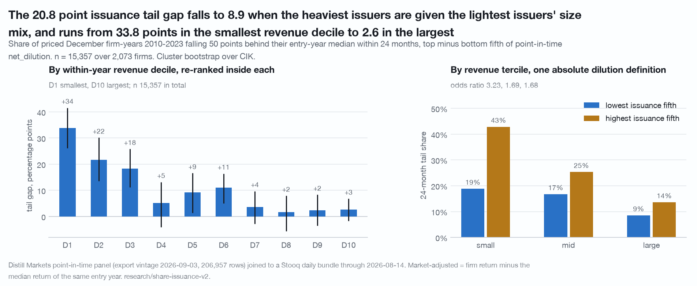
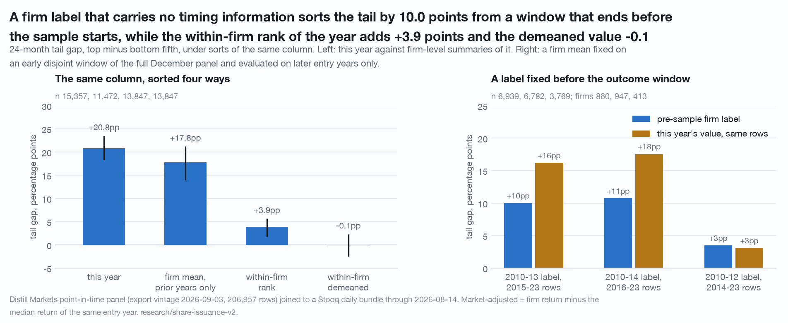
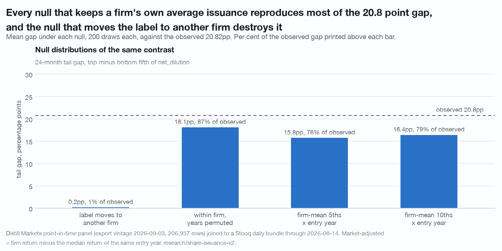
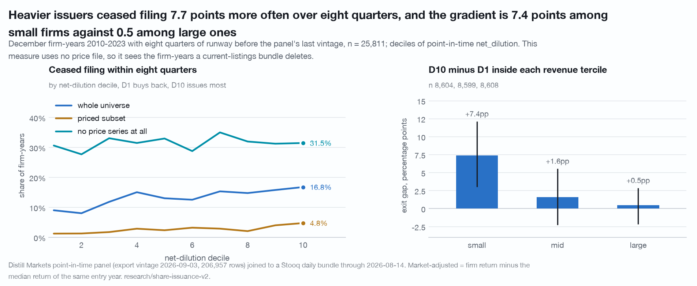

# Net share issuance is a firm type, and it is a clock: the heaviest-issuing fifth fell 50 points behind its entry-year median inside two years on 33.45% of firm-years against 12.63% for the lightest (n = 15,357 December firm-years, 2,073 firms, 2010-2023)

Two questions on one column. Does sorting December firm-years on the panel's
point-in-time `net_dilution` order the forward market-adjusted tail, and if it
does, is the sort a statement about the year a firm issues, about the kind of
firm it is, or about how big the firm is?

The answer to the first is a gap of **+20.82 percentage points [+18.12, +23.75]**
in the two-year tail rate. The answer to the second is that the gap is largely a
size composition and, once size is held, a firm-level type rather than a dated
event: a firm label fixed on 2010-2013 that cannot see the outcome window sorts
2015-2023 by +10.01pp on 860 firms, the within-firm rank of the year adds
+3.88pp, the within-firm demeaned value adds nothing, and a staler figure sorts
better than a fresh one.

"Clock" is a statement about when a shortfall arrives, not about cause and not
about any price. The tail event is "fell 50 points behind the median priced
firm-year that entered in the same December", read over 24 months. Nothing here
identifies a direction of causation, and no sentence here is about where a price
goes next.

Data vintage: Distill `screen/export` point-in-time panel of 2026-09-03 (rows
2009-06-30 to 2026-06-30), joined to a Stooq US daily bundle through 2026-08-14,
plus the `/sec/fundamentals/{t}/history` responses already on disk (2,081
tickers, 20,072 filer-years) for the provenance and share-basis checks.
Reproduce with `./.venv/bin/python research/share-issuance-v2/study.py` from the
repository root. The script is held by the publisher and available on request. It makes no API call: `distill_toolkit.client.get` is replaced
by a raiser before any analysis runs, so a run reaching its last line made none.

**What these got wrong.** [CORRECTIONS.md](../CORRECTIONS.md) is the
repository's dated log of numbers, helpers and caveats that did not survive an
adversarial re-run. A number that appears there is superseded wherever else it
appears, including here. Entries 16, 18 and 19 concern
`analysis.clustered_shuffle`, which produces the between-firm null in the table
below. That null reads **+0.13 +/- 1.53pp, z = 13.51** on the pool and
+0.13 +/- 1.18pp, z = 6.44 on the exit gradient; under a different construction
of the same shuffle it reads +0.20 +/- 1.64pp, z = 12.61 and -0.02 +/- 1.45pp,
z = 5.36. **No verdict in this document changes either way.** The null's 97.5th
percentile is +3.09pp against an observed +20.82pp and +2.53pp against +7.75pp.

## Coverage, and the denominator that matters

The December universe is **45,428 firm-years over 5,960 CIKs and 6,038 tickers**,
2010-2025.

- **Stooq match rate: 66.81%** of those firm-years carry any price series under
  the panel's ticker, 30,352 of 45,428.
- **2,904 of 6,038 distinct tickers (48.1%) carry no price at all.**
- **63.40%** carry a fresh close at the snapshot and a full 24-month grid, which
  is the denominator behind every price-based number here.
- `net_dilution` is present on 66.25% of December rows and `buyback_intensity`
  on 49.40%.

The Stooq index behind that rate read the bundle's fund folders alongside its
equity folders, so a delisted issuer whose symbol a fund now carries counted as
priced. The reader is equities only from 2026-09-10 and this study was not re-run:
the rate stands at its own vintage and is overstated by roughly what entry 21 of
[CORRECTIONS.md](../CORRECTIONS.md) measures, 0.44pp of December firm-years.

A current-listings bundle deletes a delisted symbol rather than ending its
series, so a firm that stopped trading inside a window is absent from this
sample rather than present with a bad return. **Every price-based rate here is a
rate for survivors and a floor**, and nothing in this data bounds the difference.
Section 4 is the one measurement that does not use the price file at all, and it
shows the missing cohort ceases to file at 31.59% within eight quarters against
2.57% for the priced subset, and is over-represented at the heavy-issuance end.

---

## 1. The sort

Priced December firm-years 2010-2023 carrying `net_dilution`, so every path runs
a full 24 months: **15,357 firm-years over 2,073 firms**. Quintiles are formed on
the rank of the column inside each entry year. `x_k` is a firm's cumulative price
return at month `k` minus the median return of every priced firm-year entering in
the same December.

| quintile | n | firms | median `net_dilution` | median `x_12` | median `x_24` | fell 50 behind by m12 | by m24 |
|---|---:|---:|---:|---:|---:|---:|---:|
| Q1 (buys back) | 3,079 | 917 | -4.23% | +2.92% | +6.59% | 4.81% | **12.63%** |
| Q2 | 3,068 | 1,112 | -0.52% | +1.68% | +2.89% | 4.43% | 12.71% |
| Q3 | 3,069 | 1,185 | +0.35% | -0.46% | -0.72% | 7.95% | 18.21% |
| Q4 | 3,068 | 1,212 | +1.40% | -0.91% | -2.36% | 10.27% | 22.75% |
| Q5 (issues most) | 3,073 | 1,271 | +9.59% | -5.84% | -10.35% | 18.19% | **33.45%** |

Q5 minus Q1: **+20.82pp [+18.12, +23.75]** on the 24-month tail with 0 of 400
CIK-cluster draws at or below zero, +13.38pp [+11.53, +15.37] at twelve months,
and -16.94pp [-20.32, -13.70] on the median 24-month return. The
extremes-against-the-middle contrast is +4.82pp [+3.05, +6.72], a quarter of the
directional gap, because this is a two-sided variable whose ends move in
opposite directions; it is reported for completeness and is the wrong summary for
a monotone sort.

**What the sort moves is when the shortfall arrives, not whether it is recovered
from.** Conditional on having fallen 50 points behind, the share back above
-25 points by month 24 runs 11.3 / 10.8 / 10.6 / 11.3 / 12.3% across Q1 to Q5, on
389 / 390 / 559 / 698 / 1,028 fallen firm-years, while the median month of the
fall is 15 in Q1 against 12 in Q5. That is the same recovery null
[findings/survival-clock.md](survival-clock.md) reports for the health score.

**The column is not the field the traps point at.** On 9,380 firm-years with a
cached `/history` response, `net_dilution` has Spearman **0.9279** with
`sharesOutstanding` year-over-year growth against **0.6749** with
`weightedAverageSharesDiluted` growth, and sits closer to the period-end count on
87.6% of them. It is within 0.0001 of that series on only 27.5%, so it tracks the
never-restated period-end count and is not it
([docs/traps.md](../docs/traps.md), traps 1 and 2).

---

## 2. Size takes between two fifths and three fifths of it

n = 15,357 over 2,073 firms throughout.

| statement | gap | share of the raw gap |
|---|---:|---:|
| raw Q5 minus Q1 24-month tail gap | **+20.82pp [+18.12, +23.75]** | 100% |
| Q5 given Q1's within-year size-tercile mix | **+8.95pp** | 43% |
| Q1 given Q5's mix, the reverse direction | +16.76pp | 81% |
| both groups at the pooled mix | +12.55pp | 60% |
| logit implied gap, dilution rank 0.9 minus 0.1, no size control | +20.98pp | 100% |
| logit implied gap with log revenue as a continuous control | **+12.71pp** | 61% |

The logit is on the 24-month tail with entry-year effects and CIK-clustered
standard errors: the coefficient on the within-year dilution rank is +1.7243
(se 0.1046) alone and +1.0884 (se 0.1037) with log revenue, whose own coefficient
is -0.2698. The rank coefficient stands 10.5 clustered standard errors from zero,
so the sort is not explained by size; it is substantially shared with it. Which
direction a reweighting is run in changes the published share by a factor of
four, which is why all three are printed.

Q1 is 54.2% large-tercile firm-years and Q5 is 56.5% small-tercile ones.
**Sector composition removes nothing**: giving Q5 the sector mix of Q1 leaves
+21.37pp, slightly larger than the raw gap.

By within-year revenue decile, re-ranked inside each:

| decile | median revenue | n | firms | gap |
|---|---:|---:|---:|---|
| D1 | $26m | 1,544 | 507 | **+33.78pp [+26.13, +41.58]** |
| D2 | $87m | 1,535 | 501 | +21.61pp [+13.53, +30.13] |
| D3 | $215m | 1,533 | 524 | +18.25pp [+11.12, +25.79] |
| D4 | $405m | 1,535 | 523 | +5.16pp [-4.04, +13.16] |
| D5 | $705m | 1,535 | 518 | +9.25pp [+1.34, +16.56] |
| D6 | $1,186m | 1,534 | 497 | +10.97pp [+5.02, +16.39] |
| D7 | $2,063m | 1,533 | 479 | +3.61pp [-2.81, +9.70] |
| D8 | $3,651m | 1,535 | 424 | +1.65pp [-5.65, +7.91] |
| D9 | $7,476m | 1,533 | 339 | +2.29pp [-3.57, +8.31] |
| D10 | $22,394m | 1,540 | 220 | **+2.62pp [-1.73, +6.79]** |

The gap concentrates in the bottom three deciles, all of which sit below the
$300m revenue floor of the toolkit's own sweep pool, and five of the top seven
deciles do not clear zero at about 1,535 firm-years apiece.

At the pool level, with one absolute dilution definition everywhere:

| tercile | n | n Q1 | n Q5 | tail Q1 | tail Q5 | gap | odds ratio |
|---|---:|---:|---:|---:|---:|---|---:|
| small | 5,119 | 456 | 1,735 | 18.86% | 42.88% | +24.02pp [+18.97, +28.84] | 3.23 |
| mid | 5,115 | 955 | 868 | 16.75% | 25.35% | +8.59pp [+4.61, +12.90] | 1.69 |
| large | 5,123 | 1,668 | 470 | 8.57% | 13.62% | **+5.04pp [+1.08, +9.05]** | **1.68** |

**Re-ranking dilution inside each tercile is the wrong cut.** Done that way the
gap reads +3.24pp [-0.25, +6.66] in the largest tercile and does not clear zero,
because re-ranking narrows the treatment range exactly where the sort is most
compressed: the local Q5 median is +18.43% in the small tercile and +2.59% in the
large one. Held at pool-level quintiles the large tercile clears zero at +5.04pp,
and its odds ratio of 1.68 is the same multiplicative effect as mid's 1.69. Mid
and large differ from each other only in their base rate, and both differ from
small. Two statements do not survive that table: the sort is not independent of
size, and the issuance tail does not survive inside every revenue tercile.

### The gap is flat across capitalisation in this pool, and the two size measures are different variables

Revenue is a scale proxy that conflates size with business model: a $26m-revenue
filer developing one product and a $26m-revenue holding company sit in the same
decile and are nothing alike. **Market capitalisation is not a column on this
panel.** [findings/market-cap.md](market-cap.md) builds one for the subset where
it can be built and re-runs this cut on it, and the answer does not carry the
revenue shape:

| pool | n | by revenue tercile | by capitalisation tercile |
|---|---:|---|---|
| capped firm-years, 2017-2023 | 7,025 | +15.13 / +6.44 / +3.58pp | +10.32 / +11.69 / +12.97pp |
| the same, excluding healthcare and technology | 5,089 | +12.95 / +4.06 / +2.13pp | +11.61 / +7.67 / +5.68pp |

On the capped pool the smallest-minus-largest **revenue** tercile difference of
gaps is +11.55pp [+2.34, +20.46] and clears zero, while the largest-minus-smallest
**capitalisation** difference is **+2.64pp [-5.28, +10.96]** and does not. Read
as rising, that column carries no interval, and excluding the two sectors with
the highest capitalisation-to-revenue medians the same cut falls with
capitalisation instead.
The honest statement is that the gap falls with revenue and is flat across
capitalisation on 7,025 firm-years, and that revenue is a business-model axis as
much as a size axis.

Sector heterogeneity says the same thing from the other side, on the full pool:
healthcare +30.36pp [+22.89, +37.72] and technology +23.62pp [+17.99, +28.95] at
the top, real estate -1.56pp [-8.94, +4.80] and utilities +3.70pp [-7.01, +14.28]
at the bottom.

---

## 3. Type, not timing

The same column, sorted four ways, 24-month tail gap top minus bottom fifth:

| sorted on | n | firms | gap |
|---|---:|---:|---|
| this year's `net_dilution` | 15,357 | 2,073 | +20.82pp [+18.37, +23.50] |
| the firm's mean over prior pool years only, knowable at entry | 11,472 | 1,637 | **+17.77pp [+13.95, +21.23]** |
| the within-firm rank of this year | 13,847 | 1,379 | **+3.88pp [+1.79, +5.65]** |
| the within-firm demeaned value | 13,847 | 1,379 | **-0.08pp [-2.53, +2.31]** |

A backward-looking one-number-per-firm label with no timing content gets +17.77pp
of the +20.82pp. What survives once firm identity is removed is +3.88pp on ranks
and a null on demeaned values.

**The strictly pre-sample label.** An expanding backward mean still shares rows
with the thing it sorts. This label is a firm mean fixed on an early window of the
**full** December panel, priced or not, evaluated on later entry years with a
one-year gap so the windows are disjoint:

| label | evaluated on | n | firms | gap | same rows, this year's value | share |
|---|---|---:|---:|---|---|---:|
| firm mean 2010-2013 | 2015-2023 | 6,939 | 860 | **+10.01pp [+5.12, +14.29]** | +16.20pp | **62%** |
| firm mean 2010-2014 | 2016-2023 | 6,782 | 947 | +10.72pp [+6.49, +14.91] | +17.58pp | 61% |
| firm mean 2010-2012 | 2014-2023 | 3,769 | 413 | +3.49pp [-0.67, +7.76] | +3.10pp | 113% |

The selection travels with it. The test conditions on a firm having two or more
`net_dilution`-carrying December rows in the early window and a priced pool row
years later: 860 of the pool's 2,073 firms, and the surviving set skews large,
34.9% of them in the large revenue tercile at their first evaluated row. The
three-year variant collapses to +3.49pp on 413 firms, 57.6% of them large, and
its contemporaneous comparison collapses with it, which is consistent with a size
selection rather than a failure of the label and cannot be separated from one at
this n. **This is the weakest surviving check in the document.**

**A staler figure sorts better.** 25.1% of pool rows cite a fiscal year equal to
the snapshot year, so the filed figure is 1 to 11 months old; 74.9% cite the year
before and are 12 to 23 months old. The stale half gives **+22.14pp
[+19.18, +25.09]** on n 11,503 over 1,673 firms against **+16.45pp
[+11.53, +21.16]** on n 3,854 over 497 firms. A timing signal would sort at least
as well fresh.

Four nulls, 200 draws each, against the observed +20.82pp:

| null | what it preserves | mean | sd | share of observed | z |
|---|---|---:|---:|---:|---:|
| clustered shuffle, the label moves to another firm, entry year kept | the year and the label's own path | +0.13pp | 1.53 | **1%** | 13.51 |
| within-firm shuffle, the firm keeps its own values | everything about the firm | +18.11pp | 0.66 | **87%** | 4.09 |
| firm-mean quintile by entry year | the year and one coarse number per firm | +15.76pp | 0.83 | **76%** | 6.09 |
| firm-mean decile by entry year | the same, finer | +16.43pp | 0.76 | **79%** | 5.80 |

A different construction of the clustered shuffle reads +0.20 +/- 1.64pp,
z = 12.61 on the same null (CORRECTIONS entries 16 to 19), and changes no verdict
here.

The last two nulls decide the reading. A shuffle that keeps nothing about a firm
except which fifth or tenth of the firm-mean distribution it sits in already
reproduces 76 to 79% of the gap, so the firm-level content the within-firm null
carries is very largely the firm's own average issuance rather than a residue of
size or sector riding along with firm identity. One contamination is stated
rather than removed: **261 firms contribute exactly one pool row, 1.70% of rows**,
where a within-firm shuffle is the identity, and **Q5 holds 8.6% of its rows in
firms with at most two pool rows against Q1's 2.2%**. Restricting the null to
firms with three or more rows leaves 85% of that subset's own +19.60pp.

---

## 4. Ceasing to file, measured on the whole universe including the firm-years with no price

This section uses no price file, so it sees the third of firm-years a
current-listings bundle deletes. Every December firm-year with eight quarters of
runway before the panel's last vintage, entry years 2010-2023, carrying
`net_dilution`: **25,811 firm-years over 4,340 CIKs**. Exit means the CIK has no
panel row of any kind after the snapshot plus two years. Base rates: **13.24%**
whole universe, **2.57%** priced subset, **31.59%** with no price series at all.

| decile | n | median `net_dilution` | share priced | exit, whole universe | exit, priced | exit, no price |
|---|---:|---:|---:|---:|---:|---:|
| D1 | 2,588 | -6.13% | 73.5% | 9.04% | 1.26% | 30.66% |
| D2 | 2,580 | -2.22% | 74.4% | 8.06% | 1.30% | 27.73% |
| D3 | 2,580 | -0.48% | 67.8% | 11.86% | 1.77% | 33.09% |
| D4 | 2,580 | 0.00% | 57.4% | 15.08% | 2.90% | 31.51% |
| D5 | 2,581 | +0.32% | 65.1% | 13.06% | 2.38% | 33.00% |
| D6 | 2,578 | +0.70% | 63.5% | 12.57% | 3.24% | 28.80% |
| D7 | 2,578 | +1.28% | 61.3% | 15.36% | 2.91% | 35.04% |
| D8 | 2,582 | +2.42% | 57.5% | 14.79% | 2.09% | 32.00% |
| D9 | 2,579 | +6.05% | 56.7% | 15.82% | 4.03% | 31.27% |
| D10 | 2,585 | +21.34% | 55.1% | 16.79% | 4.78% | 31.50% |

D10 minus D1 on the whole universe: **+7.75pp [+5.43, +9.67]**, 0 of 400 draws at
or below zero.

**Both compositions, side by side, because they are one thing said twice:**

| decomposition | gap left | share removed |
|---|---:|---:|
| priced flag, D10 at D1's mix | +2.81pp | 64% |
| priced flag, D1 at D10's mix | +2.31pp | 70% |
| priced flag, both at the pooled mix | +2.53pp | 67% |
| size tercile, D10 at D1's mix | +1.88pp | **76%** |
| size tercile, D1 at D10's mix | +3.09pp | 60% |
| size tercile, both at the pooled mix | +2.37pp | 69% |

The share priced falls from 73.5% at D1 to 55.1% at D10, and the size mix runs
from 57.7% large-tercile at D1 to 61.2% small-tercile at D10. The priced flag is
largely a size proxy, so "64 to 70% of the gradient is the changing share of
firm-years a price file can see" and "76% of it is the changing size mix" are two
views of one composition and not two findings. Naming only the first reads as a
survivorship story when it is at least as much a size story.

By size tercile, and inside the cohort with no price at all:

| cohort | n | base exit | share priced | D10 minus D1 |
|---|---:|---:|---:|---|
| small | 8,604 | 19.55% | 50.0% | **+7.41pp [+3.00, +12.13]** |
| mid | 8,599 | 13.59% | 61.8% | +1.62pp [-2.29, +5.55] |
| large | 8,608 | 6.59% | 77.9% | +0.47pp [-2.19, +2.87] |
| priced subset, pooled deciles | 16,322 | 2.57% | 100% | +3.52pp [+2.18, +5.09] |
| unpriced cohort, pooled deciles | 9,489 | 31.59% | 0% | **+0.84pp [-4.38, +5.74]** |
| unpriced cohort, re-deciled inside itself | 9,489 | 31.59% | 0% | -0.35pp [-5.46, +4.60] |

**Inside the unpriced cohort the column says nothing measurable.** The treatment
range is not the limitation: the re-deciled D1 and D10 medians inside that cohort
are -5.02% and +24.86% against -5.95% and +20.70% in the priced subset, a wider
spread. What limits it is the interval. On a 31.6% base rate at plus or minus
five points, an effect the size of the priced subset's own +3.52pp would not be
detectable, so the correct sentence is "shows no effect measurable at plus or
minus five points", not "carries no information".

Nulls on the gradient: the clustered shuffle gives +0.13 +/- 1.18pp against the
observed +7.75pp, and the within-firm shuffle gives **+8.98 +/- 0.57pp, 116% of
the observed gap**. Inside a firm, the year it issues most is not the year before
it stops filing.

---

## 5. Robustness that survived

Gap is Q5 minus Q1 on the 24-month tail throughout.

| variant | n | firms | gap |
|---|---:|---:|---|
| full pool | 15,357 | 2,073 | +20.82pp [+18.47, +23.59] |
| drop the rows at the clip | 15,355 | 2,073 | +20.81pp [+18.42, +23.50] |
| drop every absolute value at or above 0.45 | 15,281 | 2,068 | +21.02pp [+18.39, +23.40] |
| drop every absolute value at or above 0.20 | 14,620 | 2,025 | +19.04pp [+16.52, +21.69] |
| share-series unit-defect gate applied | 15,108 | 2,060 | +20.88pp [+18.32, +23.48] |
| drop the first panel year of each CIK | 14,097 | 1,985 | +19.57pp [+16.72, +22.12] |
| drop the first two panel years of each CIK | 12,500 | 1,805 | +18.65pp [+15.69, +21.39] |
| CIKs first seen 2013 or later, first two years dropped | 2,621 | 677 | +26.03pp [+20.74, +32.11] |
| out of sample, entry years 2010-2016 | 5,352 | 1,231 | **+16.85pp [+13.09, +20.52]** |
| out of sample, entry years 2017-2023 | 10,005 | 2,005 | **+22.94pp [+19.87, +26.41]** |

Four notes on that table.

- **The clip does not create Q5.** The column runs -0.500000 to 0.499999, with 11
  of 135,951 panel rows and **2 of 15,357 pool rows** at the clip. The 72 Q5 rows
  above 0.45 carry a lower tail rate than the rest of Q5, 23.61% against 33.69%,
  which is why removing them raises the gap.
- **A unit switch in the served share count does not reach the panel.** No value
  of the shape a millions-for-shares switch would produce appears anywhere in the
  column
  ([CORRECTIONS.md](../CORRECTIONS.md) entry 3), and gating out the flagged fiscal
  years and their successors moves the gap by 0.06pp.
- **First-panel-year steps are a composition item and a bracket, not a number.**
  Q5 draws 29.8% of its rows from a CIK's first two panel years against Q1's
  13.2%, so 10 to 16% of the headline is those rows. But 3,581 of 6,998 CIKs
  first appear in 2009-2012, which is the export's coverage ramp rather than a
  listing, so the proxy measures coverage for half the panel. Restricted to CIKs
  first seen 2013 or later, where it means something, the gap is larger.
- **No lookahead.** 25.1% of pool rows cite a fiscal year equal to the snapshot
  year, which is the shape of a non-calendar year end and not a lookahead: for
  the CIKs producing such a row a fiscal-year label first appears at the March,
  June, September and December quarter ends at 24.3 / 21.8 / 25.1 / 28.7%, while
  for CIKs that never produce one it is 97.2% March. Exactly one December row in
  45,428 cites a fiscal year after its own snapshot year, and it carries a null
  `net_dilution`.

---

## 6. Did not survive

**The buyback-jump timing contrast is not a finding.** Buyback jumps following a
12-month market-adjusted fall run -4.47pp [-7.97, -0.62] behind jumps following a
rise at twelve months. That arithmetic is correct and it is not a statement about
buyback jumps, because it compares two cohorts differing in two things at once. Events 13,315 over 1,791
firms; 1,332 jumpers, 609 after a fall and 723 after a rise, and 11,983
non-jumpers:

| horizon | jumped: fall minus rise | did not jump: fall minus rise | difference in differences |
|---|---|---|---|
| x_6 | -0.19pp [-3.09, +1.84] | +0.16pp [-0.71, +1.01] | -0.34pp [-3.49, +2.16] |
| **x_12** | **-4.47pp [-7.97, -0.62]** | **-1.74pp [-3.05, -0.51]** | **-2.73pp [-6.46, +1.56]** |
| x_24 | -6.30pp [-11.74, +1.61] | -0.83pp [-3.10, +1.23] | -5.47pp [-11.48, +2.82] |

A firm-year following a market-adjusted fall sits behind one following a rise at
twelve months whether or not its buybacks jumped, which is twelve-month momentum
in this panel. The jump-specific part is -2.73pp with an interval containing zero.
The point estimate is stable across every prior-intensity floor tested, 0.5%, 1%
and 2% of revenue; what the floor costs is the interval.

**The buyback-intensity sort is dropped as a second result.** Its within-firm
null reproduces 100% of it, so nothing is left that section 3's reading does not
already cover.

---

## What would break it

- **Market capitalisation is not on the panel row.** Revenue is the single
  covariate that removes 57% of the headline in the direction quoted, 19% in the
  reverse direction and 40% at the pooled mix, and it conflates scale with
  business model. The capitalisation cut that exists covers 7,025 of the 15,357
  firm-years, only entry years 2017-2023, and it is a survivor of a second
  selection described in [findings/market-cap.md](market-cap.md).
- **The effect is small in large firms and small in percentage points everywhere
  above the third revenue decile.** Five of the top seven deciles do not clear
  zero at about 1,535 firm-years apiece. A universe of large filers has +5.04pp
  [+1.08, +9.05], not +20.82pp.
- **Every price-based rate is a floor.** 33.2% of December firm-years and 48.1%
  of tickers have no price. Those firm-years cease filing at 31.6% against 2.6%
  and are over-represented at the heavy-issuance end, 55.1% priced at D10 against
  73.5% at D1. The tail rates are computed on the survivors of exactly the cell
  the result claims most about.
- **The pre-sample label test conditions on 860 of 2,073 firms** and skews large,
  and the three-year variant collapses along with its own contemporaneous
  comparison. On a longer panel the +10.01pp could turn out to be a number that
  excludes the firms where the effect is smallest.
- **The rival nulls preserve the firm mean by construction**, so they cannot
  separate "a firm's issuance type sorts the tail" from "a firm's issuance type
  proxies something else about the firm". Log revenue is demonstrably one such
  something; this export does not carry the others.
- **`net_dilution` is a period-end share count, not a weighted-average diluted
  one** (Spearman 0.928 against 0.675). It is protected here by the panel being
  point-in-time and by `net_dilution` being bounded to [-0.5, +0.5] in the
  export, and the unit gate moves the gap by 0.06pp, but it is not the field the
  traps point at.
- **Price returns omit dividends**, and the buyback end of the sort is the
  dividend-paying end, so the bias runs toward the result.
- **The reweightings are descriptive.** Size tercile and the priced flag are
  measured on the same row as the treatment, and the priced flag is read off a
  2026 bundle, so neither decomposition identifies anything causal.
- **The exit event merges causes.** "No panel row after eight quarters" is an
  acquisition, a going-private, a bankruptcy and a deregistration in one number,
  and a heavy issuer funding an all-stock deal is more likely to be doing an
  acquisition than receiving one.
- **The two-year window and the 50-point threshold are choices.** The twelve-month
  gap is +13.38pp on the same rows, and no other threshold was scanned.

## Limits of the data as published

The panel row carries no market capitalisation and no share count, so the only
size covariate available is revenue, and revenue conflates scale with business
model: it removes 57% of the headline in one direction, 19% in the other and 40%
at the pooled mix, and a study on this data cannot tell which of those is the
size effect. `net_dilution` collapses a secondary offering, stock-based
compensation and an all-stock acquisition into one number, and the export carries
no financing-cash-flow split to separate them, which is exactly the ambiguity the
size gradient turns on. The column is bounded to [-0.5, +0.5] in the export and
its provenance is not stated, so it had to be reverse-engineered against 9,380
cached filer-years: it tracks the never-restated period-end count at Spearman
0.928 and matches it within 0.0001 on only 27.5%. Panel exit merges an
acquisition, a going-private, a bankruptcy and a deregistration into one event
with no cause attached, and those run in opposite directions for a heavy issuer.
And every price-based rate here is a price return for a survivor, since the
bundle deletes delisted symbols and carries no dividends.

## Disclosure

No company is named.

Distill Markets Pty Ltd, the publisher of this repository, operates the paid data
service this study uses. Authors and the publisher may hold positions in
securities of the kind described. Everything above is general information derived from
public SEC filings and from a price file the author holds. It is not financial
product advice, does not consider your objectives, financial situation or needs,
and past patterns do not guarantee future results. See [NOTICE](../NOTICE).
