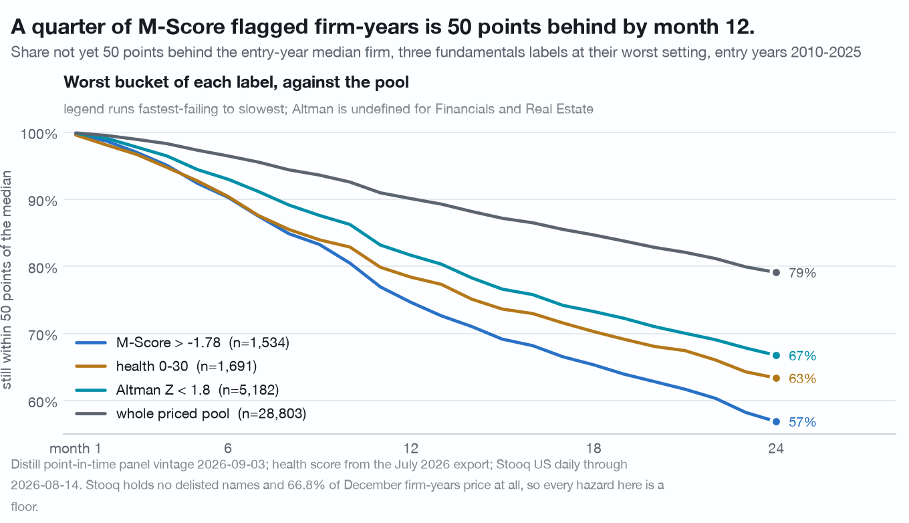
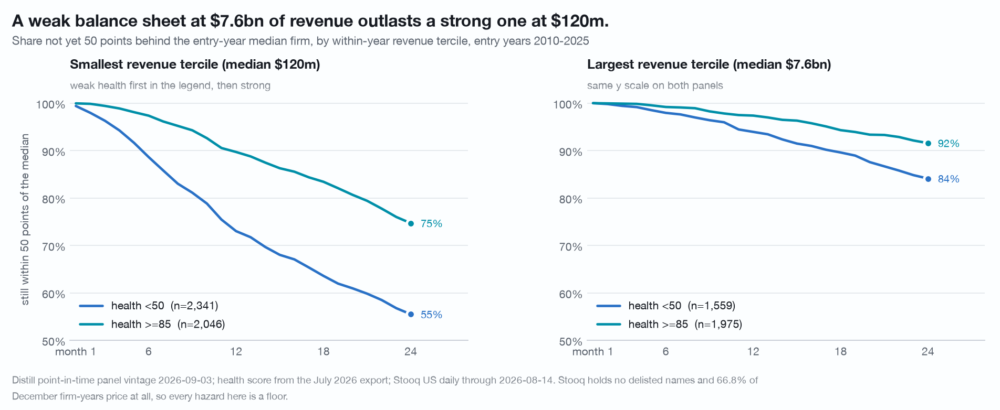
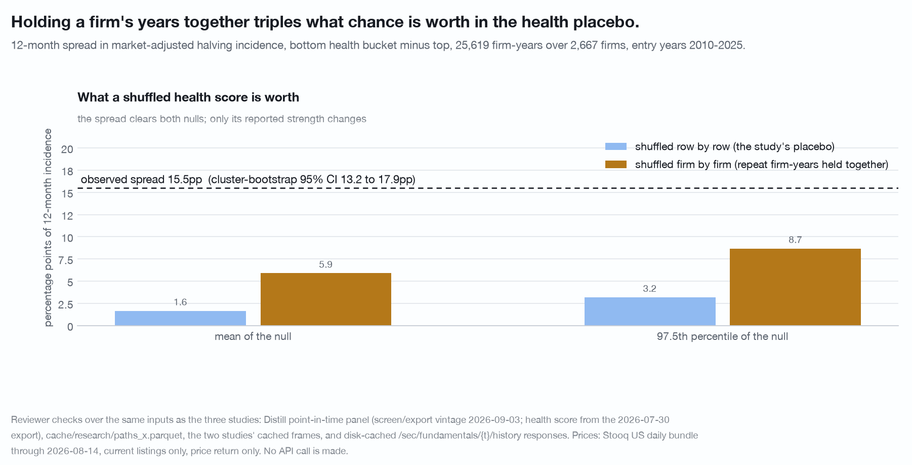

# The health label is a clock: month 7 for the weakest bucket, month 17 for the strongest (n = 25,619 firm-years, 2,667 firms, December entries 2010-2025, 24-month horizon)

A financial-health score does not move the median forward return. It moves the
left tail, and it moves it on a schedule. This study puts a clock on that: for
each fundamentals label, how many months pass before a tenth of the cohort has
fallen 50 points behind the entry-year median firm.

Data vintage: Distill `screen/export` point-in-time panel of 2026-09-03, joined
to a Stooq US daily bundle through 2026-08-14. Reproduce with
`./.venv/bin/python research/survival-curves/study.py` from the repository root. The script is held by the publisher and available on request.
Every number here was independently re-derived from the same panel by a second
implementation; the numbers that changed under that check are listed in
[CORRECTIONS.md](../CORRECTIONS.md).

## Definitions

**Universe.** 28,803 priced December firm-years, entry years 2010-2025, one row
per (CIK, December snapshot), with cumulative price returns at months 1 to 24 and
market-adjusted returns over the same horizons. Market-adjusted means minus the
same-entry-year median across every priced firm-year at the same horizon.
25,619 of those rows carry a health score, and they come from 2,667 distinct
firms, 9.6 firm-years apiece. Every `n` below is firm-years; the firm counts
behind the five health buckets are 813 / 1,407 / 2,067 / 1,596 / 1,271.

**Event.** "50 points behind" is the first month in 1 to 24 at which the
market-adjusted cumulative return is at or below -50%. The raw price version
(the price itself halved) is reported next to it. Because the path is sampled at
month ends, a round trip through -50% inside one month is invisible.

**Estimator.** Kaplan-Meier cumulative incidence with an absorbing failure
state. Censoring is the right edge of the price file for entry years 2024 and
2025 and has nothing to do with the label. Every headline number is repeated on
a complete-case pool (entry years 2010-2023, n = 20,851, no censoring at all)
and the two agree to within 4 percentage points of incidence and one month of
timing. The study runs its own implementation
(`research/survival-curves/survival.py`), and section 0b checks it against the
toolkit's shipped `analysis.survival_curve` and finds the two agree to machine
precision on this panel.

**Coverage.** 66.8% of the panel's 45,428 December firm-years 2010-2025 have a
Stooq series under the panel's ticker; 63.4% also have a close within 14 days of
the snapshot, which is the test the paths builder applies. **Every hazard rate
below is a floor**, and the floor is not uniform: the missing third is
concentrated in the low-health and small-revenue cells, which are the cells this
study claims the most about.

## The clock

Market-adjusted, Kaplan-Meier, entry years 2010-2025:

| health score | firm-years | firms | 12m incidence | 24m incidence | month 10% reached | month 25% reached |
|---|---|---|---|---|---|---|
| 0-30 | 1,691 | 813 | 21.6% | 36.7% | **7** | **15** |
| 30-50 | 3,950 | 1,407 | 15.5% | 29.5% | 9 | 20 |
| 50-70 | 8,018 | 2,067 | 11.7% | 24.0% | 11 | not reached by 24 |
| 70-85 | 5,543 | 1,596 | 6.9% | 16.5% | 16 | not reached by 24 |
| 85-100 | 6,417 | 1,271 | 6.1% | 16.6% | 17 | not reached by 24 |

On raw price the same five buckets reach 10% at months 6, 9, 10, 16 and 20, with
12-month incidences of 21.9%, 15.9%, 12.3%, 7.1% and 5.6%.

The bottom bucket reaches a tenth of the cohort 50 points behind in **7 months**,
the top bucket in **17** (20 on raw price), between two and three times as long.
Only the bottom two buckets reach 25% inside 24 months, at months 15 and 20. The
ordering across the five buckets is monotone at 12 months on both bases.

**The top two buckets converge by month 24** (16.5% against 16.6%,
market-adjusted). The separation between "good" and "excellent" health is a
first-twelve-months effect on this event and does not persist into the second
year. On the complete-case pool the months to 10% are 8, 10, 12, 17 and 18, so
the ordering and the roughly two-to-one timing hold with no estimator involved.

## The three labels do not say the same thing

Market-adjusted, entry years 2010-2025:

| label | firm-years | 12m | 24m | month 10% | month 25% |
|---|---|---|---|---|---|
| Altman Z < 1.8 | 5,182 | 18.3% | 33.3% | 8 | 17 |
| Altman Z 1.8-3 | 2,512 | 9.1% | 21.9% | 13 | not reached |
| Altman Z > 3 | 8,368 | 7.7% | 18.8% | 15 | not reached |
| M-Score > -1.78 (flagged) | 1,534 | **25.4%** | **43.1%** | **7** | **12** |
| M-Score <= -1.78 | 22,606 | 9.9% | 21.3% | 13 | not reached |
| Piotroski 0-3 | 6,179 | 18.4% | 33.0% | 8 | 18 |
| Piotroski 4-6 | 14,292 | 8.8% | 20.0% | 14 | not reached |
| Piotroski 7-9 | 3,591 | 5.8% | 15.1% | 18 | not reached |

**Altman Z is a re-telling of the health score, not an addition.** Spearman 0.71
on the 15,958 firm-years carrying both, and most of the mass sits on the
diagonal (1,008 firm-years are both bottom-health and Z below 1.8; 4,395 are both
top-health and Z above 3). Altman is undefined for Financials and Real Estate,
with 0% coverage in both, so its 16,062 firm-years are a different universe from
the health score's 25,619 and the cross-tab runs on the intersection.

**The M-Score is close to orthogonal to health** (Spearman 0.07) and roughly
triples the 12-month hazard inside every health bucket:

| health | unflagged | flagged | firm-years unflagged / flagged |
|---|---|---|---|
| 0-30 | 22.0% | 28.8% | 1,331 / 177 |
| 30-50 | 15.1% | 29.1% | 3,278 / 339 |
| 50-70 | 11.4% | 27.7% | 6,668 / 539 |
| 70-85 | 6.4% | 22.3% | 5,004 / 205 |
| 85-100 | 5.6% | **15.9%** | 6,040 / 259 |

**The top-bucket cell is thin and its interval belongs next to it.** The 15.9%
rests on **40 halvings from 38 distinct firms** out of 259 firm-years; the
bootstrap 95% interval is **11.3% to 20.7%**, which does not touch the unflagged
5.6%. The claim holds at that width and not at any narrower one.

Per firm-year flagged, the M-Score concentrates the most damage: 6.4% of the
labelled population contains 15.1% of the 12-month halvings, a lift of 2.37
against the health score's 2.06. The health score reaches the largest ratio
between its worst and best buckets (3.54x); the M-Score flag reaches the highest
absolute hazard (25.4% at 12 months) and is the only label whose worst group
reaches 25% incidence inside 12 months.

## Size moves the tail further than the label does

Revenue terciles formed within entry year, median revenue $120m, $1,117m and
$7,619m. Market-adjusted:

| group | firm-years | 12m | 24m | month 10% | month 25% |
|---|---|---|---|---|---|
| health <50, small revenue | 2,341 | 27.0% | 44.5% | 6 | 12 |
| health >=85, small revenue | 2,046 | 10.3% | 25.3% | 12 | 24 |
| health <50, mid revenue | 1,741 | 14.4% | 28.2% | 10 | 21 |
| health >=85, mid revenue | 2,396 | 5.4% | 15.7% | 18 | not reached |
| health <50, large revenue | 1,559 | 6.1% | 15.9% | 18 | not reached |
| health >=85, large revenue | 1,975 | 2.6% | 8.4% | not reached | not reached |

The label adds something inside every tercile: the weak-to-strong ratio is 2.6x
in the smallest, 2.7x in the middle and 2.3x in the largest, and the gap in time
to 10% is 6, 8 and at least 6 months.

The ordering reverses across terciles. **Weak health at large revenue reaches 10%
at month 18 and sits at 6.1% at 12 months (n = 1,559 firm-years); strong health
at small revenue reaches 10% at month 12 and sits at 10.3% (n = 2,046
firm-years).** A cluster bootstrap over firms on that difference gives
[2.2, 5.8]pp, with 0 of 300 draws showing no reversal. Any reading of the
health-score curve that crosses size groups is reading a size effect.

The chart headline states the reversal without its n or its window. Read it as:
weak health at $7.6bn of median revenue reaches 10% of the cohort 50 points
behind at month 18, and strong health at $120m reaches it at month 12, over
entry years 2010-2025.

## The placebo, clustered by firm

The health score was shuffled within entry year, 500 draws, and the statistic is
the bottom-bucket minus top-bucket spread in cumulative market-adjusted
incidence at 12 months. **Shuffled row by row the null is 1.7pp ± 0.9. That null
is too tight**: the 25,619 firm-years come from 2,667 firms, 9.6 apiece, and a
row-level shuffle breaks a dependence the observed statistic keeps.

Shuffled firm by firm, so each firm carries one label for its whole history and
labels are permuted among firms with the same median entry year, the null is
**5.9pp ± 1.4** with a 97.5th percentile of 8.7pp. Against the clustered null
the observed 15.5pp is **z = 7.0**, not the 15.3 a row-level shuffle implies.

| null | mean | sd | 97.5th percentile | implied z on 15.49pp |
|---|---|---|---|---|
| row by row | 1.65pp | 0.84pp | 3.17pp | 16.6 |
| **firm by firm** | **5.89pp** | **1.38pp** | **8.67pp** | **7.0** |

A cluster bootstrap over firms puts the spread at 15.5pp with a 95% interval of
**13.2 to 17.9pp** and **no draw at or below zero** in 300. The split is
therefore 5.9pp of composition and 9.6pp of label, not the 1.7 / 13.8 a
row-level shuffle reports.

The placebo mean is not zero, and that is informative rather than a defect: the
shuffle preserves each bucket's entry-year mix, and low-health firm-years are
concentrated in later entry years (14.7% of the bottom bucket are 2025 entries
against 9.5% of the pool) which carry fatter tails.

**Robustness.** The 12-month spread is positive in 13 of 13 entry years with at
least 30 bottom-bucket firm-years and a full 12 months of path (2012-2024),
median 11.7pp, minimum 7.0pp (2013), maximum 21.5pp (2018). It is 11.0pp on
entry years 2010-2017 (where the bottom bucket is thin, n = 374) and 16.1pp on
2018-2025. Dropping 2020 entries changes nothing; dropping 2018 and 2021
entries, whose windows carry the 2022 drawdown, changes nothing.

## The label times the fall, not the recovery

Complete-case pool, entry years 2010-2023, n = 20,851:

| basis | fell 50 points behind by month 24 | back above -25% at month 24 | back above -50% | back above 0 | median position at month 24 |
|---|---|---|---|---|---|
| market-adjusted | 4,369 (21.0%) | **11.2%** | 30.6% | 5.7% | -59.1% |
| raw price | 3,894 (18.7%) | **22.9%** | 46.7% | 12.1% | -51.7% |

By health bucket, conditional on having fallen that far:

| health | fell n | median month of the fall | back above -25% at m24 | median position at m24 |
|---|---|---|---|---|
| 0-30 | 400 | 11 | 11.3% | -65.6% |
| 30-50 | 868 | 12 | 11.5% | -62.9% |
| 50-70 | 1,486 | 13 | 12.4% | -59.4% |
| 70-85 | 731 | 14 | 12.2% | -57.5% |
| 85-100 | 884 | 15 | 8.1% | -56.1% |

The recovery share is flat across the five buckets, 8.1% to 12.4%, while the
median month of the fall moves monotonically from 11 to 15. **Conditional on the
event, the outcome distribution is the same whatever label preceded it.** This
is a null and it is reported as one.

## What would break it

- **Survivorship, above everything.** 33.2% of December firm-years never price,
  and the missing names are the ones that stopped trading. Every incidence here
  is a floor. If the missing third fell that far at even twice the observed
  rate, the bottom-bucket number would rise and the top-bucket number would
  barely move, which widens the spread rather than closing it. Nothing in this
  data can establish that either way.
- **The delisting hazard is not estimable from this price file.** Of 23,418
  paths in entry years 2010-2023, **zero** stop before month 24, because the
  bundle deletes delisted symbols rather than ending their series. A
  `delisted_in_window` flag in the paths file is True on exactly the 2024 and
  2025 entries, which is the file's right edge, not a delisting. A "series
  ended" event is, on this file, a step function at the file edge, identical for
  every label, and carries no information.
- **The health score's fact vintage, not its date.** The score is dated per
  snapshot and moves with the firm: only 10.6% of the 2,667 firms carry a
  constant value across their December rows. What a July 2026 export can carry
  is the fact vintage behind each dated score, a value as later restated rather
  than as originally filed. That contamination would grow with distance from
  July 2026, and the spread runs the other way (7.5pp for 2010-2013 entries
  against 18.4pp for 2022-2025), while the panel's own point-in-time labels
  reproduce the shape (Piotroski 0-3 against 7-9 is 18.4% against 5.8% at 12
  months; M-Score flagged against not is 25.4% against 9.8%). Re-running against
  a point-in-time health score would still settle it.
- **Month-end sampling.** Timing is quantised to whole months, and the 10% and
  25% crossings are step functions that can move a month on a small change in
  the cohort.
- **Bucket edges sit on modal values.** The health score takes 21 distinct
  values and 30, 50, 70 and 85 are four of them, with 821, 1,818, 1,931 and
  1,583 rows sitting exactly on an edge. Flipping the convention to right-closed
  moves thousands of rows between buckets.
- **The bottom bucket is small and recent**, 1,691 firm-years over 813 firms,
  only 374 of them in entry years 2010-2017.
- **Market adjustment is a cross-sectional median, not a beta.** It removes the
  market level and not exposure, so a high-beta cohort shows a fatter tail on
  this measure than a risk-adjusted one would.
- **Price returns only, no dividends.** Over 24 months a 4% yield is roughly 8
  points, which matters more in the high-health, high-payout cells than in the
  low-health ones and biases the comparison toward the reported result.

## Limits of the data as published

The price file is a current-listings bundle, so a firm that stopped trading is
deleted rather than ended: of 23,418 paths in entry years 2010-2023, zero stop
before month 24, and nothing served anywhere here dates a delisting or a
deregistration. That single absence is what turns every incidence above from an
estimate into a floor, because the event this study measures and the event the
data cannot see are the same kind of event. The health score is dated per
snapshot but the facts behind each dated score are as later restated, and the
export carries no vintage on them, so the label's contamination can be argued
from its own gradient but not measured. The panel row carries no market
capitalisation and no share count, so the size control here is revenue, which
conflates scale with business model. And a label's own age is unobservable: the
data says which bucket a firm is in at a December snapshot, never when it crossed
into that bucket.

## Disclosure

Companies are named only as facts they exhibit in this data.

Distill Markets Pty Ltd, the publisher of this repository, operates the paid data
service this study uses. Authors and the publisher may hold positions in
securities named here. Everything above is general information derived from
public SEC filings and from a price file the author holds. It is not financial
product advice, does not consider your objectives, financial situation or needs,
and past patterns do not guarantee future results. See [NOTICE](../NOTICE).
