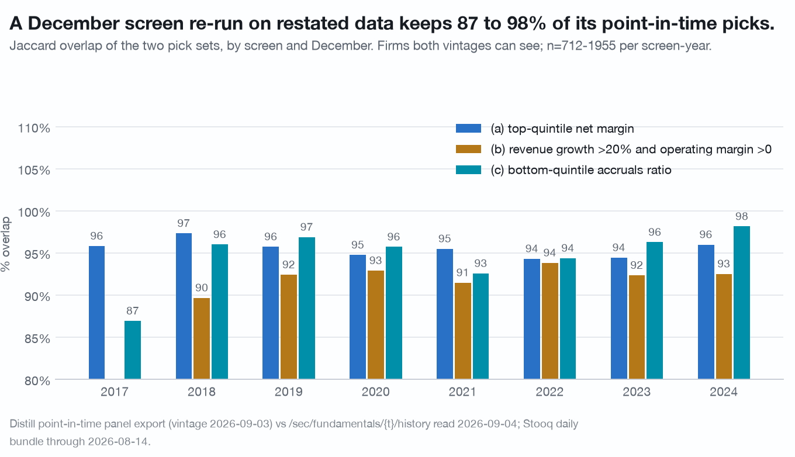
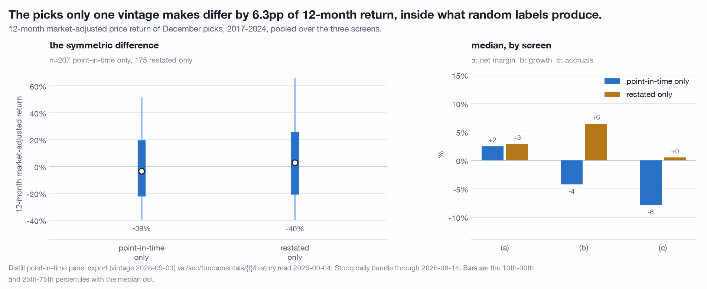
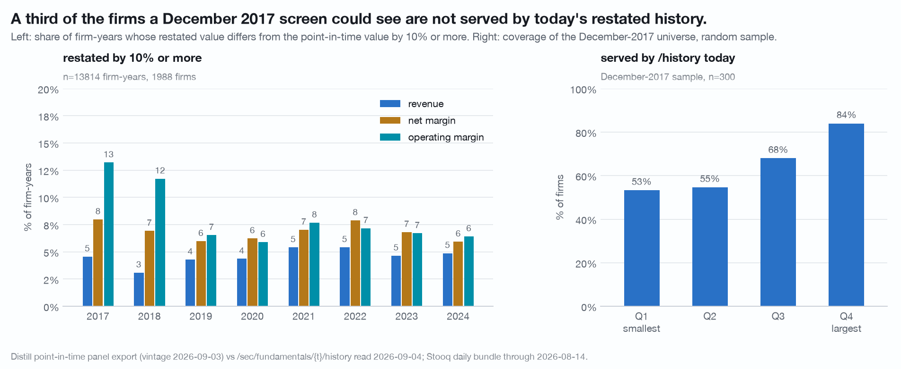

# Re-running a December screen on today's history changes about 5% of the answer through restatement and about a third through who is no longer served (n = 13,814 firm-years / 1,988 firms, December 2017-2024, and a 300-firm coverage probe of the December-2017 universe)

Take a simple screen, run it on a past December, and ask how much the answer
depends on the vintage of the data used: what the API would have reported on
that date, against what it reports today for the same fiscal year. The answer
has two parts and they behave completely differently. The values barely move.
The universe moves a great deal.

Data vintage: Distill `screen/export` panel of 2026-09-03 for the point-in-time
side, `/sec/fundamentals/{ticker}/history` responses cached 2026-09-04 for the
restated side, Stooq US daily bundle through 2026-08-14 for returns. Reproduce
with `./.venv/bin/python research/vintage-gap/study.py` from the repository
root; the script makes no network call and is held by the publisher, available
on request. Claims that changed under an adversarial
re-run are recorded in [CORRECTIONS.md](../CORRECTIONS.md).

## Definitions

Two vintages of the same (CIK, fiscal year):

- **point-in-time**: the December row in the panel export, aligned on its own
  `fiscal_year` column. For 75% of firm-years the December-Y snapshot cites
  FY-1, for the rest FY-Y. The value is what was on file that December.
- **restated**: the cached `/history` response for the same ticker, matched on
  `fiscalYear`, with margins recomputed from raw components rather than read
  from the served rounded fields.

Point-in-time revenue growth uses the last value on file for FY-1 as of the
snapshot date, so both sides of the ratio are knowable in December. Restated
growth uses consecutive fiscal years inside one `/history` response.

Universe: a 2,047-ticker pre-cached pool, December snapshots 2017-2024,
**13,814 firm-years over 1,988 firms**. The window starts at 2017 because
`/history` returns ten fiscal years by default and for 84.6% of pool tickers the
earliest year served is 2016.

**A definitional check first.** On the 12,015 firm-years whose revenue is
bit-identical in both vintages, the two vintages produce bit-identical net margin
on 95.9%, operating margin on 89.8%, fcf margin on 91.3% and accruals on 88.8%,
with a median absolute difference of 5.6e-17 in every case. The panel and the
history endpoint run the same arithmetic. What differs below is vintage, not
formula.

**Coverage.** The Stooq match rate over the full panel's December firm-years
2017-2024 is **0.721** (n = 25,158). Inside the study frame it is 99.0%, because
the pool was itself selected on being priced. That selection is the single
largest caveat on every return number here.

## 1. Among firms both vintages can see, most values are identical

Relative difference between the restated and the point-in-time value, 2017-2024:

| metric | firm-years | identical | differ >=1% | differ >=10% | firms | firms with any >=1% | firms with any >=10% |
|---|---|---|---|---|---|---|---|
| revenue | 13,801 | 87.1% | 7.8% | 4.6% | 1,986 | 27.9% | 18.4% |
| net margin | 13,638 | 83.5% | 11.4% | 6.8% | 1,983 | 38.9% | 26.4% |
| operating margin | 13,449 | 78.2% | 15.5% | 8.0% | 1,958 | 48.3% | 29.6% |
| fcf margin | 9,986 | 80.1% | 13.5% | 7.7% | 1,591 | 42.9% | 26.4% |
| accruals ratio | 10,462 | 82.2% | 10.7% | 5.2% | 1,648 | 39.2% | 21.7% |
| revenue growth | 11,862 | 81.3% | 13.7% | 10.3% | 1,951 | 34.6% | 29.3% |

Per firm rather than per firm-year, between a quarter and a half of firms have
at least one year that moved by 1% or more.

## 2. Direction: restated revenue is lower, restated margins are higher

Over the firm-years that changed at all:

| metric | firm-years changed | firms | restated higher | firm-clustered |
|---|---|---|---|---|
| revenue | 1,786 | 831 | 38.5% | 39.9% |
| net margin | 2,255 | 967 | 55.4% | 54.5% |
| operating margin | 2,931 | 1,164 | 51.5% | 51.9% |
| fcf margin | 1,988 | 884 | 58.3% | 58.9% |
| accruals ratio | 1,859 | 874 | 47.1% | 45.0% |

Every one of those directions makes a firm look better on the screens run here.

**The mechanism has a signature.** Where revenue was restated down by 1% or more
(n = 741 firm-years), net margin was restated up on **67.9%** of them, median
+0.43pp. Where revenue was restated up (n = 324), net margin rose on 44.8%.
Where revenue is identical (n = 11,875), net margin moved at all on 2.0%.
Revenue leaving the top line while the margin on what remains improves is the
divestiture and discontinued-operations signature, and that is an
interpretation supported by those three rates rather than a fact the data
states.

## 3. The 2017-18 difference is a cohort recast, not ageing

The share of firm-years whose operating margin differs by 1% or more is 33.5%
(2017) and 32.0% (2018), then drops to 11.9% (2019) and sits between 9.4% and
11.7% for every year after. The same shape appears in fcf margin (38.7%, 24.3%,
then 8.7-11.1%) and accruals (37.1%, 22.6%, then 4.3-9.0%). Revenue is flat at
6.8-10.3% throughout. A pure ageing effect would decay smoothly; this is a cliff
between the 2018 and 2019 snapshots.

The revisions endpoint shows the same cliff as a cohort event. Share of pool
tickers with a revision at each fiscal period end:

| period end | 2015 | 2016 | 2017 | 2018 | 2019 | 2020 | 2021 | 2022 | 2023 |
|---|---|---|---|---|---|---|---|---|---|
| OpIncome | 9.2% | 22.3% | 26.7% | 13.5% | 8.3% | 8.2% | 8.7% | 9.4% | 9.2% |
| OperatingCashFlow | 11.7% | 15.1% | 12.2% | 4.6% | 3.4% | 3.8% | 3.6% | 3.3% | 2.9% |
| Revenue | 6.6% | 4.5% | 6.3% | 6.7% | 6.4% | 5.7% | 5.8% | 6.0% | 7.4% |
| NetIncome | 3.9% | 6.9% | 8.4% | 5.9% | 4.5% | 5.3% | 5.2% | 5.6% | 3.6% |

Operating income and operating cash flow for fiscal 2015-2017 were recast for
two to four times as many filers as any later year, while revenue was not.
17.4% of the firm-years with a large revenue move have no revision on file at
all, so the revisions endpoint accounts for most of the gap and not all of it.

**Two things bound that reading.** The recast evidence is measured only on the
surviving pool, so it is a statement about firms that lived to 2019 and traded.
And the cliff shape is an argument for the recast reading rather than an
identification of it: the 2017 and 2018 snapshots do double duty as both the
oldest, with the most time for restatement, and the years whose comparatives
were recast most. Eight years of data does not separate the two.

**Count revisions per filing, never per fact.** Across the pool a revising
filing carries a median of 2 and a mean of 4.52 revised facts (7,439 filings,
1,818 tickers). Firm-years whose revenue moved by 10% or more have a revision on
file for the same period end 82.6% of the time (n = 639) against 24.6% for
firm-years whose revenue is identical (n = 12,015), and 76.4% of the big-move
firm-years include at least one `multi-period-recast` against 13.6% of the
unchanged ones.

## 4. The screens agree on 87 to 98% of their picks

Three screens, run at each December once per vintage, on the firms both vintages
can value so the universe is identical on both sides:

| screen | pooled Jaccard | picks PIT | picks restated | agreed | PIT only | restated only |
|---|---|---|---|---|---|---|
| (a) top-quintile net margin | 0.954 | 2,730 | 2,730 | 2,666 | 64 | 64 |
| (b) growth >20%, op margin >0 | 0.924 | 1,987 | 1,956 | 1,894 | 93 | 62 |
| (c) bottom-quintile accruals | 0.951 | 2,097 | 2,097 | 2,044 | 53 | 53 |

Worst screen-year is 0.869 (screen c, December 2017), best is 0.981 (screen c,
December 2024). Two unrelated quintile pick sets of the same size overlap at
0.111, so 0.95 is close to agreement rather than close to chance. In list terms,
the share of a point-in-time pick list the restated vintage drops runs 1.4-2.9%
for screen a, 1.4-6.3% for screen b and 0.9-7.0% for screen c: 4 to 24 names a
year off lists of 143 to 586.

Screen (b) is the only one where the two vintages disagree about the size of the
answer, because it is an absolute threshold rather than a rank: December 2023
picks 421 firms point-in-time and 408 restated.

**A placebo on the overlap statistic.** Vintage labels assigned at random per
firm, all of a CIK's firm-years flipped together, 200 draws, gives Jaccards of
0.964 ± 0.002 (a), 0.9244 ± 0.0000 (b) and 0.957 ± 0.002 (c) against the
observed 0.954 / 0.924 / 0.951. **The overlap statistic is invariant to which
vintage is called first.** Jaccard measures how much the two vintages disagree
and says nothing about direction.

## 5. The picks only one vintage makes: a return null with p = 0.17

Pooled over the three screens and eight Decembers, 12-month market-adjusted
price return:

- picks both vintages agree on: median **+2.9%**, n = 6,545
- picks only the point-in-time vintage makes: median **-3.4%**, n = 207 (172 firms)
- picks only the restated vintage makes: median **+2.9%**, n = 175 (147 firms)
- difference **+6.3pp**

By screen the difference is +0.4pp (a, n = 64/63), +10.7pp (b, n = 90/61) and
+8.3pp (c, n = 53/51). A cluster bootstrap by CIK, 2,000 draws over 283 firms,
puts the pooled difference at +6.2pp with a 95% interval of **[-1.7, +11.6]pp**,
and 5.2% of draws are at or below zero. Under the random-label placebo the
pooled gap has mean -0.0pp and sd 5.0pp, and the observed +6.3pp sits at the
83rd percentile, **one-sided p = 0.17**.

**This is a null.** Treat +6.3pp as not distinguishable from zero, not as a
small effect. The directional facts that do survive are the value asymmetries in
section 2, which rest on 1,800 to 2,900 changed firm-years rather than on 382
picks.

## 6. The universe is where the answer actually changes

A random sample of 300 firms from the December-2017 point-in-time universe
(n = 2,966 firms, seed 7), each queried on `/history` today:

- 196 return 200 (65.3%), 104 return 404 (34.7%)
- **195 of 300 (65.0%) serve fiscal 2016 or 2017**, which is what a December-2017
  screen needs. Binomial 95% interval on n = 300: **[59.6%, 70.4%]**
- coverage by revenue quartile at the snapshot: 53.3% (smallest), 54.7%, 68.0%,
  84.0% (largest), n = 75 each

The chart headline says "a third". The measured figure is 35.0%, and it splits.

**The 404s are not stale ticker strings.** All 104 resolve on `/sec/profile` and
97% return the panel's own CIK. Most are disappearances: 78 of the 104 have no
panel row after 2023, their median last panel date is 2021-08 against 2026-06
for the served group, and their median December-2017 revenue was $329m against
$975m. **The rest are not.** 26 of the 104 (25.0%) have a panel row in 2024 or
2025, and 9 (8.7%) have one dated in 2026, the export's own final year: **CIO,
DENN, GES, HES, LPI, PFMT, SGMA, SRDX and SUP are all in the current panel and
all 404 on `/history` under the panel's ticker.** Of the 35.0% of the
December-2017 universe a screen cannot reach today, **26.0 points are firms that
stopped filing and 3.0 points are firms that did not**, with 6.0 points in
between.

The panel's own last row is the filing-status proxy here, and a firm can leave
the panel for reasons other than ceasing to file, so that three-way split is a
partition of reachability rather than of causes. The nine firms with a 2026 row
are the only unambiguous cell.

### What the missing universe does to one screen

Holding values at their point-in-time values so only the universe changes, the
top-quintile net-margin screen over the full December-2017 sample picks 59
firms. **Fifteen of those 59 (25.4%) are not served by `/history` today**
(bootstrap over the 295 sampled firms: 74.6% served, 95% interval 63.9% to
86.4%).

Re-cutting the top quintile inside the served universe picks 39 names, and all
39 are among the original 59. The restated pick set is a strict **subset** of
the point-in-time one, so the overlap statistic there is 39/59 = 0.661 **by
construction**: it is a coverage number, not a disagreement number, and it is
not the same kind of object as the 0.954 above. A like-for-like comparison, the
top 59 of the served universe against the top 59 of the full one, overlaps on 44
for a **Jaccard of 0.595**, which is genuinely two-sided and still far from
0.954.

**Either way the ordering is not close.** For a December-2017 screen, roughly a
quarter to a third of the answer is unreachable today, against about 5% of the
reachable answer having changed value.

## What would break it

- **The pool is a survivor set.** The 2,047 tickers were selected on being
  priced with revenue over $300m in 2019-2025, so sections 1 to 5 are measured
  on firms that survived to 2019 and traded. Restatement rates, screen churn and
  the return gap could all differ for the third of the 2017 universe section 6
  shows is missing, and nothing here measures that, because those firms have no
  restated vintage to compare against.
- **n = 382 picks behind the return comparison**, across 283 firms, spread over
  eight Decembers and three screens that share firms.
- **Prices are survivorship-biased and dividend-free.** 27.9% of December
  firm-years 2017-2024 have no series at all, and the study frame is 99% priced
  only because the pool was selected that way.
- **`years=20` was not used**, so the 404 rate is measured against the ten-year
  default. A firm that stopped filing in 2019 would 404 either way, but the
  claim that December 2014-2016 has no restated counterpart is about the default
  window rather than about what Distill holds.
- **The probe is one year.** Coverage of the December-2017 universe need not
  equal coverage of December-2021.

## Limits of the data as published

The history endpoint serves one vintage, today's, so "what would this screen have
returned in December 2017" cannot be asked of it directly and has to be assembled
from two different products, the point-in-time panel on one side and today's
history on the other, matched on fiscal year. A restated value carries no stamp
saying when it was restated, so dating one means joining the revisions endpoint
on period end, and 17.4% of the firm-years with a large revenue move have no
revision row at all. Nothing served dates a filer's first or last filing, so
"stopped filing" here is read off the panel's own last row, and a 404 from the
history endpoint carries no reason: outside coverage, no longer filing, a foreign
private issuer and not-a-ticker all arrive as the same response, which is why
each of the 104 had to be resolved against the profile endpoint one at a time.
The default history window is ten fiscal years, so the study frame starts at 2017
and the absence of a restated counterpart before that is a property of the window
rather than of the corpus.

## Disclosure

Companies are named only as facts they exhibit in this data.

Distill Markets Pty Ltd, the publisher of this repository, operates the paid data
service this study uses. Authors and the publisher may hold positions in
securities named here. Everything above is general information derived from
public SEC filings and from a price file the author holds. It is not financial
product advice, does not consider your objectives, financial situation or needs,
and past patterns do not guarantee future results. See [NOTICE](../NOTICE).
