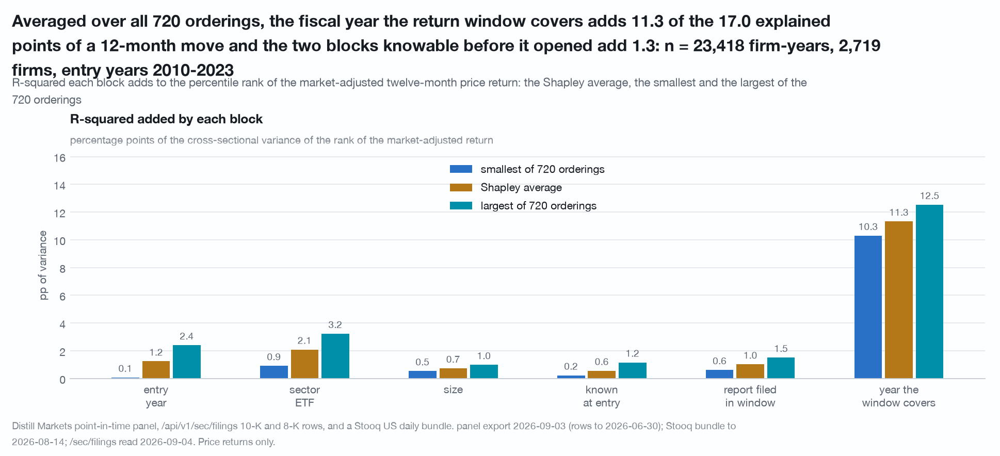
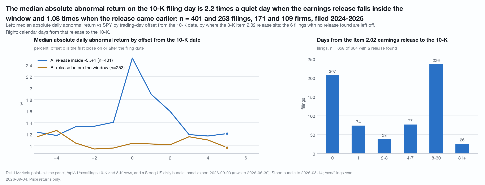

# What a twelve-month price move sits with, and what it does not: the fiscal year the window covers adds 11.3 of the 17.0 explained points (n = 23,418 December firm-years, 2,719 firms, entry years 2010-2023)

Two questions, one frame. Of the cross-sectional variance of a December
firm-year's next twelve months of price return, how much sits with what a
point-in-time panel already knew when the window opened, how much with things
dated inside or after it, and how much with neither, when no block of variables
gets credit for being entered into the model first? And on the day a 10-K is
filed, is anything left in the price once the earnings release that preceded it
is dated?

The title says "sits with" rather than "moves". Nothing here identifies a
direction of causation, and no sentence here is about where a price goes next.

Data vintage: Distill `screen/export` point-in-time panel of 2026-09-03 (rows
to 2026-06-30), `/api/v1/sec/filings` 10-K and 8-K rows read 2026-09-04, joined
to a Stooq US daily bundle through 2026-08-14. Reproduce with
`./.venv/bin/python research/what-moves-v2/study.py` from the repository root,
which makes no API call and prints every table below. The script is held by the publisher and available on request. The 8-K rows it reads are
fetched once by `research/what-moves-v2/sweep.py`, one call per event ticker.

**What these got wrong.** [CORRECTIONS.md](../CORRECTIONS.md) is the
repository's dated log of numbers, helpers and caveats that did not survive an
adversarial re-run. A number that appears there is superseded wherever else it
appears, including here.

## Coverage, and the denominator that matters

**Stooq match rate: 66.81%** of the 45,428 December firm-years over 5,960 CIKs
in the panel 2010-2025 carry a price series. The missing third is absent from
every number here. A current-listings bundle deletes a delisted symbol rather
than ending its series, so a firm that stopped trading inside a window is not in
this sample at all rather than in it with a bad return. **Every share and every
ratio below is a share for survivors and a floor**, and nothing in this data
bounds the difference.

The Stooq index behind that rate read the bundle's fund folders alongside its
equity folders, so a delisted issuer whose symbol a fund now carries counted as
priced. The reader is equities only from 2026-09-10 and this study was not re-run:
the rate stands at its own vintage and is overstated by roughly what entry 21 of
[CORRECTIONS.md](../CORRECTIONS.md) measures, 0.44pp of December firm-years.

A December panel snapshot cites the previous fiscal year on **76.4%** of panel
rows and the current one on 23.6%; in the Part A analysis sample the same split
is **74.4 / 25.6**. That split is why two blocks are needed for the two fiscal
years around the window, and it is also why their labels swap meaning on the
25.6%.

---

## Part A: the six blocks, averaged over every ordering

n = 23,418 December firm-years over 2,719 firms, 8.6 rows per firm, entry years
2010-2023. Each block is a set of columns entered together; all 64 subsets of
the six are fitted, which yields all 720 orderings' increments exactly, and each
block is reported as its Shapley average with the smallest and largest increment
any ordering gives it. The six Shapley values sum to the model's R-squared by
construction.

The headline basis is the **percentile rank of the market-adjusted twelve-month
return**: it market-adjusts, and a rank cannot be carried by a handful of
extreme rows. The winsorised raw return is published beside it as the
sensitivity.

Percentage points of the cross-sectional variance of that basis's own dependent
variable:

| block | Shapley, ranks of the market-adjusted return | min over 720 orderings | max | 95% CIK-cluster interval | Shapley, winsorised raw return | min | max |
|---|---:|---:|---:|---|---:|---:|---:|
| the fiscal year the window covers | **11.33** | 10.30 | 12.53 | [10.55, 12.28] | **7.68** | 6.27 | 8.74 |
| the firm's sector ETF that year | **2.09** | 0.91 | 3.23 | [1.70, 2.52] | **5.98** | 1.67 | 10.58 |
| entry year (the market's own year) | **1.24** | 0.07 | 2.40 | [1.10, 1.47] | **6.39** | 2.00 | 10.32 |
| the report filed inside the window | **1.02** | 0.62 | 1.50 | [0.84, 1.28] | **0.63** | 0.15 | 1.10 |
| size (log revenue) | **0.73** | 0.54 | 0.98 | [0.56, 0.94] | **0.01** | 0.00 | 0.03 |
| everything the panel knew at entry | **0.56** | 0.22 | 1.16 | [0.47, 0.77] | **0.30** | 0.17 | 0.51 |
| total | **16.97** | | | [16.25, 18.21] | **20.98** | | [19.47, 22.20] |

On the winsorised basis the covered-year block's interval is [6.76, 8.64].
Intervals are 300-draw CIK-cluster bootstraps over the 2,719 firms.

### The three-number summary, on five bases

"Known before" is the entry-fundamentals block plus size; "arrived during" is
the entry year, the sector ETF, the report filed inside the window and the
fiscal year the window covers; "neither" is the residual.

| basis | known before | arrived during | neither | total |
|---|---:|---:|---:|---:|
| **percentile ranks of market-adjusted `x_12`** | **1.30** | **15.67** | **83.03** | **16.97** |
| raw `r_12` winsorised 1/99 within entry year | 0.31 | 20.67 | 79.02 | 20.98 |
| raw `r_12` | 0.33 | 13.01 | 86.66 | 13.34 |
| market-adjusted `x_12` | 0.40 | 8.33 | 91.28 | 8.72 |
| percentile ranks of `r_12` | 1.38 | 28.09 | 70.53 | 29.47 |

The three numbers are consistent within a basis and **not comparable across
bases**: the denominator is a different variable each time. "Arrived during" is
29% entry-year fixed effects on the raw basis and 31% on ranks of the raw
return, which market-adjusting removes by construction.

### The placebos

Each block was shuffled and its Shapley value recomputed, 60 draws per block.
The entry block moves firm to firm within entry year, a clustered shuffle; the
two dated blocks move across a firm's own years, a within-firm shuffle that
keeps every firm-level property and destroys only the timing.

| basis | block | observed Shapley | null mean | null 95th pct | draws at or above observed |
|---|---|---:|---:|---:|---:|
| ranks of `x_12` | everything the panel knew at entry | 0.561 | 0.058 | 0.099 | 0 of 60 |
| ranks of `x_12` | the report filed inside the window | 1.018 | 0.340 | 0.417 | 0 of 60 |
| ranks of `x_12` | the fiscal year the window covers | 11.329 | 0.756 | 0.922 | 0 of 60 |
| winsorised raw | everything the panel knew at entry | 0.304 | 0.082 | 0.119 | 0 of 60 |
| winsorised raw | the report filed inside the window | 0.626 | 0.146 | 0.218 | 0 of 60 |
| winsorised raw | the fiscal year the window covers | 7.678 | 0.442 | 0.549 | 0 of 60 |
| raw `r_12` | everything the panel knew at entry | 0.312 | 0.071 | 0.121 | 0 of 60 |
| raw `r_12` | the report filed inside the window | 0.426 | 0.106 | 0.149 | 0 of 60 |
| raw `r_12` | the fiscal year the window covers | 5.372 | 0.312 | 0.425 | 0 of 60 |

**A single-position increment is not the block's value.** Entered in one
position the report block adds 0.12pp and does not clear its own shuffled null.
That arithmetic is correct and it is not the block's Shapley value, which is
0.43pp on the same raw basis, 0.63pp winsorised and 1.02pp on ranks, and on all
three bases 0 of 60 shuffled draws reach the observed value. The correct
statement is that the block is small and not zero, and that its size depends on
what is already in the model by a factor of seven, 0.10 to 0.75pp on the raw
basis.

### Three caveats on Part A

**The raw basis is a statement about a few hundred rows.** Of the raw return's
total sum of squares, the single most extreme row carries 6.74%, the ten most
extreme (0.04% of rows) 25.83%, the fifty most extreme 42.78%, and the 234 most
extreme, which is **1.00% of rows, carry 59.01%**. `r_12` runs from -1.00 to
+27.02 with a standard deviation of 0.676 against a MAD-implied 0.372. That is
why the raw basis is a sensitivity row here and not the headline.

**The entry-year block is a pooling statistic, not a share of any
cross-section.** Alone it is 5.79% of the pooled variance of fourteen December
cohorts, 6.72% equal-weighting those cohorts, and zero by construction inside
any one of them. Fitting the same decomposition inside each entry year with at
least 300 rows, 13 years, the total on the rank basis has a median of 19.3% with
a range of 16.1% to 34.0%, and the covered-year block a median Shapley value of
11.4pp.

**A fiscal year that begins after the window closed reproduces 47% of the
covered year's increment.** On entry years 2010-2022 (n = 20,858 over 2,612
firms), entered in the same position over the first four blocks, the covered
year adds 5.33pp and the year after the window adds 2.51pp; added on top of the
complete six-block model the year after still adds 1.74pp. Component by
component the split is clean:

| component | covered year | the year after the window |
|---|---:|---:|
| revenue growth | 3.391pp | 2.071pp |
| operating-margin change | 3.044pp | 0.002pp |
| net-margin change | 1.915pp | 0.071pp |
| health-score change | 2.100pp | 0.043pp |

The margin channel is specific to the window; the revenue-growth channel is
largely a persistence property that a later year reproduces.

---

## Part B: the 10-K filing day is the earnings release

**The release date is served on the endpoint the study already used.** On
`/api/v1/sec/filings/{ticker}`, `items` is non-null on **99.9%** of the 7,207
8-K rows read and on **0.0%** of the 10-K rows from the same endpoint; **37.7%**
of the 8-K rows carry Item `2.02`. Each 10-K is classified by where the most
recent Item 2.02 8-K on or before its filing date sits, within 150 calendar
days, placed on the ticker's own trading-day calendar.

664 10-K filings over 243 firms, filed 2024-01-24 to 2026-06-26:

| class | filings | firms | median calendar gap, release to 10-K |
|---|---:|---:|---:|
| A: release inside the -5..+1 window | 403 | 172 | 0 days |
| B: release before the window | 255 | 111 | 16 days |
| C: no 8-K Item 2.02 found | 6 | 5 | not applicable |

Over the 658 filings with a release found the gap has a median of 4 calendar
days and a mean of 8.8; 31% share the release's day, 40% are eight days or more,
and 61.2% of releases fall inside the -5..+1 window. Three of the six class-C
filings sit within 120 days of that ticker's own first served 8-K, so the
release is below the corpus floor rather than absent. 660 of the 664 filings
carry a complete daily abnormal-return path over offsets -70 to +20, over 242
firms.

### Dispersion on the filing day, against that firm's own quiet day

Median absolute daily abnormal return versus SPY on day 0, divided by its median
over the 80 quiet offsets (|k| >= 6) in -70..+20, with a 400-draw CIK-cluster
interval. Per-day returns are bar to bar, not a difference of a cumulative path.

| class | n | firms | median abs, day 0 | median abs, quiet | ratio | 95% cluster interval | same ratio on day +1 | placebo at offset -30 |
|---|---:|---:|---:|---:|---:|---|---:|---:|
| A: release inside the window | 401 | 171 | 2.52% | 1.13% | **2.23x** | [1.87, 2.62] | 1.68x | 0.90x |
| B: release before the window | 253 | 109 | 1.04% | 0.97% | **1.08x** | [0.97, 1.21] | 1.07x | 0.89x |
| C: no release found | 6 | 5 | 4.42% | 1.41% | 3.14x | [0.20, 15.38] | 3.29x | 0.88x |
| all events | 660 | 242 | 1.79% | 1.06% | **1.68x** | [1.44, 1.87] | 1.33x | 0.89x |

**The elevated filing day is the earnings release.** When the release falls
inside the window the filing day runs 2.2 times a quiet day of that same firm;
when the release came earlier the filing day is 1.08 times a quiet day, an
interval whose lower end is below one. Pooling the two classes produces the
1.68x that reads as a filing-day effect. Class C is six filings at five firms
and is printed for completeness rather than read.

Two placebos bound this. Moving every statistic 30 trading days earlier on each
ticker's own calendar gives dispersion ratios of 0.90x, 0.89x and 0.88x for the
three classes. Permuting the release-class label among events within filing
year, 200 draws with class sizes held fixed, gives an observed class A minus
class B day-0 ratio of **+1.156** against a shuffled null of mean -0.031,
standard deviation 0.196 and 95th percentile +0.311, with **0 of 200** draws
reaching the observed value.

### The decile spreads all cross zero

Within-filing-year deciles of the change in revenue growth the 10-K carried, cut
on the 660 events with a complete path, top decile minus bottom decile, mean
abnormal return in percentage points, 500-draw CIK-cluster interval:

| class | window | n top / bottom | firms top / bottom | spread | 95% cluster interval | share of draws at or below zero |
|---|---|---:|---:|---:|---|---:|
| A | day 0 | 36 / 43 | 34 / 36 | **-3.50pp** | [-7.05, +0.05] | 0.97 |
| A | days 0..+1 | 36 / 43 | 34 / 36 | **-4.31pp** | [-9.04, +0.36] | 0.96 |
| B | day 0 | 29 / 20 | 27 / 19 | -0.39pp | [-1.53, +0.94] | 0.72 |
| B | days 0..+1 | 29 / 20 | 27 / 19 | -0.65pp | [-2.62, +1.22] | 0.71 |
| C | day 0 | 0 / 3 | 0 / 2 | not estimable | | |
| all events | day 0 | 65 / 66 | 61 / 56 | -2.10pp | [-4.51, +0.01] | 0.97 |
| all events | days 0..+1 | 65 / 66 | 61 / 56 | -2.87pp | [-6.32, +0.03] | 0.97 |

**Every one of these intervals crosses zero.** The sign is negative on both
windows in class A, is a third of the size and a null in class B, and is not
estimable in class C, which has no top-decile filing. At 36 and 43 filings a
cell this is a wide interval, and **the sort is a change in an accounting
series, not the surprise in it**: nothing here measures what was already known
when the 10-K landed. At the placebo day the same spread is +1.25pp
[-0.63, +3.70] in class A and -0.08pp [-1.15, +0.98] in class B, both the
opposite sign and both nulls.

### The filing-day window is not flat, and day 0 is the whole of it

A -5..+1 window around the first print of a 10-K shows no decile ordering, which
reads as a null. The window is not flat: the whole of the -5..+1 spread sits on
the filing day, and day 0 alone is -2.37pp [-4.63, -0.23] on a 648-event
population. Recut on this study's 660-event population the pooled day-0 spread
is -2.10pp [-4.51, +0.01], and cutting the deciles on the 648-event population
reproduces -2.37pp exactly, so the difference between the two figures is which
events the decile boundaries are cut on and nothing else.

What the window carries is the dispersion result, not a spread: the filing day
is elevated, the elevation is dated to the earnings release rather than to the
10-K, and the decile spreads on both windows cross zero.

---

## What would break it

- **The unpriced third.** 33.2% of December firm-years carry no price series at
  all, and they are the small and the gone. Every share, ratio and spread here
  is a share for survivors and a floor with nothing in this data to bound it.
- **A rank basis answers a different question from a level basis.** Ranks of the
  market-adjusted return remove the tail and the market, which is why they are
  published, and it also means 16.97% is not comparable with the raw basis's
  13.34%. Which basis is "the" answer is a choice, made explicitly here with the
  other four printed beside it.
- **The covered-year block is contemporaneous and its direction is not
  identified.** Nothing here separates the market learning fundamentals through
  the year from the two sharing a common cause, and the year after the window
  reproduces 47% of it, so part of the association is firm-level persistence
  rather than anything the window contains.
- **Shapley values are an averaging convention, not a truth.** They remove the
  ordering choice by averaging over it. A reader who believes one ordering is
  the right sequence would read the min or the max column instead, and those
  differ by a factor of up to 34 on the entry-year block.
- **Part B is three filing years in one regime.** The corpus floor on
  `/sec/filings` is January 2024 for 10-K and 8-K rows alike, so the classes
  cannot be split by year at 36 to 43 filings a decile cell, and three of the six
  class-C filings are a corpus-floor artefact rather than a firm that filed no
  release.
- **Class A is itself a mixture.** Of the 658 dated filings, 207 share the
  release's news day and a further 189 sit one to seven calendar days from it.
  Nothing here separates the 10-K's own content from the release on those days.
- **A one-day event window on daily closes cannot see intraday timing.** An 8-K
  filed after the close and a 10-K filed the same day land on the same offset.
- **Missing-value fills.** The ex-ante block is winsorised, filled with the entry
  year's median and carries its own missingness flags, so "known at entry" means
  the metrics where they exist plus who is missing them. Altman Z is null on 45%
  of rows by construction in Financials and Real Estate.
- **Health-score vintage.** The health-score change comes from a July 2026
  export joined per snapshot: it is dated per snapshot, but the fact vintage
  behind each dated score is as later restated.
- **The two fiscal-year labels are only correct for 74.4% of the sample.** For a
  non-December fiscal-year-end filer the pair labelled "filed in the window" is
  the more contemporaneous of the two, and the labels swap meaning on the
  remaining 25.6%.
- **Price returns only, no dividends.** The dividend component is not in any
  number here and its size is not measurable from this data.

## Limits of the data as published

A `/sec/filings` row carries no period end and no fiscal year, and the panel row
carries no fiscal-period-end date, so every fiscal-calendar problem in both parts
is a reconstruction: the two dated blocks in Part A are labelled by a 74/26
mixture whose labels swap meaning on the 26%, and Part B's release dates had to
be rebuilt from 7,207 8-K rows by matching Item 2.02. The filings corpus begins
in January 2024, so Part B is one regime and its classes cannot be split by
period, and three of the six class-C filings are that floor rather than a filer
that published no release. The panel row carries no market capitalisation and no
share count, so "size is 0.01pp on levels and 0.73pp on ranks" cannot be
separated from "revenue is a poor size proxy". And the price file is a
current-listings bundle with no dividends and no delisted issuers, which is what
makes the survivorship caveat unbounded rather than measurable and every number
here a price return.

## Disclosure

No company is named.

Distill Markets Pty Ltd, the publisher of this repository, operates the paid data
service this study uses. Authors and the publisher may hold positions in
securities of the kind described. Everything above is general information derived from
public SEC filings and from a price file the author holds. It is not financial
product advice, does not consider your objectives, financial situation or needs,
and past patterns do not guarantee future results. See [NOTICE](../NOTICE).
