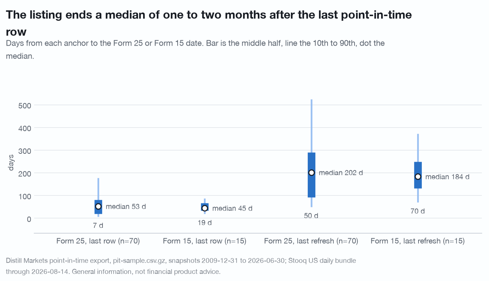
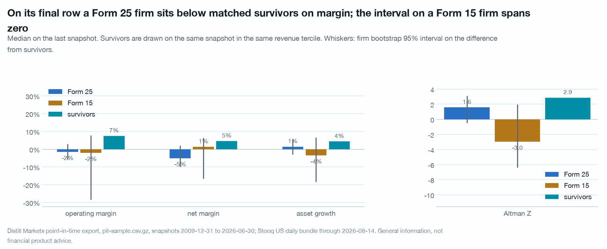

# The listing ends a median 53 days after a Form 25 firm's last point-in-time row and 45 after a Form 15 firm's; the final row's margin gap to survivors was already there on the first row, years earlier

A base-rate check with 200 firms behind it. It runs with no key on the
published sample of the point-in-time export, and every interval below is wide
for that reason; the full export re-runs the same script.

**Uncached API calls:** 0 budgeted, 0 spent. The client's request functions are
replaced by a raiser before anything else is imported. Manifest at start and
end under `cache/research/listing-end/`; no cache entry outside that folder
changed during the run.

Every table below was specified in `PREREGISTRATION.md` before `study.py` was
run. No table was added afterwards. The adversarial review in
[`../review-listing-end/`](../review-listing-end/README.md) held the timing
claims, trimmed the final-row claim, and found the whole-universe match rate
missing; its verdicts are applied in the text below and its numbers are marked
as the review's, reproduced by its own script.

Reproduce from the repository root:

```
DISTILL_OFFLINE=1 ./.venv/bin/python research/listing-end/study.py
```

**Leaving the panel is leaving the corpus, not failing. A Form 25 follows an
acquisition, a going-private and an exchange deficiency alike, and nothing in
this data separates them. That sentence belongs under every table here.**

## Question

For a firm whose listing ended with a Form 25 (exchange delisting) or a Form 15
(Section 12 deregistration) on file, how many days after its last point-in-time
panel row, and after its last record refresh, does the listing end; and how
does the final row on file for a Form 25 firm compare with a Form 15 firm and
with survivors observed on the same snapshot in the same revenue tercile.

Unit resampled: the firm. Descriptive only; no return is computed anywhere, so
there is nothing to market-adjust.

## Data and vintage

| source | vintage | used for |
|---|---|---|
| `cache/pit-sample.csv.gz` | release `pit-sample-2026-09-07`: 200 CIKs drawn with seed 20260630 from the `screen/export` panel rebuilt 2026-09-07, 6,155 rows, snapshots 2009-12-31 to 2026-06-30 | everything |
| `cache/stooq_us/` | Stooq US daily bundle through 2026-08-14 | whether a ticker has a series in the bundle, and where that series starts; nothing else |

`listed_until` and `listing_end_source` are set on every row of a firm whose
listing has ended where a Form 25 or Form 15 is on file (`docs/agent-guide.md`,
field notes). The last panel row precedes the listing end for every dated
firm in the sample; on this export an issuer is dropped from its exit date,
so the row is a last observation, not a staleness drop.

## Pool

| | n |
|---|---|
| firms | 200 |
| survivors (a row at 2026-06-30) | 98 |
| leavers | 102 |
| dated leavers | 87: Form 25 **70**, Form 15 **15**, migration 1, crawl 1 |
| undated leavers | 15 |

Migration and crawl are counted and excluded from every comparison.

**Match rate against the price file, on the honest denominator.** 108 of the
200 firms (54.0%) have a series in the bundle under the panel's ticker; 94.9%
of survivors do and 14.7% of leavers (review, table R3). No result here is
joined to a price, so nothing below is biased by that rate; it is stated
because the contract asks for it. **8 of 87 dated leavers have a series**, and for
**5 of the 8 the series begins after the listing end**: the symbol was
reissued to another company (`PERF`, `CGNT`, `SHLD`, `LDRH`, `INNV`). The
other three span the end date (`QDEL`, `HESM`, and `FOX`, whose source is
`migration`). A forward return read under any of those eight tickers past the
date would belong to whoever holds the symbol now; `analysis.forward_paths`
stops at `listed_until` for that reason. 7 of the 15 undated leavers have a
series that runs to the bundle's edge (table 6).

## Method

- **Last row**: the leaver's last `as_of_date`.
- **Last record refresh**: the first `as_of_date` at which the leaver's final
  `fiscal_year` appears (trap 16).
- **Gap**: `listed_until` minus each anchor, in days.
- **Revenue tercile**: within each snapshot over rows with `is_listed_equity`
  and `revenue > 0`.
- **Matched survivors**: for each Form 25 or Form 15 leaver, three rows drawn
  with a fixed seed from firms still present at the final snapshot, on the
  leaver's last snapshot and in its revenue tercile: 255 rows over 80 firms.
- **Metrics on the final row**, each with its non-null count: revenue,
  operating margin, net margin, asset growth, FCF margin, Altman Z, Piotroski,
  net dilution.

## Null

Between-firm label shuffle, `analysis.clustered_shuffle` with the firm as the
group, 200 draws. (a) The source label across the 85 Form 25 and Form 15
firms; (b) the leaver label across the 70 Form 25 firms and their 80 matched
survivor firms, each firm's rows moving together. Intervals are a firm
bootstrap, `analysis.cluster_boot_diff`, 1,000 draws. The z quoted beside a
placebo is a property of this construction (CORRECTIONS.md entry 18); the
share of draws at least as far from zero is given next to it.

## Results

### 1. The gap from each anchor to the listing end

| | n | 10th | 25th | **median** | 75th | 90th | mean |
|---|---|---|---|---|---|---|---|
| Form 25, from the last row | 70 | 7 | 20 | **53** | 82 | 178 | 129 |
| Form 15, from the last row | 15 | 19 | 35 | **45** | 67 | 88 | 72 |
| Form 25, from the last refresh | 70 | 50 | 93 | **202** | 291 | 525 | 291 |
| Form 15, from the last refresh | 15 | 70 | 133 | **184** | 250 | 373 | 218 |

Days. The last row sits a median 2 quarters after the last refresh for a Form
25 firm (IQR 1 to 3) and 1 quarter for a Form 15 firm (IQR 1 to 2).

Difference of medians, Form 25 minus Form 15: **+8 days from the last row, 95%
interval -29 to +29; +18 days from the last refresh, -65 to +97.** Under the
label shuffle the observed +8 sits at z = 0.49 with 72% of draws at least as
far from zero, and +18 at z = 0.24 with 66%. **The form does not separate the
timing.**



*Leaving the panel is leaving the corpus, not failing.*

### 2. The Form 25 gap by sector and by exit-year half

Median and interquartile range of days from the last row. No interval is
reported per cell; n does not support one.

| cut | n | 25th | median | 75th |
|---|---|---|---|---|
| Healthcare | 21 | 20 | 56 | 174 |
| Industrials | 13 | 23 | 67 | 82 |
| Technology | 8 | 20 | 28 | 36 |
| Consumer Discretionary | 6 | 7 | 27 | 74 |
| Energy | 5 | 78 | 78 | 81 |
| exit 2011 to 2018 | 30 | 24 | 52 | 82 |
| exit 2019 to 2026 | 40 | 20 | 53 | 81 |

The two halves of the sample agree to a day on the median. The sector cells
are five to twenty-one firms and are listed so a reader can see how little
they hold, not because any of them is a result.

### 3. The final row on file

Median on the leaver's last snapshot, with the non-null count. Survivors are
the matched rows.

| metric | Form 25 | Form 15 | undated | survivors |
|---|---|---|---|---|
| revenue | $318m (70) | $335m (15) | $20m (15) | $343m (255) |
| operating margin | -1.6% (65) | -2.1% (14) | -10.4% (15) | 7.5% (244) |
| net margin | -5.1% (66) | 1.4% (15) | -17.6% (15) | 4.6% (250) |
| asset growth | 1.4% (68) | -3.6% (14) | -6.7% (12) | 4.4% (251) |
| FCF margin | -1.0% (44) | 0.8% (8) | -4.9% (10) | 3.3% (164) |
| Altman Z | 1.58 (51) | -2.97 (8) | -0.12 (9) | 2.87 (177) |
| Piotroski | 4 (60) | 3 (12) | 2.5 (12) | 4 (216) |
| net dilution | 0.9% (47) | 0.0% (9) | 3.4% (8) | 0.4% (153) |

Differences of medians with the firm bootstrap 95% interval, and the placebo
from the label shuffle:

| difference | operating margin | net margin | asset growth | FCF margin | Altman Z | Piotroski |
|---|---|---|---|---|---|---|
| **Form 25 minus survivors** | **-9.0pp (-13.3 to -4.5)** | **-9.6pp (-14.4 to -2.5)** | -2.9pp (-7.4 to +1.2) | -4.3pp (-12.4 to -0.0) | -1.28 (-3.34 to +0.23) | 0 (-1 to +0.5) |
| placebo z, share as extreme | -3.13, 0% | -4.70, 0% | -1.20, 22% | -2.02, 5% | -2.32, 3% | -0.05, 100% |
| Form 15 minus survivors | -9.6pp (-35.8 to +0.3) | -3.2pp (-21.2 to +1.8) | -7.9pp (-22.8 to +2.3) | -2.6pp (-22.8 to +16.2) | -5.84 (-9.24 to -0.91) | -1 (-2 to +0.5) |
| Form 25 minus Form 15 | +0.5pp (-10.0 to +26.9) | -6.4pp (-13.8 to +14.1) | +5.0pp (-5.2 to +19.3) | -1.8pp (-23.9 to +18.6) | +4.56 (-0.37 to +7.86) | +1 (-1 to +2) |
| placebo z, share as extreme | -0.10, 96% | -1.02, 41% | 1.19, 20% | -0.39, 77% | 1.98, 3% | 0.97, 68% |

Revenue and net dilution are in the script's output and separate nothing:
Form 25 minus survivors on revenue is -$25m with an interval from -$398m to
+$247m, on net dilution +0.5pp (-0.6 to +1.2).

**What holds, as trimmed by the review.** On its final row a Form 25 firm sits
about nine points below matched survivors on operating margin, with an interval
that excludes zero under tercile matching (-9.0pp) and under sector-and-tercile
matching (-8.5pp, -12.5 to -3.3), and under a snapshot-stratum shuffle no draw
in 200 reached it. Net margin is -9.6pp under tercile matching and -8.9pp with
sector in the cell, where the interval reaches +0.6. Six survivor draws put the
gaps between -9.0 and -11.4pp on operating margin and -9.6 and -11.3pp on net
margin; the draw reported here is the smallest of the six (review, R4b).

**Where the gap lives.** The same 70 firms already sat -8.1pp and -7.2pp below
survivors matched on their **first** panel row, a median 4.2 years before the
listing ended, with intervals excluding zero, and -6.5pp and -6.3pp eight
quarters before the last row (review, R5). The final row is where the gap was
measured, not where it arose: about one to two of the nine to ten points belong
to the final row itself. Within revenue terciles no interval excludes zero
(review, R4a): the small-firm third carries -16pp and -21pp inside intervals
seventy points wide, the middle third +1.4pp and -2.6pp. The 40 firms whose
final row had gone two or more quarters without a refresh carry the gap
(-9.2pp and -9.6pp, intervals excluding zero); the 30 firms current at the end
show half of it with intervals including zero (review, R2). Leavers' last rows
are not staler than the survivor rows they are matched with (mean 1.77 against
1.61 quarters), so vintage does not drive the pooled number.

**What does not hold.** Form 25 against Form 15 separates nothing: the one
placebo z near 2, on Altman Z, has a bootstrap interval that includes zero and
8 Form 15 rows behind it, and the review's exit-year-stratum shuffle agrees. A
Form 15 firm against survivors is undetermined rather than a null: the
operating-margin interval spans zero by 0.3pp under tercile matching and
excludes it under sector matching (-12.3pp, -39.2 to -1.9) on 14 rows, and at
n = 15 neither reading is stable.



*Leaving the panel is leaving the corpus, not failing.*

### 4. The undated leavers

A coverage statement, not a result. The 15 leavers with no Form 25 or Form 15
on file are the smallest cohort (median last revenue $20m against $318m for a
Form 25 firm) and the lowest on every metric in table 3.

| ticker | sector | last snapshot | rows | series to the bundle's edge | quarters before the final snapshot |
|---|---|---|---|---|---|
| ANVS | Technology | 2012-12-31 | 4 | yes | 54 |
| EVRT | Technology | 2014-06-30 | 6 | no | 48 |
| NESL | Materials | 2017-06-30 | 19 | no | 36 |
| CGPH | Consumer Discretionary | 2018-06-30 | 10 | no | 32 |
| GPIW | Communication Services | 2018-12-31 | 13 | no | 30 |
| ERNA | Healthcare | 2020-12-31 | 36 | yes | 22 |
| PGAS | Industrials | 2021-03-31 | 7 | no | 21 |
| ZNOG | Energy | 2022-12-31 | 4 | no | 14 |
| BMRA | Healthcare | 2023-06-30 | 4 | yes | 12 |
| MSLP | Healthcare | 2023-06-30 | 41 | no | 12 |
| EEPL | Energy | 2023-12-31 | 24 | no | 10 |
| ATYR | Healthcare | 2023-12-31 | 8 | yes | 10 |
| ISPC | Healthcare | 2023-12-31 | 8 | yes | 10 |
| CODX | Healthcare | 2023-12-31 | 12 | yes | 10 |
| LITS | Healthcare | 2025-06-30 | 24 | yes | 4 |

**7 of the 15 have a series that runs to 2026-08-14 under the panel's
ticker.** Where the series begins says which shape each is (review, R3): for
2 of the 7 (`ANVS`, `ERNA`) it begins after the firm's last panel row, the
reissued-symbol shape; for the other 5 (`BMRA`, `ATYR`, `ISPC`, `CODX`,
`LITS`) it begins before the firm's first panel row and runs through and past
its whole panel presence, the shape of a symbol that never stopped trading.
Their exit stays an inference from the last row (trap 3), and any study that
counts an undated leaver as a departure should say that 5 of 15 here carry a
series that says otherwise.

## What did not hold

- Form 25 against Form 15 on the timing of the listing end (section 1).
- Form 25 against Form 15 on the final row (section 3).
- The final row as the place the margin gap lives: it is a firm-level gap
  present on the first row, years earlier (review, R5). The title of the first
  draft, "the final row differs from survivors", was true as a number and
  wrong as an emphasis.
- Form 25 against survivors within any single revenue tercile (review, R4a).
- Form 15 against survivors: undetermined at n = 15, not a null.
- Sector cells (section 2): too few firms to carry an interval.

## What data was wished for

- **The filing date of the last periodic report.** The gap measured here runs
  from a panel snapshot, which follows the filing by up to a quarter. The
  filings endpoint serves it on a Free key; 102 calls would date every leaver
  in the sample.
- **Who filed the Form 25.** An exchange files it after a deficiency; the
  issuer files it before an acquisition closes or a voluntary delisting. The
  filer field would split the Form 25 cohort into the two events this document
  cannot separate, and would test whether the stale-row split the review found
  (R2) is that split.
- **Whether the undated leavers still file.** A first-filing and last-filing
  date on the row would settle 7 of 15 cases in section 4.
- **The full export.** Every interval here is a 200-firm interval; the same
  script runs on `cache/panel.csv` from a Pro key.

## Disclosure

Companies are named only as facts they exhibit in this data.

Distill Markets Pty Ltd, the publisher of this repository, operates the paid
data service this study uses. Authors and the publisher may hold positions in
securities named here. Everything above is general information derived from
public SEC filings and from a price file the author holds. It is not financial
product advice, does not consider your objectives, financial situation or
needs, and past patterns do not guarantee future results. See
[NOTICE](../../NOTICE).
