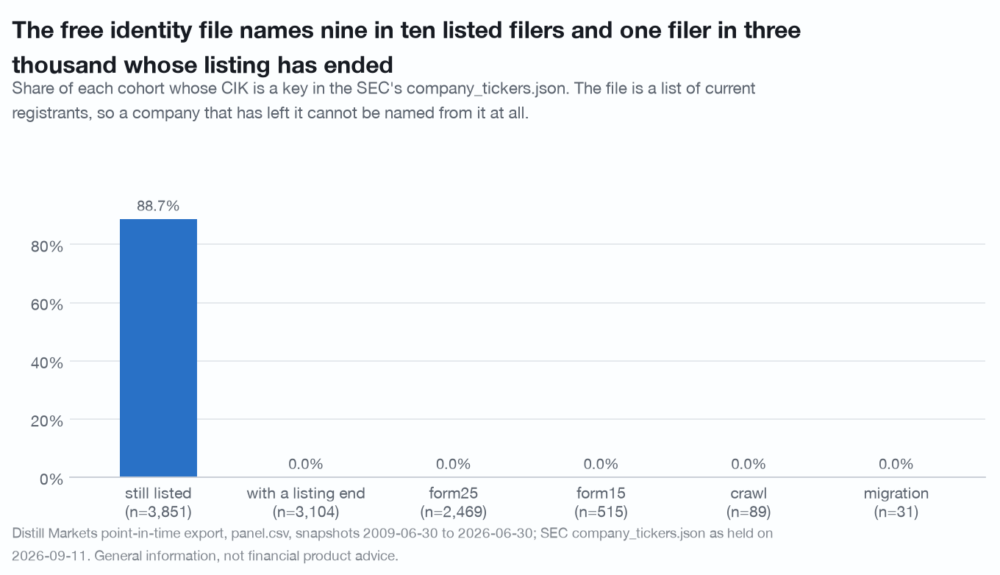

# The free identity file names 88.7% of the panel's listed filers and 1 of the 3,104 whose listing has ended; the API lookup names all 3,104 and 12.4% of the time the name it returns is another company's

**Superseded in part.** The review in
[`../review-naming-the-dead/`](../review-naming-the-dead/) split the "still
listed" pool, which was two populations, and the headline is 95.3% against 0.0%
rather than 88.7% against 0.0%; it also showed that SEC's own per-CIK
submissions file names 3,104 of 3,104 ended filers, so the claim this document
invites about free data is false in the direction it is usually read
(`CORRECTIONS.md` entries 22, 23 and 24). The published version is
[`../../findings/naming-the-dead.md`](../../findings/naming-the-dead.md). This
document is kept as the first draft the review was run against.

A census of 6,955 filers, not a sample. Every rate below is a population rate
over the whole panel, so none of them carries a sampling interval and none of
them needs a placebo: there is no draw to shuffle.

**The keyless half runs keyless.** Tables 1, 2, 3 and 7 join the panel to the
SEC's free `company_tickers.json` and need no API key, no paid tier and no
cached response. They were run with `DISTILL_API_KEY` empty and an empty
response cache and produced the numbers printed here. On the published 200-firm
sample, which needs no key either, the same script run with only
`cache/pit-sample.csv.gz` on disk reports 0 of 87 ended firms nameable against
103 of 113 still listed.

**Uncached API calls:** 0 budgeted, 0 spent. The client's request functions are
replaced by a raiser before anything else is imported. Manifest at start and
end under `cache/research/naming-the-dead/`; no cache entry outside that folder
changed during the run.

Every table below was specified in `PREREGISTRATION.md` before `study.py` was
run. No table was added afterwards.

Reproduce from the repository root, with the SEC file where
[docs/data-sources.md](../../docs/data-sources.md) says to put it:

```
DISTILL_OFFLINE=1 ./.venv/bin/python research/naming-the-dead/study.py
```

**Leaving the panel is leaving the corpus, not failing. A Form 25 follows an
acquisition, a going-private and an exchange deficiency alike, and nothing in
this data separates them. That sentence belongs under every table here.**

## Question

For a filer in the point-in-time panel, can its company name be recovered from
the free SEC identity file, and does that answer depend on whether its listing
has ended; and where the free file fails, does the publisher's own ticker-keyed
profile endpoint recover the name of the company that was asked about.

Unit: the firm (CIK). Descriptive only. No price appears anywhere in this
study, so there is nothing to market-adjust and nothing here is about where a
price goes next.

Why the name matters: a name is the join key to everything the SEC does not
key by CIK. Trial registries, patent assignees, procurement awards, court
dockets, press archives and most commercial datasets are keyed by company name
or by ticker, and a panel row that cannot be named cannot be joined to any of
them. Survivorship bias in prices is well known. This is the same hole one
layer earlier, in identity, and it bites before a single price is fetched.

## Data and vintage

| source | vintage | used for |
|---|---|---|
| `cache/panel.csv` | Distill Markets `screen/export` panel rebuilt 2026-09-07, 197,332 rows over 6,955 CIKs, snapshots 2009-06-30 to 2026-06-30 | the universe, the listing status, the ticker |
| SEC `company_tickers.json` | as held on 2026-09-11: 10,407 ticker rows over 8,013 CIKs | whether a filer can be named for free |
| `cache/api_v1_sec_profile_*.json` | `/api/v1/sec/profile/{ticker}` responses fetched 2026-09-11, one per ended firm | what the API lookup returns |

The SEC file is a US federal government work in the public domain. This
repository ships no copy of it and no downloader for it; the one-line fetch and
the access conditions are in
[docs/data-sources.md](../../docs/data-sources.md), and
`distill_toolkit/sec_tickers.py` reads whatever you put on disk.

`listed_until` and `listing_end_source` are set on every row of a firm whose
listing has ended where a Form 25, a Form 15, a crawl of the SEC's submissions
index or a CIK migration says so.

## Pool

| | n |
|---|---|
| firms | 6,955 |
| still listed (no `listed_until`) | 3,851 |
| with a listing end | 3,104 |
| by source | Form 25 **2,469**, Form 15 **515**, crawl **89**, migration **31** |

## Method

- **Nameable from the free file** means the firm's CIK is a key in
  `company_tickers.json`. The file carries a `title` on every row it holds, so
  presence is nameability. The CIK is the key that survives a rename and a
  symbol change, which is why the join is made on it.
- **The API lookup** is `/api/v1/sec/profile/{ticker}`, asked with the ticker
  on the firm's last panel row. That half of the study needs a key of a tier
  that reaches the route; the responses are read from `cache/` as files here,
  so the reproduction itself needs none.
- **CIK agrees** means the response's `cikNumber` equals the CIK asked about.
  Where it does not, the `name` in that response belongs to another company.
- **Where a mismatch lands** is the returned CIK's own span of panel rows under
  the same ticker, against the asked firm's last row: a **later holder**, an
  **earlier or overlapping holder**, or **absent from the panel** under that
  ticker. This is a geometry. It is not a corporate fact and it does not
  identify which of the three situations in section 4 a case is.

## Null

None, and none is needed. This is a census of every firm in the panel, not a
sample from it, so each share is exact rather than estimated and there is no
label to shuffle. The comparison that carries the finding, 88.7% against 0.0%,
is a difference between two complete cohorts.

## Results

### 1. What the free file can name

| cohort | n | nameable | share |
|---|---|---|---|
| **still listed** | 3,851 | 3,415 | **88.7%** |
| **with a listing end** | 3,104 | 1 | **0.0%** |
| Form 25 | 2,469 | 1 | 0.0% |
| Form 15 | 515 | 0 | 0.0% |
| crawl | 89 | 0 | 0.0% |
| migration | 31 | 0 | 0.0% |

The file is a list of current registrants. A company whose listing has ended
leaves it, and nothing in it records that the company was ever there. The
answer is therefore not "poor coverage of delisted names"; it is that the file
does not hold delisted names at all, and the four listing-end sources agree to
the row.

The single exception is `ADAP`, whose Form 25 is dated 2025-10-28 and whose CIK
was still in the file on 2026-09-11. One row in 3,104 is the file lagging, not
a class of case.

The 11.3% of still-listed filers the file also misses are a separate matter: a
CIK in the panel with no current ticker row in the SEC file, which includes
filers between symbols and filers the SEC's list does not carry.



*Leaving the panel is leaving the corpus, not failing.*

### 2. Reaching the same file by its other key makes it worse

The obvious repair is to join on the ticker instead. It does not work, and it
fails silently.

| cohort | n | ticker is in the file | points at this firm | points at someone else |
|---|---|---|---|---|
| still listed | 3,851 | 3,375 | 3,357 | 18 |
| **with a listing end** | 3,104 | **266** | **0** | **266** |

For 266 of the 3,104 ended filers the last ticker is present in the current
file, and in **none of the 266** does it point at the filer that held it. A
ticker join to this file answers "who holds that symbol today", which for a
symbol freed by a delisting is by construction someone else. 8.6% of the ended
cohort would come back named, and every one of those names would be wrong.

### 3. What the API lookup returns, and where it is wrong

Asked for all 3,104 ended firms by ticker, `/sec/profile/{ticker}` returned a
name for **3,104 of 3,104**, with no errors. That is the coverage claim, and it
holds.

**The identity claim does not. The CIK returned matched the CIK asked about for
2,718 of 3,104, so 386 responses (12.4%) carried another company's name.** That
is a defect in the publisher's own API. It is stated here rather than in a
footnote, because a coverage number is worth nothing without it, and it is why
`docs/traps.md` gains trap 19.

| how the listing ended | CIK agrees | CIK differs | share differing |
|---|---|---|---|
| Form 25 | 2,168 | 301 | 12.2% |
| Form 15 | 466 | 49 | 9.5% |
| crawl | 80 | 9 | 10.1% |
| migration | 4 | 27 | **87.1%** |

**The mechanism is visible in the response itself.** Every profile response
carries a `source` field naming the path that resolved it, and the defect is
concentrated in one of the three:

| resolver `source` | n | CIK agrees | CIK differs | share differing |
|---|---|---|---|---|
| `submissions-dead-crawl` | 2,748 | 2,618 | 130 | 4.7% |
| `ticker-history-fallback` | 111 | 100 | 11 | 9.9% |
| `sec-edgar` | 245 | **0** | **245** | **100.0%** |

`sec-edgar` behaves as a lookup of whoever holds the symbol now: on this census
it never once returned the CIK that was asked about, 245 responses out of 245.
It is the path taken when the other two have nothing to offer, which is exactly
the case for a company that is gone. It accounts for 245 of the 386 mismatches;
the other 141 come from the two paths that are usually right.

Until that path checks the CIK it returns, the rule for a caller is: **compare
`cikNumber` in the response against the CIK you asked about, and treat any
response whose `source` is `sec-edgar` as a symbol lookup rather than an
identity.** Both fields are served, so the check costs nothing.


*Leaving the panel is leaving the corpus, not failing.*

### 4. The 386 are three situations, not one

Flattening them into "the endpoint is wrong" would be inaccurate. The 87.1% on
`migration` in particular is not a random error: a migration is a CIK moving,
so the endpoint is exposing a real successor relationship rather than losing
one.

Where the 386 land, as geometry:

| how the listing ended | later holder of the ticker | earlier or overlapping holder | absent from the panel under this ticker |
|---|---|---|---|
| Form 25 | 119 | 74 | 108 |
| Form 15 | 16 | 6 | 27 |
| crawl | 6 | 1 | 2 |
| migration | 22 | 0 | 5 |
| **all** | **163** | **81** | **142** |

**165 of the 386 return a company that is still listed today.** For the 163
later holders the median gap from the asked firm's listing end to the returned
company's first panel row under that ticker is 763 days (10th to 90th
percentile 78 to 3,119); 70 of the 163 are inside a year and 40 are more than
five years out.

The geometry does not separate the three situations, and the following are
**hand-classified against the filings, not computed**:

| what it is | asked | listing ended | name returned | gap |
|---|---|---|---|---|
| **successor after a reorganisation** | `GOOG` | 2015-10-02 | Alphabet Inc. | 181 d |
| | `ETN` (migration) | 2012-11-14 | Eaton Corp plc | 137 d |
| | `DIS` | 2019-03-20 | Walt Disney Co (the new CIK) | 286 d |
| | `DOW` | 2017-09-01 | DOW INC. | 942 d |
| | `DELL` | 2013-10-29 | Dell Technologies Inc. | 1,249 d |
| **unrelated company that took the symbol later** | `BEAM` | 2014-05-02 | Beam Therapeutics Inc. | 2,890 d |
| | `APC` | 2019-08-09 | ARKO Petroleum Corp. | not in the panel |
| **predecessor** | `DTV` | 2015-10-30 | DIRECTV GROUP INC | not in the panel |

Timing does not sort them. Alphabet at 181 days and Eaton Corp plc at 137 are
successors; so are Dow Inc at 942 days and Dell Technologies at 1,249. A rule
that called anything inside a year a successor would keep Alphabet and Eaton,
which sit among the 70 later holders arriving inside a year, and lose Dow and
Dell, which sit out where the unrelated reissues are. The successor
relationship is real and is worth having, but it is a different fact from the
one the caller asked for, and nothing in the response says which of the two it
just returned.

### 5. One sector, on the honest denominator

The last Healthcare row per ticker with revenue of at least $10m: 1,157 firms,
649 still listed and 508 with a listing end. This is the shape a sector study
meets, and it is where the identity hole turns into a selection.

| cohort | revenue tercile | n | nameable | share |
|---|---|---|---|---|
| still listed | small | 216 | 187 | 86.6% |
| still listed | mid | 216 | 196 | 90.7% |
| still listed | large | 217 | 204 | 94.0% |
| still listed | **all** | 649 | 587 | **90.4%** |
| with a listing end | small | 169 | 0 | 0.0% |
| with a listing end | mid | 169 | 1 | 0.6% |
| with a listing end | large | 170 | 0 | 0.0% |
| with a listing end | **all** | 508 | 1 | **0.2%** |

The still-listed half carries a size gradient, 86.6% to 94.0%, so a name-keyed
join is already biased toward larger firms inside the surviving half. The ended
half is flat at zero across all three terciles: size does not buy a delisted
company its name back. A researcher who builds a Healthcare cohort by joining
names to any outside registry gets 587 firms out of 1,157, all of them
survivors, and nothing in the joined frame says the other 570 existed.

**Which way this biases a result.** Every name-keyed study built on the free
file is a study of companies that are still listed, plus a mild tilt to the
larger ones among them. That is the same direction as the price-file bias in
trap 3 and it stacks with it: the price file drops the dead, and the identity
file drops them again before the price join is even attempted.

## What did not hold

- **"Join on the ticker instead" as a repair.** It returns names for 266 ended
  filers and every one of them is a different company (section 2).
- **The API lookup as an identity.** It is a coverage success and an identity
  failure at 12.4%, and its own `source` field says where (section 3).
- **Any timing rule for separating a successor from a reissue.** The
  distributions overlap, and the named cases cross in both directions
  (section 4).
- **Size as protection.** The ended half is at zero in every revenue tercile
  (section 5).

## What data was wished for

- **A former-name history that names the company asked about.**
  `formerNamesJson` is in the payload. Not preregistered, and printed by the
  script rather than folded into a table: it is populated on 136 of the 386
  mismatches and on 0 of the 2,718 agreements, so it tracks the resolver path
  rather than the company. When it is populated it lists the **returned**
  company's former names, which on `DIS` are `TWDC Holdco 613 Corp` and
  `TWDC Holdco 613 Corp.` and do not name the Walt Disney Co that was asked
  about. It therefore does not repair the substitution, and a field that did
  would turn a successor case from an unlabelled swap into a stated
  relationship.
- **A CIK-keyed identity route.** Every defect in section 3 is the consequence
  of asking by ticker, which is not a stable identifier. A route keyed on the
  CIK could not return the wrong company by construction.
- **The SEC's own history.** `company_tickers.json` carries no date and the
  SEC serves only the current file. A researcher who wanted
  to name the companies listed in 2014 would have had to save the file in 2014.
  Capturing it daily costs nothing and cannot be done retroactively, which is
  the whole argument of this study in one sentence.
- **A name on the panel row.** The export carries the ticker and the CIK. A
  name column would make this study unnecessary for anyone holding the panel.

## Disclosure

Companies are named only as facts they exhibit in this data.

Distill Markets Pty Ltd, the publisher of this repository, operates the paid
data service this study uses, and section 3 reports a defect in that service's
own endpoint. Authors and the publisher may hold positions in securities named
here. Everything above is general information derived from public SEC filings
and from a public-domain SEC file the reader holds. It is not financial product
advice, does not consider your objectives, financial situation or needs, and
past patterns do not guarantee future results. See [NOTICE](../../NOTICE).
