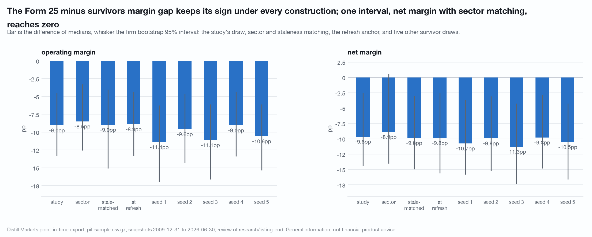

# Adversarial review of `research/listing-end`

Reviewer pass over `research/listing-end/` (`PREREGISTRATION.md`, `README.md`,
`study.py` and the tables under `cache/research/listing-end/`). The job was to
break the headline claims. Nothing in that folder was edited.

Reproduce from the repository root:

```
DISTILL_OFFLINE=1 ./.venv/bin/python research/review-listing-end/study.py
```

**0 uncached API calls.** Every number below comes from `cache/pit-sample.csv.gz`
(release `pit-sample-2026-09-07`, 200 firms, 6,155 rows, snapshots 2009-12-31 to
2026-06-30), `cache/stooq_us/` (through 2026-08-14) and the reviewed study's own
on-disk tables. The reviewed study's constructors (`load_panel`, `frames`,
`series_facts`, `matched_survivors`, `t2_gaps`, `_median_gap`) are **imported by
path**, not copied, so a reproduction failure here would be a real one. Importing
the study also inherits its raiser on every client request function, and the
manifest diff at the end of the run reports zero cache entries changed outside
this review's folder. Full log: `cache/research/review-listing-end/output.txt`;
the study's own reproduction log: `cache/research/review-listing-end/repro-run.txt`.

The study is a 200-firm base-rate check and says so in its first paragraph. Every
interval in it and in this review is a 200-firm interval; the verdicts below are
about whether the claims hold on that sample under other constructions, not about
what the full export would show.

---

## Verdicts

| headline claim | verdict |
|---|---|
| (a) Medians 53 and 45 days from the last row, 202 and 184 from the last refresh | **HELD** (exact reproduction; table R0) |
| (b) The form does not separate the timing | **HELD** (year-stratum placebo z 0.50 and 0.43, 79% and 60% of draws as extreme; table R1a) |
| (c) Form 25 minus survivors about -9 to -10pp on operating and net margin, intervals excluding zero | **TRIMMED.** The pooled number holds under the year-stratum null, staleness matching, the refresh anchor and six survivor draws (range -9.0 to -11.4pp operating, -9.6 to -11.3pp net). Three cuts trim it: with sector in the matching cell the net-margin interval reaches zero (-8.9pp, -14.0 to +0.6); within revenue terciles no interval excludes zero and the middle tercile sits at +1.4pp / -2.6pp; and the same firms were already -8.1pp / -7.2pp below survivors on their first panel row, a median 4.2 years before the listing ended. The final row carries a firm-level gap that predates it by years; about 1 to 2 of the 9 to 10 points belong to the final row itself. |
| (d) Form 15 against survivors and Form 25 against Form 15 are nulls | **HELD** for Form 25 against Form 15 (year-stratum placebo: nothing beyond Altman Z at z 1.98, which the study already discounts). **HELD WITH A CAVEAT** for Form 15 against survivors: the study's null on operating margin spans zero by 0.3pp, and with sector in the cell it excludes zero (-12.3pp, -39.2 to -1.9) on 14 rows; at n = 15 neither reading is stable and the honest statement is "undetermined", not "null". |
| (e) Coverage: 94.9% of survivors, 8 of 87 dated leavers with a series, 5 of 8 beginning after the listing end, 7 of 15 undated with a series to the edge | **HELD as counts, TRIMMED as a statement.** The whole-universe match rate the contract asks for is never stated: it is 54.0% (108 of 200), and 14.7% of leavers. Section 4's "nothing in this data says which" is too strong: for 2 of the 7 the series begins after the firm's last panel row (a reissued-symbol shape) and for 5 it begins before the firm's first panel row and spans its whole panel presence. |

**The check that did the most damage** was the early-window firm-identity check
(R5): the Form 25 minus survivors margin gap is mostly a property of which firms
these are, not of their final row. Second was the tercile split (R4a), where no
tercile carries an interval that excludes zero.

**Language:** no sentence in the reviewed README rates, values, forecasts or
recommends a security. One sentence is borderline and should be reworded: "the
weakest on every metric in table 3" applies a rating word to a cohort whose 15
members are listed by ticker in the same section; "lowest on every metric" says
the same thing. No em dashes.

---

## R0. Reproduction

`r0_reproduction.csv`. Forty-seven quantities quoted in the README were read
against the study's on-disk outputs (`t1_universe.json`, `t2_gaps.csv`,
`t2_diffs.json`, `t4_medians.json`, `t4_diffs.json`, `t5_placebo.csv`,
`t6_undated.csv`). **All 47 match** to the README's rounding. The study ran on
`pit-sample.csv.gz` and said so; `cache/panel.csv` on this machine predates the
`listed_until` column and the script fell through to the sample as documented.
Two prose claims were checked separately and hold: the last panel row precedes
`listed_until` for all 87 dated firms (minimum gap 1 day), and the two
exit-year halves' medians are 52 and 53.

| quantity | README | script |
|---|---|---|
| Form 25 / Form 15 median gap from the last row | 53 / 45 | 53 / 45 |
| Form 25 / Form 15 median gap from the last refresh | 202 / 184 | 202 / 184 |
| difference of medians, last row (interval) | +8 (-29 to +29) | +8 (-29 to +29) |
| difference of medians, refresh (interval) | +18 (-65 to +97) | +18 (-65 to +96.5) |
| Form 25 minus survivors, operating margin | -9.0pp (-13.3 to -4.5) | -9.0pp (-13.3 to -4.5) |
| Form 25 minus survivors, net margin | -9.6pp (-14.4 to -2.5) | -9.6pp (-14.4 to -2.5) |
| between-firm placebo z, operating / net | -3.13 / -4.70 | -3.13 / -4.70 |
| matched survivor rows / firms | 255 / 80 | 255 / 80 |
| survivors with a series; dated leavers with one; beginning after the end | 94.9%; 8; 5 | 94.9%; 8; 5 |
| undated leavers with a series to the edge | 7 | 7 |

## R1. The null, rebuilt

### R1a. Year-stratum shuffle (`r1_year_stratum_placebo.csv`)

The study shuffled labels between firms with no stratification. Here the source
label is permuted among Form 25 and Form 15 firms **within exit-year strata**,
and the leaver label among Form 25 firms and their matched survivors **within
snapshot-date strata** (each firm's rows move together; a survivor firm drawn on
two snapshots is a unit in each). 200 draws, seeds as in the study.

| comparison | metric | observed | placebo mean | placebo sd | z | share as extreme |
|---|---|---|---|---|---|---|
| Form 25 minus Form 15, exit-year strata | gap from last row | +8.0 d | -0.9 | 17.7 | 0.50 | 79% |
| Form 25 minus Form 15, exit-year strata | gap from refresh | +18.0 d | -0.6 | 43.5 | 0.43 | 60% |
| Form 25 minus Form 15, exit-year strata | operating margin | +0.5pp | -0.6 | 6.3 | 0.18 | 93% |
| Form 25 minus Form 15, exit-year strata | net margin | -6.4pp | -0.5 | 6.6 | -0.90 | 45% |
| Form 25 minus Form 15, exit-year strata | Altman Z | +4.56 | 0.39 | 2.11 | 1.98 | 1.5% |
| Form 25 minus survivors, snapshot strata | operating margin | -9.0pp | -0.9 | 2.2 | -3.65 | 0% |
| Form 25 minus survivors, snapshot strata | net margin | -9.6pp | -0.4 | 1.6 | -5.73 | 0% |
| Form 25 minus survivors, snapshot strata | FCF margin | -4.3pp | -0.6 | 2.1 | -1.82 | 3.5% |
| Form 25 minus survivors, snapshot strata | Altman Z | -1.28 | 0.12 | 0.44 | -3.16 | 0.5% |
| Form 25 minus survivors, snapshot strata | asset growth | -2.9pp | -0.3 | 2.1 | -1.28 | 16% |

The timing null (b) and the Form 25 versus Form 15 null (d) clear the stratified
shuffle as they cleared the study's. The Form 25 minus survivors margin gaps
clear it too: no draw in 200 reached the observed value on either margin. The z
is a property of the construction (CORRECTIONS.md entry 18) and is quoted beside
it; the share of draws is the number to read.

### R1b. Sector added to the matching cell (`r1c_sector_matched.csv`, `r1c_sector_cells.csv`, `r1d_sector_matched_placebo.csv`)

Same draw as the study's, with the survivor required to share the leaver's
sector as well as its snapshot and revenue tercile. Coverage is the cost: of 70
Form 25 firms, 8 have no sector match on their snapshot, 10 have one row, 5 have
two and 47 have three; of 15 Form 15 firms, 5 have none. 183 survivor rows over
71 firms.

| difference | operating margin | net margin | FCF margin | Altman Z |
|---|---|---|---|---|
| Form 25 minus sector-matched survivors | **-8.5pp (-12.5 to -3.3)** | **-8.9pp (-14.0 to +0.6)** | -4.1pp (-13.6 to +3.2) | -1.59 (-3.44 to +0.03) |
| snapshot-stratum placebo z, share as extreme | -3.18, 0.5% | -3.38, 0% | -1.98, 9% | -2.80, 2.5% |
| Form 15 minus sector-matched survivors | -12.3pp (-39.2 to -1.9) | -4.0pp (-24.3 to +1.1) | -5.6pp (-29.5 to +12.1) | -6.11 (-9.48 to -1.59) |

Sector matching moves the point estimates by less than a point and widens the
intervals: the net-margin interval now reaches +0.6pp. The placebo still finds no
draw as extreme, so the two readings disagree on net margin, which is what a
borderline interval on 66 rows looks like. **Claim (c) is trimmed** to: operating
margin -8.5 to -9.0pp with an interval that excludes zero under both matchings;
net margin -8.9 to -9.6pp with an interval that excludes zero under tercile
matching and touches zero under sector-and-tercile matching. The Form 15 minus
survivors operating margin, a null in the study by 0.3pp, excludes zero here on
14 leaver rows against 20 survivor rows; that is the caveat on (d).

## R2. Fiscal time (`r2_staleness.csv`, `r2_gap_by_staleness.csv`, `r2_alt_constructions.csv`)

The sample carries `fiscal_year` and no period end, so staleness is the study's
own `stale_q` (quarters since the row's fiscal year first appeared for that firm)
applied row by row, plus the coarser `as_of` year minus `fiscal_year`.

| cohort | n | mean stale quarters | share 0 | share 1 | share 2 | share 3+ | share with fiscal year 2+ years behind the snapshot |
|---|---|---|---|---|---|---|---|
| Form 25 last row | 70 | 1.77 | 24% | 19% | 27% | 30% | 5.7% |
| matched survivor rows | 255 | 1.61 | 24% | 20% | 29% | 28% | 0.8% |

Leavers' last rows are **not systematically staler** than the survivor rows they
are compared with: a mean of 1.77 quarters against 1.61, and the same four-bucket
shape. The one difference is a tail: 4 of 70 leaver rows ride on a fiscal year two
or more years behind the snapshot, against 2 of 255 survivor rows. So the
vintage mismatch does not drive the pooled gap, and two rebuilds confirm it:

| construction | operating margin | net margin | Altman Z |
|---|---|---|---|
| study: tercile-matched | -9.0pp (-13.3 to -4.5) | -9.6pp (-14.4 to -2.5) | -1.28 (-3.34 to +0.23) |
| survivors also matched on staleness bucket (206 rows) | -9.0pp (-15.1 to -4.0) | -9.8pp (-15.0 to -3.0) | -1.59 (-3.59 to -0.06) |
| anchored at the leaver's last refresh, its fresh row against survivors on that snapshot (210 rows) | -8.9pp (-13.3 to -4.4) | -9.8pp (-15.6 to -2.5) | -1.46 (-3.40 to +0.21) |

What staleness does do is split the leavers. Against their own matched rows:

| leaver's last row | n | operating margin | net margin | Altman Z |
|---|---|---|---|---|
| fresh (0 to 1 quarters stale) | 30 | -5.3pp (-17.9 to +4.7) | -5.3pp (-16.5 to +0.8) | -0.46 (-2.82 to +1.87) |
| stale (2 or more quarters) | 40 | -9.2pp (-15.8 to -4.0) | -9.6pp (-19.1 to -2.3) | -2.53 (-4.47 to +0.25) |

The margin gap sits in the 40 firms whose final row had gone two or more quarters
without a refresh; the 30 firms that were current when the listing ended show
half the gap with intervals that include zero. A firm that stops refreshing before
its listing ends and a firm that is current to the end are the two events the
study says it cannot separate; the refresh gap is a partial proxy for that split
and the study did not use it. This is a fact about the sample, not a result, at
30 and 40 firms.

## R3. The denominator (`r3_match_rate.csv`, `r3_undated_series.csv`)

| cohort | firms | with a series in the bundle | rate |
|---|---|---|---|
| survivors | 98 | 93 | 94.9% |
| dated leavers, Form 25 | 70 | 6 | 8.6% |
| dated leavers, Form 15 | 15 | 1 | 6.7% |
| dated leavers, migration / crawl | 1 / 1 | 1 / 0 | |
| undated leavers | 15 | 7 | 46.7% |
| **all leavers** | 102 | 15 | **14.7%** |
| **whole universe** | 200 | 108 | **54.0%** |

The README states the survivor rate and the leaver counts and never the
universe rate. Nothing in the study is joined to a price, so no result is biased
by it; the contract asks for the number regardless, and 54.0% is it. The counts
"8 of 87", "5 of 8" and "7 of 15" reproduce exactly (R0).

The undated leavers, with where each series begins:

| ticker | last panel row | series first bar | series to the edge | shape |
|---|---|---|---|---|
| ANVS | 2012-12-31 | 2020-01-29 | yes | begins 7 years after the last row |
| ERNA | 2020-12-31 | 2021-03-30 | yes | begins after the last row |
| BMRA | 2023-06-30 | 2016-08-29 | yes | spans the firm's panel presence |
| ATYR | 2023-12-31 | 2015-05-07 | yes | spans the firm's panel presence |
| ISPC | 2023-12-31 | 2021-06-17 | yes | spans the firm's panel presence |
| CODX | 2023-12-31 | 2017-07-12 | yes | spans the firm's panel presence |
| LITS | 2025-06-30 | 2005-02-25 | yes | spans the firm's panel presence |
| EVRT, NESL, CGPH, GPIW, PGAS, ZNOG, MSLP, EEPL | | none | no | |

Section 4 says the 7 could be either a reissued symbol or a firm that still files
and "nothing in this data says which". The series start date does say something:
2 of the 7 begin after the firm's last panel row, which is the reissued-symbol
shape the README itself uses for the 5 dated leavers in the match-rate paragraph,
and 5 begin before the firm's first panel row and run to the bundle's edge, which
is the shape of a symbol held continuously through and past the firm's panel
presence. That is a coverage statement, as the section says, and the sentence
should carry the split.

## R4. Size and the draw

### R4a. Within revenue terciles (`r4a_terciles.csv`)

Form 25 firms against their own matched survivors, by the tercile the match was
drawn in.

| tercile | n leavers | median last revenue | operating margin | net margin | FCF margin | Altman Z |
|---|---|---|---|---|---|---|
| 1 (small) | 37 | $105m | -16.4pp (-55.1 to +17.0) | -20.5pp (-58.4 to +18.3) | -28.2pp (-79.6 to +4.8) | -2.47 (-8.65 to +2.32) |
| 2 | 23 | $710m | +1.4pp (-9.2 to +5.8) | -2.6pp (-9.7 to +3.7) | -3.8pp (-10.9 to +6.6) | -1.19 (-3.47 to +1.18) |
| 3 (large) | 10 | $4,644m | -6.8pp (-15.7 to +3.5) | -4.3pp (-11.0 to +1.9) | -6.8pp (-16.3 to +4.5) | -1.70 (-5.00 to +1.73) |

No tercile carries an interval that excludes zero. The pooled -9 to -10pp is a
median over a mixture whose small-firm third has point estimates of -16 and -21pp
inside intervals seventy points wide, and whose middle third shows +1.4 and
-2.6pp. The pooled comparison is size-balanced by construction (the survivor mix
is 3x the leaver mix in every tercile), so this is not a size confound; it is a
statement that the gap is not uniform across size and that 37, 23 and 10 firms
do not bound it within any tercile.

### R4b. The survivor draw (`r4b_seeds.csv`)

The study's seed and five others, three survivor rows per leaver each time.

| seed | survivor firms | operating margin | net margin |
|---|---|---|---|
| 20260909 (study) | 80 | -9.0pp (-13.3 to -4.5) | -9.6pp (-14.4 to -2.5) |
| 1 | 82 | -11.4pp (-17.0 to -6.3) | -10.7pp (-15.8 to -3.7) |
| 2 | 82 | -9.6pp (-14.3 to -4.7) | -9.9pp (-15.2 to -3.1) |
| 3 | 79 | -11.1pp (-16.6 to -6.1) | -11.3pp (-17.4 to -4.2) |
| 4 | 84 | -9.0pp (-13.4 to -4.3) | -9.8pp (-14.8 to -2.8) |
| 5 | 79 | -10.6pp (-15.3 to -6.1) | -10.5pp (-16.6 to -4.2) |

Range across six draws: **-9.0 to -11.4pp** on operating margin and **-9.6 to
-11.3pp** on net margin, every interval excluding zero. The study's seed gives the
smallest gap of the six on both metrics. The draw is not the source of the
result; "about -9 to -10pp" is the low end of what the draw produces and "-9 to
-11pp" describes it.



## R5. Firm identity: the same firms years earlier (`r5_early_window.csv`)

The 70 Form 25 firms on their **first** panel row, and on the row **eight
quarters before their last**, each against three survivors drawn on that
snapshot in the firm's revenue tercile at that time.

| window | n | median years before the last row | operating margin gap | net margin gap | Altman Z gap |
|---|---|---|---|---|---|
| final row (the study) | 70 | 0 | -9.0pp (-13.3 to -4.5) | -9.6pp (-14.4 to -2.5) | -1.28 (-3.34 to +0.23) |
| 8 quarters before the last row | 52 | 2.0 | -6.5pp (-13.6 to -2.9) | -6.3pp (-12.9 to -3.1) | -2.40 (-4.25 to -0.65) |
| first panel row | 70 | 4.2 | -8.1pp (-14.5 to -4.5) | -7.2pp (-13.9 to -4.3) | -2.01 (-3.73 to -0.29) |

On their first row, a median 4.2 years before the listing ended, these firms
already sat 8.1 and 7.2 points below survivors matched on that snapshot, with
intervals that exclude zero. The final-row gap of 9.0 and 9.6 points is that
firm-level gap plus one to two points. The README's title, "the final row differs
from survivors", is true as written and reads as if the final row were where the
difference lives; it is where the difference was measured. A reader who takes the
study as "the last row on file for a Form 25 firm looks different from a
survivor's" gets the right number and the wrong emphasis: the firms that leave by
Form 25 in this sample were lower-margin firms for as long as the panel held them.
The Altman Z gap, which the study reports as touching zero on the final row,
excludes zero on both earlier windows.

## R6. Language (`r6_language.csv`)

Every sentence of the reviewed README was scanned for rating, valuation,
forecasting and recommending words (buy, sell, hold, cheap, target, should,
opportunity, expect, will, upside, downside, outperform, weak, strong, best,
worst, fail, winner, loser and their variants), tables excluded. Eleven
sentences hit; all but one are the words in another sense ("what holds",
"what did not hold", "not failing", "may hold positions", "should say that 7
of 15"). The one to reword is in section 4: "the weakest on every metric in table
3", said of a cohort listed by ticker in the same section. It describes medians
on stated metrics and forecasts nothing, so it does not fail the rule; it uses a
rating word where "lowest" says the same. The chart headlines in `study.py` are
descriptive. Companies are named only as facts they exhibit. No em dashes.

## What the study got right that this review leaned on

The zero-call design, the raiser on the client, the manifest diff, the
preregistered tables, and a script that produced every number in the README on
the first run. The caveat line under every table ("leaving the panel is leaving
the corpus, not failing") is the right one and R2 gives it a partial handle the
study could use.

## What data was wished for

The same three things the study lists, and one more: the filer of each Form 25
would test whether the stale-row split in R2 is the exchange-versus-issuer split
it resembles.

## Disclosure

Companies are named only as facts they exhibit in this data.

Distill Markets Pty Ltd, the publisher of this repository, operates the paid
data service this study uses. Authors and the publisher may hold positions in
securities named here. Everything above is general information derived from
public SEC filings and from a price file the author holds. It is not financial
product advice, does not consider your objectives, financial situation or
needs, and past patterns do not guarantee future results. See
[NOTICE](../../NOTICE).
