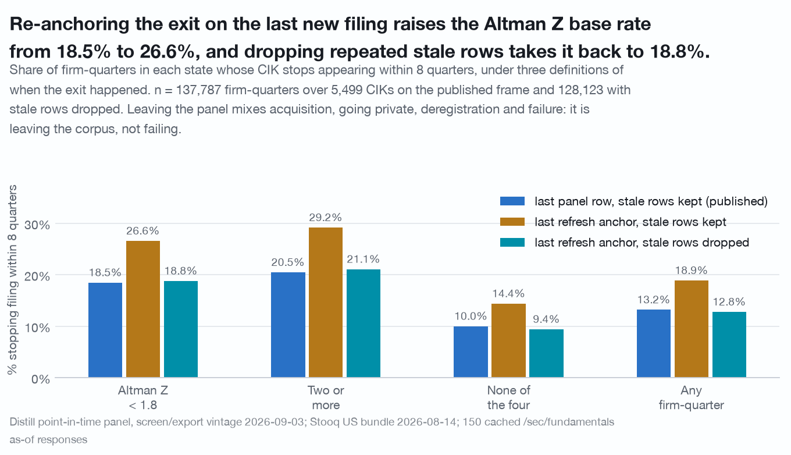
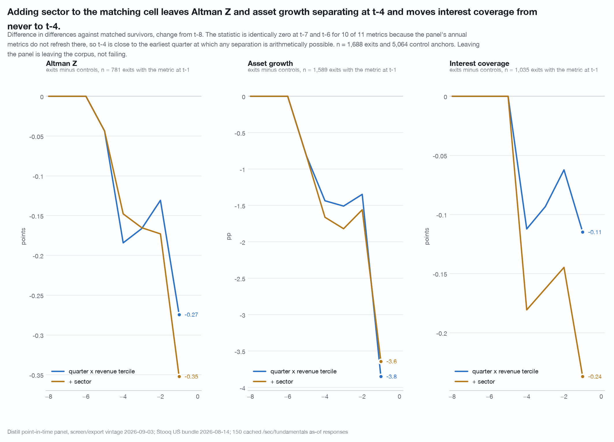
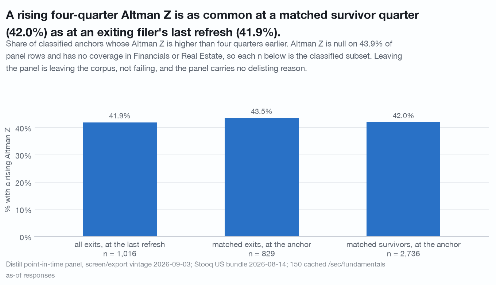

# Adversarial review of `research/pre-exit-signature`

Reviewer pass over `research/pre-exit-signature/` (`README.md`, `study.py`,
`panel_base.py`, `probe_delisted.py` and the frames under
`cache/research/pre-exit-signature/`, including the 150 cached probe responses).
The job was to break the headline claims. Nothing in that folder was edited.

Reproduce with:

```
./.venv/bin/python research/review-pre-exit/study.py
```

**0 uncached calls.** Every number below comes from
`cache/panel.csv`, `cache/stooq_us/`, the reviewed study's own cached frames and
the 150 cached `/sec/fundamentals/{t}/as-of/2026-09-03` responses. The reviewed
study's constructors (`load_frames`, `build_anchors`, `build_trajectories`,
`states`, `section_base_rates`, `rate_ci`, `tercile`) are **imported**, not
reimplemented, so a reproduction failure here would be a real one. The script is
seeded throughout; two consecutive runs are kept at
`cache/research/review-pre-exit/run1.txt` and `run2.txt`.

Files: `study.py`, full log at `cache/research/review-pre-exit/output.txt`,
intermediate frames alongside it, three charts in `charts/`.

---

## Question

For the pre-exit study's headline numbers: do they reproduce, and do they survive
(1) an exit definition re-anchored on the last new filing rather than on the last
panel row, (2) the removal of stale repeated rows from the base-rate frame, (3)
matching on sector as well as quarter and revenue tercile, (4) the two toolkit
defects the study itself reports, (5) a placebo for the Altman-Z-trend split, and
(6) a language and caveat scan?

## Method

1. Rebuilt the section-3 base-rate table by importing the study's own
   constructors, and checked every count and rate against the published README.
2. Recomputed every base rate under six exit definitions: the published one; the
   exit dated at `fresh_qi` (the last quarter at which a new annual filing
   refreshed the row); each of those with rows after `fresh_qi` dropped; the
   corrected one minus the eleven probe CIKs with no served `delistedAt`; and one
   calibrated to the probe's own median position of `delistedAt`.
3. Re-ran the matched-control signature with sector added to the matching cell,
   over five control-draw seeds, and measured how much of the change-from-t-8
   statistic is identically zero.
4. Wrote a minimal synthetic frame with a known answer for each of the two
   claimed toolkit defects, then measured both on the study's own frame and on
   the frames of `research/share-issuance`, `research/fundamental-momentum` and
   `research/price-leads-record`.
5. Ran the Altman-Z-trend split against matched survivor anchors, and against the
   Z level at the same anchor.
6. Scanned the README and the five chart headlines for advice, valuation and
   price-direction language, and for the mixed-cause caveat.

### Stooq match rate

**66.34%** of the 190,586 firm-quarters and **53.22%** of the 6,103 CIKs carry a
series under the panel's ticker; **11.43%** of the 2,555 exited CIKs do. All four
reproduce the published values exactly. Every priced-subset number in the study,
and every priced-subset number in this review, is therefore a floor computed on a
9-in-10-missing denominator, and nothing in this data bounds by how much.

---

# Verdicts

| headline claim | verdict |
|---|---|
| Universe 190,586 firm-quarters / 6,103 CIKs / 2,555 exits (41.9%); 1,688 with 8 quarters of history | **SURVIVES** (exact) |
| Stooq 66.34% / 53.22% / 11.43% / 79.26% | **SURVIVES** (exact) |
| Probe: 141/150 same CIK, 130 with `delistedAt`, drop lags it +2.92q for 93.1%, last refresh precedes it +1.83q for 93.8% | **SURVIVES** (exact) |
| "7.8% of sampled exits are not exits" | **SURVIVES WITH CAVEATS** (7.8% is the no-`delistedAt` share; the still-filing evidence covers 5.7%) |
| 29.97% unpriced against 2.33% priced, reproducing the ghost cohort | **SURVIVES** (exact) |
| Matching: 1,688 exits, 5,064 controls over 1,936 CIKs, 0 unmatched | **SURVIVES** (independently rebuilt, identical) |
| **Base rate table: Altman Z < 1.8 -> 18.49% whole, 3.55% priced** | **SURVIVES as arithmetic, BROKEN as a measurement** (two offsetting errors; range 9.83% to 26.60%) |
| "Understated by 4.2x to 6.2x, largest ratio on the healthiest state" | **SURVIVES** (4.25x to 6.90x corrected) |
| Ordering survives, relative lift roughly survives, level does not | **SURVIVES** (lift 1.85x published, 2.00x corrected) |
| Horizon sweep 10.40 / 18.49 / 25.94% | **SURVIVES** (11.05 / 18.81 / 26.11% corrected) |
| Out-of-sample split keeps sign and order in both halves | **SURVIVES** (also under the corrected definition) |
| **"Between 82% and 103% of the gap on eight of eleven metrics is already there at t-8"** | **BROKEN as stated** (seven of eleven, and 72% to 115% on seven once sector is matched) |
| "The signature is a level, not a slope" | **SURVIVES** as a direction |
| "Altman Z and asset growth separate from t-4" | **SURVIVES WITH CAVEATS** (survives sector matching; t-4 is the earliest quarter at which the statistic can move) |
| **"Interest coverage, FCF margin, Piotroski, accruals and net dilution never separate"** | **BROKEN for interest coverage** (t-4 under sector matching, in 3 of 5 seeds); the other four survive |
| Between-firm shuffle null, z = 4.6 to 12.2 | **SURVIVES WITH CAVEATS** (z = 3.2 to 8.0 under a null that drops no row) |
| Within-firm shuffle reproduces most of each lift, Piotroski z = 2.0 | **SURVIVES** (helper carries no defect; not re-derived) |
| `clustered_shuffle(within=year)` NaNs 44% of rows | **SURVIVES** (42.19% +/- 0.43% over 20 seeds) and is **incomplete**: a second defect in the same helper is unreported |
| `cluster_boot_diff` returns 0.000 [0.000, 0.000] on integer scores | **SURVIVES as a symptom, BROKEN as a cause** (the trigger is a tied median, not an integer dtype) |
| 1,016 classifiable exits, 590 falling / 426 rising Z, same drop schedule | **SURVIVES** (exact; mean stale tail differs by 0.12 quarters) |
| **"Almost all of the exit lift a distress state carries is a lift in exits preceded by a falling Z"** | **SURVIVES as arithmetic, BROKEN as a reading about exit type** |
| Language: no advice, no price direction, no named company | **SURVIVES** |
| Every table carries the "left the corpus, not failed" caveat | **BROKEN** (three of four tables do not) |

---

## 1. Reproduction: exact

`study.py` section 1. Importing `S.section_base_rates` and re-running it from the
panel reproduces the published section-3 table to **0.0048pp** at worst, and every
n, CIK count and priced count matches. The universe counts, all four Stooq rates,
the ghost-versus-priced pair (29.97% on n = 54,205 against 2.33% on n = 83,582)
and all six probe statistics reproduce exactly from the cached responses.

One wording item on the probe. The study's "what would break it" reads *"7.8% of
sampled exits are not exits. 11 of 141 CIKs carry no `delistedAt` and 8 of them
still file."* The 7.8% is `11/141`, the no-`delistedAt` share; the evidence that a
CIK still files covers **8 of 141, 5.7%**, because three of the eleven return no
`filedAt` at all. And one of the eleven is a **commodity trust**, admitted to the
universe by `is_listed_equity` and `revenue > 0`, so part of the 7.8% is a
universe-filter fact rather than a filing fact. Both counts should travel
together.

## 2. The exit anchor and the stale tail: the headline is right by cancellation

`study.py` section 2. This is the most important item in this review.

The study anchors its **trajectory** on `fresh_qi`, the last quarter at which a
new annual filing refreshed the row, and explains at length why the last panel row
is a drop date and not a filing date. Its **base-rate table** does not use that
anchor: `exit_h` is `last_qi <= qi + horizon`. Two consequences follow, and they
run in opposite directions.

**First, the exit is dated late.** The probe measures the lag directly: the panel
drop follows the served `delistedAt` by a median +2.92 quarters. Re-dating the
exit at `fresh_qi` and changing nothing else takes the Altman Z cell from
**18.49% to 26.60%**, +8.12pp.

**Second, the frame contains repeated rows that are positive by construction.**
**9,664 of the 137,787 base-frame rows (7.01%) fall after their CIK's last record
refresh.** Every one of them belongs to an exiting CIK; survivor rows contribute
none, because a still-present CIK's last refresh is later than the 2022Q2 anchor
cut. Those rows repeat one annual filing, so they carry the firm's final reading
several times over, and **100.0% of them are labelled as exiting within eight
quarters** because the drop is at most five quarters away. In the Altman Z < 1.8
cell they are 9.6% of the rows and **51.9% of the 5,161 positive outcomes**.
Removing them and changing nothing else takes the cell from **18.49% to 9.83%**,
-8.65pp.

| definition | Altman Z < 1.8 | two or more | none of the four | any firm-quarter |
|---|---|---|---|---|
| **A** published: last panel row, stale rows kept | **18.49%** | 20.48% | 10.00% | 13.21% |
| **B** last-refresh anchor, stale rows kept | 26.60% | 29.20% | 14.40% | 18.90% |
| **C** last-refresh anchor, stale rows dropped | **18.81%** | 21.09% | 9.42% | 12.79% |
| **D** last panel row, stale rows dropped | 9.83% | 11.37% | 4.76% | 6.66% |
| **E** C minus the 11 probe CIKs that still file | 18.74% | 21.01% | 9.40% | 12.75% |
| **F** last refresh + 2 quarters (probe-calibrated), stale rows dropped | 15.21% | 17.03% | 7.52% | 10.27% |

n is 137,787 firm-quarters over 5,499 CIKs for A, B and E-less-eleven, and
128,123 for C, D and F. Priced-subset cells move the same way: 3.55% published,
4.91% under B, 3.10% under C, 1.72% under D, 2.51% under F.

**The published 18.49% is within 0.33pp of the corrected 18.81% because the two
errors nearly cancel.** That is luck, not method: the honest range across four
defensible definitions is **9.83% to 26.60%**, a factor of 2.7. The definition
closest to the API's own delisting date is F, an anchor two quarters after the
last refresh (the probe's median `delistedAt` position), which gives **15.21%**.

What does not move: the **ordering** (every distress state above the healthy state
in every definition), the **relative lift** (1.85x published, 2.00x corrected,
2.02x under F), the **whole-panel-over-priced ratio** (5.20x published, 6.06x
corrected, 6.07x under F), the **horizon sweep** (corrected 11.05 / 18.81 /
26.11% against published 10.40 / 18.49 / 25.94% at h = 4, 8, 12) and the
**out-of-sample split** (corrected 19.08% for 2009-2015 against 18.67% for
2016-2022, both keeping every state's sign and order).

**Dropping the still-filing CIKs does almost nothing, and cannot.** The eleven
probe CIKs with no `delistedAt` are 0.4% of the 2,555 exits, and removing them
moves the corrected Altman cell by **-0.070pp**. The probe's 7.8% is a rate on a
150-CIK sample, not a list, so it can only be applied as a bound: removing 7.8% of
exit CIKs at random, 200 draws, takes the corrected Altman cell to
**17.36% +/- 0.16** and the unconditional rate to **11.79% +/- 0.04**.

One asymmetry the re-anchored definition introduces and this review does not
resolve: **218 of 3,548 still-present CIKs (6.1%)** have not refreshed since
2024Q2 and are still counted as non-exits. They contribute 4,033 rows to the base
frame, so the effect is small here, but the fresh anchor is stricter on exits than
on survivors by construction.



## 3. The signature under sector matching

`study.py` section 3. My sampler reproduces the study's `build_anchors` exactly
(same 1,688 exits, same 5,064 control rows, same 1,936 control CIKs). Adding the
panel's own sector at the anchor row to the cell costs nothing: 0 exits go
unmatched, 5,064 controls over 1,914 CIKs, and the sector total-variation distance
between the two cohorts falls from **0.107 to 0.000**. The imbalance it removes
is real: Industrials is 16.1% of exit anchors against 21.4% of tercile-matched
controls, Energy 7.5% against 3.7%, Real Estate 5.0% against 7.5%.

**The two movers survive.** Altman Z still first separates at **t-4** and its t-1
difference in differences goes from -0.274 [-0.434, -0.143] to **-0.352
[-0.511, -0.177]**; asset growth still first separates at **t-4** and goes from
-0.038 [-0.053, -0.025] to **-0.036 [-0.053, -0.023]**. n at t-1 is 781 exits /
2,672 controls for Altman Z and 1,589 / 4,911 for asset growth.

**One of the five "never separate" metrics starts separating.** Interest coverage
goes from *never* to a first significant quarter at **t-4** (-0.181, interval
excluding zero), though its t-1 interval still crosses zero at
-0.237 [-0.490, +0.015]. It is seed-fragile: over five control-draw seeds the
first significant quarter is t-4, t-2, never, t-4, never. FCF margin, Piotroski,
accruals and net dilution still never separate at any quarter under either cell.
Operating margin moves from t-1 to t-3 and M-Score from t-3 to t-4.

**"Separates from t-4" is close to the earliest answer the design can give.** The
statistic is each anchor's change from its own t-8 value, and the panel's metrics
refresh once a fiscal year, so that change is **exactly zero** for most rows
early in the window:

| share of rows whose change from t-8 is exactly zero | t-7 | t-6 | t-5 | t-4 |
|---|---|---|---|---|
| Altman Z | 90.2% | 75.3% | 12.8% | 0.8% |
| asset growth | 90.8% | 76.8% | 11.8% | 0.4% |
| operating margin | 90.6% | 76.5% | 11.9% | 0.7% |

**Ten of the eleven metrics have a difference in differences of exactly
0.000 [0.000, 0.000] at t-7 and again at t-6**, which is the same degeneracy the
study flags for the Piotroski score, here reaching every continuous metric. The
"first quarter the difference excludes zero" statistic therefore has no resolution
before t-5 and almost none before t-4. The study discloses the annual granularity;
what it does not say is that the early part of its own trajectory table is a
structural zero rather than a measured null. The one metric that separates at t-5,
revenue growth, does so because its denominator is a four-quarter revenue lag that
moves on a different schedule from its numerator.

**"Between 82% and 103% on eight of the eleven metrics" is seven, not eight.**
Counting the study's own published column, seven metrics fall in that band
(operating margin 87%, Altman Z 93%, interest coverage 88%, FCF margin 103%,
revenue growth 82%, Piotroski 87%, accruals 87%); asset growth is 41%, M-Score
32%, and two rows are n/a. With sector in the cell the shares fall: operating
margin 77%, interest coverage 73%, Piotroski 72%, accruals 75%, M-Score -2%, and
only two metrics remain inside 80-105%. The direction survives (nine of eleven
still have at least half the t-1 gap present at t-8); the specific range and the
count do not.



## 4. The two toolkit defects, and a third the study did not find

`study.py` section 4. Both claims were checked against a synthetic frame with a
known answer before being measured on real data. `distill_toolkit/analysis.py` was
read, not edited.

### 4a. `clustered_shuffle(within=...)` dropped rows: **confirmed, 42.19%**

Synthetic frame: firm A in years 1-3, firm B in 2-4, firm C in year 5, seven rows
and no NaN. A relabelling must return seven labels. Over six seeds the helper
returned 5, 0, 5, 4, 0 and 5 NaN: a row whose partner firm had no row in that
calendar year was dropped. On the study's own placebo frame the rate was
**42.19% +/- 0.43% over 20 seeds** against the study's reported 44%.

The behaviour was stated in the docstring, so "silently" is too strong; what was
missing was a **count**, which the caller had no way to obtain. The drop was not
level-neutral: the shuffled mean on surviving rows was 0.1235 against an observed
rate of **0.1343 on the same rows** and 0.1321 on all rows. The study's lift
statistic subtracts the shuffled overall rate from the shuffled state rate on the
same surviving rows, so that 1.1pp level bias cancels, and the study's claim that
"the drop mostly cancels" is correct for the statistic it publishes. The shipped
helper drops no row (`CORRECTIONS.md` entries 16 and 18, regression tests in
`tests/test_analysis_nulls.py`).

### 4b. The same helper kept only the first row of a `(group, within)` cell: **new, unreported**

`clustered_shuffle` built its source series as
`src = src[~src.index.duplicated()]`, so when a group had more than one row at the
same `within` key, only the first survived. Synthetic frame: firm B holds four
distinct labels 9, 8, 7, 6 in year 1; firm A received **9, 9, 9, 9** at every seed
and 8, 7 and 6 were never drawn.

The study's frame is **quarterly** and aligned on **calendar year**: mean 3.64 rows
per `(cik, year)` cell, 98.2% of cells holding more than one row. Measured on that
frame, **100.0% of shuffled `(cik, year)` cells carried a constant label against
95.25% of observed cells**, so the null destroyed within-year variation that the
observed statistic keeps, and three quarters of every partner firm's labels were
never drawn. The shipped helper walks every row of the partner's cell in order
(`CORRECTIONS.md` entries 16 and 18, regression tests in
`tests/test_analysis_nulls.py`).

### 4c. Does either defect change a published number in the pre-exit study? No

A null that drops nothing (each row takes its partner cell's mean label, falling
back to the partner's overall mean) and a null with no `within` alignment at all
both leave every state clearing its own null:

| state | observed lift | published null | z | no-drop null | z | no-`within` null | z |
|---|---|---|---|---|---|---|---|
| Altman Z < 1.8 | +5.28pp | +0.06 +/- 0.59 | 8.8 | +0.63 +/- 0.92 | **5.1** | -0.11 +/- 0.92 | 5.9 |
| interest coverage < 1 | +6.38pp | +0.08 +/- 0.54 | 11.6 | +0.49 +/- 0.74 | **8.0** | -0.50 +/- 0.64 | 10.7 |
| FCF < 0 and revenue falling | +4.67pp | +0.24 +/- 0.96 | 4.6 | +0.88 +/- 1.17 | **3.2** | +1.78 +/- 1.27 | 2.3 |
| Piotroski <= 2 | +5.38pp | +0.22 +/- 0.64 | 8.0 | +0.05 +/- 0.75 | **7.1** | -0.07 +/- 0.74 | 7.4 |
| two or more | +7.27pp | +0.14 +/- 0.68 | 10.5 | +0.61 +/- 0.89 | **7.5** | -0.03 +/- 0.77 | 9.5 |
| none of the four | -3.20pp | -0.07 +/- 0.26 | -12.2 | -0.26 +/- 0.36 | **-8.1** | +0.14 +/- 0.33 | -10.2 |

200 draws for the first two nulls, 25 for the third (the no-`within` branch is a
per-row Python loop in the toolkit and is slow). **The between-firm placebo
survives; its published z values are overstated by 25% to 40%** because the buggy
helper produces a narrower null than an honest one. The study's stronger null is
its within-firm one, and `within_firm_shuffle` carries no defect I could find; I
did not re-derive its numbers.

### 4d. Which other studies the row drop reaches

| frame | n | rows per (group, key) cell | cells with more than one row | NaN share |
|---|---|---|---|---|
| `share-issuance/dilution_pool` | 15,357 | 1.00 | 0.0% | 39.1% |
| `share-issuance/buyback_pool` | 13,168 | 1.00 | 0.0% | 43.2% |
| `share-issuance/exit_frame` | 25,811 | 1.00 | 0.0% | **53.7%** |
| `price-leads-record/frame` | 25,597 | 1.00 | 0.0% | 29.8% |
| `fundamental-momentum/december` | 45,428 | 1.00 | 0.0% | **59.6%** |
| `fundamental-momentum/events` | 47,266 | 1.00 | 0.0% | **75.6%** |
| `pre-exit-signature` base frame | 137,787 | **3.64** | **98.2%** | 42.2% |

The `share-issuance`, `fundamental-momentum` and `price-leads-record` folders are
not in this checkout; the scripts that wrote those frames are held by the
publisher and available on request (open an issue at
https://github.com/distillmarkets/agentic-stock-research/issues).

**The NaN drop reaches all six sibling frames**; the `fundamental-momentum`
refresh-anchor null is computed on a quarter of its rows. The duplicate-cell
defect reaches **only the pre-exit frame**, because it is the only quarterly one
aligned on calendar year. The direction of the drop is to shrink the null's n,
which widens it and is conservative; what it also does is change the composition
of the rows the null is cut on, and in `share-issuance` and
`fundamental-momentum` the null re-cuts quantiles on the surviving rows, so the
centre can shift too. Each of those studies should report the drop rate next to
its null. I did not re-derive any sibling's published number.

### 4e. `cluster_boot_diff` degeneracy: right symptom, wrong cause

The study reports that `cluster_boot_diff` "on an integer-valued column returns
exactly 0.000 [0.000, 0.000]". On a synthetic integer column with a true mean gap
of -0.5175 it returns **-0.500 [-1.262, +0.000]**, which is not degenerate. On a
**continuous** column that is 80% exact zeros, with a true mean gap of -0.4392, it
returns **+0.000 [+0.000, +0.000]**. The trigger is a **tied median on both
sides**, not an integer dtype. On the real frame the Piotroski level gap is
+0.000 [+0.000, +0.000] against a mean gap of -0.3405 at t-1, exactly as the study
says, and the same degeneracy silently produces the ten exact-zero rows at t-7 and
t-6 in its own trajectory table. The recommended guard should fire on a tied
median, which catches both cases.

## 5. The Altman Z trend: a level split with a survivor base rate

`study.py` section 5. The study is careful to call this a proxy. Three checks say
it is a weaker one than the section reads.

**The panel mechanics do not separate the groups**, which is what the study
reports and it reproduces exactly: stale tail median 5 quarters and IQR 5-5 for
both, mean 4.80 for the rising group against 4.68 for the falling one (a
difference of 0.12 quarters), median history 16 quarters for both, and a last row
carrying a two-year-old fiscal year for 75.8% against 77.1%.

**The rising-Z share is the survivor base rate.** A four-quarter Altman Z increase
appears at **42.00%** of matched survivor anchors (n = 2,736 classified), against
**41.93%** of exiting filers' last refreshes (n = 1,016) and 43.55% of matched
exit anchors (n = 829). The chart headline "58% left with a falling Z" is
therefore also, to the decimal, the share of non-exiting firm-quarters whose Z was
not rising. The split carries no information about whether a firm left in good
order.

**The "trend" split is a level split.** The falling group has a median Altman Z of
**0.45** at the anchor and 63.1% of it sits below 1.8; the rising group has a
median of **2.71** and 39.4% below 1.8. Splitting the base-rate table by Z trend
and then reading "the distress-state lift is a lift in falling-Z exits" is close
to reading the Altman Z state variable twice. The falling group also shrinks its
balance sheet (55.6% with negative asset growth against 34.7%), so the trend is
partly an asset-denominator effect.

**The probe points the other way, on small n.** For the sampled exits with a
served `delistedAt`, the rising-Z group's delisting date sits a median **2.18
quarters** after its last refresh against **1.19** for the falling group (n = 17
and 33). If anything, the rising-Z group is the one whose record stopped being
updated longer before the delisting, which is the opposite of the orderly-exit
reading.

**What survives** is the arithmetic the study actually publishes: among classified
exits out of a distress state 63% to 77% had a falling Z, against 45.4% out of the
healthy state, and the Z-falling exit rate lifts 3.6x to 5.6x with the state while
the Z-rising rate lifts 1.0x to 2.7x. That is a fact about the joint distribution
of the state and the Z trend. **What breaks** is any reading of the rising-Z cell
as "left in good order", because a coin-flip share of firms that do not leave at
all look identical on that variable.



## 6. Language and caveats

Clean on advice. The only hit from a 14-word advice, valuation and
price-direction scan is `recommends` inside the disclosure sentence "Nothing here
rates, values or recommends a security", which is a disclaimer and not a claim. No
company is named anywhere in the report, as the study states.

The **caveat coverage is uneven**. The mixed-cause statement ("every count in this
document mixes acquisition, going private, deregistration, exchange deficiency and
bankruptcy into one event") appears once in section 1 and in three of five chart
subtitles. It does **not** appear at or next to the section-3 base-rate table, the
horizon-sweep table or the section-5 split table, which are the three tables most
likely to be quoted alone. Each of those should carry a one-line "leaving the
panel is leaving the corpus, not failing" alongside it.

Chart headlines, and the change each needs:

1. *"2,555 of 6,103 panel CIKs stopped appearing at least 8 quarters before the
   2026-06-30 vintage, and the drop lags the served delisting date."* Fact with n
   in the subtitle. No change.
2. *"Most of the pre-exit gap is a level, not a slope: exiting filers already sit
   1.81 Altman Z and 4.0pp of operating margin below matched survivors two years
   out."* The two numbers become 1.66 and 3.7pp once sector is matched, and the
   subtitle's "Asset growth and Altman Z separate from t-4; coverage and FCF
   margin never do" needs "coverage separates at t-4 when the control is also
   matched on sector". Add "leaving the corpus, not failing" to the subtitle.
3. *"A firm-quarter with Altman Z below 1.8 stops filing within 8 quarters 18.5%
   of the time on the whole SEC panel and 3.6% of the time on the priced
   subset."* Suggested: keep the pair and add "on the study's exit definition;
   dating the exit at the last new filing and dropping repeated rows gives 18.8%
   and 3.1%, and the range across four defensible definitions is 9.8% to 26.6%".
4. *"Every state's exit lift is many times the spread of a firm-clustered shuffle
   of the exit label within calendar year."* The shuffle behind it drops 42% of
   rows and holds every shuffled label constant within a firm-year. Suggested:
   *"Every state's exit lift is 3.2 to 8.0 standard deviations from a
   firm-clustered null that drops no row, and -8.1 for the healthy state."*
5. *"Of the 1,016 exits whose Altman Z can be read over their last four quarters,
   58% left with a falling Z; in the healthiest state the split reverses."*
   Suggested: add *"58.0% of matched survivor quarters also show a non-rising Z,
   so the split is a level read twice and not an exit type"*.

---

# What I found that the study does not report

1. **Half of the base-rate table's positive outcomes sit on repeated rows.** In
   the Altman Z < 1.8 cell, 51.9% of the 5,161 firm-quarters labelled as exiting
   within eight quarters are rows dated after the CIK's last record refresh, and
   100% of such rows are positive by construction. The study identifies the
   staleness rule and anchors its trajectory on `fresh_qi` for exactly this
   reason, then does not apply the same anchor to its deliverable.
2. **The headline is right because two errors cancel.** 18.49% published against
   18.81% corrected, with the components at +8.12pp and -8.65pp. Any future study
   that fixes only one of the two would publish a number 8pp wrong and would look
   like it had improved the method.
3. **A second defect in `clustered_shuffle`.** `src[~src.index.duplicated()]`
   makes the null constant within every `(group, within)` cell and never draws
   three quarters of the partner's labels on a quarterly frame. Unreported, and
   unique among the four studies to this one.
4. **The `cluster_boot_diff` degeneracy is not about integers.** It fires on any
   column with a tied median, including a continuous zero-inflated one, and it is
   silently producing the ten `0.000 [0.000, 0.000]` cells at t-7 and t-6 in the
   study's own trajectory table.
5. **A rising four-quarter Altman Z is the survivor base rate**, 42.00% at
   matched survivor anchors against 41.93% at exits.
6. **"Eight of the eleven metrics" is seven.**
7. **`study.py:473` prints "Altman Z is null on 46% of panel rows" where the
   study's own README says 43.9%.** The panel value is **43.93%**, and coverage
   is exactly zero in Financials and Real Estate, which the study states
   correctly. Interest coverage is null on 30.01%.
8. **The NaN drop rate in `clustered_shuffle(within=...)` reaches 75.6% on the
   `fundamental-momentum` refresh-anchor frame**, higher than on the frame where
   the study found it.

---

# Safe to publish as-is

Every number in this list reproduces and needs no change beyond, where noted, one
sentence of disclosure.

1. The universe, exit count, Stooq match rates and all six probe statistics.
2. The matched-control construction and its counts.
3. "The signature is a level, not a slope" as a direction, with the count
   corrected from eight to seven and the sector-matched shares stated.
4. The ordering, the relative lift, the whole-panel-over-priced ratio, the horizon
   sweep and the out-of-sample split in section 3.
5. The within-firm placebo, including the Piotroski z = 2.0 reading.
6. Every item in the study's own "what would break it", which is unusually
   complete: items 1, 2, 6 and 8 anticipate three of the four defects above.

---

## What would break this review

1. **"Corrected" is a choice, not a truth.** Dropping rows after `fresh_qi`
   removes 9,664 quarters in which the firm existed and did not file. A hazard
   model over calendar time has a reasonable claim to keep them; what is not
   reasonable is keeping them **and** dating the exit at the drop. The
   probe-calibrated anchor F rests on a median from 130 CIKs and is itself a
   single point estimate.
2. **Multiplicity.** The trajectory table is 77 intervals at 95%, so about four
   spurious exclusions of zero are expected. I did not correct for it, and the
   interest-coverage flip at t-4 is exactly the size of finding that produces.
   Over five control-draw seeds it appears three times and vanishes twice.
3. **The sector-matched pool is thinner.** No exit went unmatched, but controls
   are drawn from smaller cells, so the sector-matched intervals are not directly
   comparable in width to the tercile-only ones.
4. **The Z-trend placebo compares different anchor populations.** Survivor
   anchors are quarters chosen to have eight quarters of panel rows ahead of
   them; exit anchors are last refreshes. Both classify on the same four-quarter
   Z change, but they are not the same kind of date.
5. **Everything here inherits the price file's survivorship.** 88.57% of exited
   CIKs carry no series, so every priced-subset number in this review is a floor
   in the same direction as the study's.
6. **I did not re-derive any sibling study's published number.** The sibling
   section measures a helper's drop rate on their cached frames and stops there.

## What I needed that did not exist

Written inside this review folder.

- **`base_table(u, horizon, anchor, drop_stale, drop_ciks)`**, a base-rate table
  parameterised on the exit anchor. The reviewed study hard-codes one anchor
  inside `section_base_rates`, so testing an alternative meant re-implementing the
  frame construction around its own `states()`.
- **`build_anchors_keyed(u, firm, keys)`**, the study's matched-control sampler
  with the matching cell as a parameter. This is another study that had to write a "draw k controls per event from the same cell without
  replacement, report the unmatched count and the distinct control-cluster count"
  routine, and the reviewed study asks for the same helper.
- **`level_table` and `did_table`**, the level gap and the difference in
  differences at every quarter with a clustered interval, extracted so that two
  matching cells can be compared row by row.
- **`cell_mean_shuffle(labels, groups, within)`**, a between-group shuffle
  aligned on a key that drops no row and draws from every row of the partner's
  cell. This is what `analysis.clustered_shuffle(within=...)` should return, or
  the existing helper should at minimum return the drop count alongside the
  labels.
- **A tied-median guard for `cluster_boot_diff`.** The study asked for a
  degeneracy guard on integer columns; the right test is `median(a) == median(b)`
  with a bootstrap interval of zero width, which catches the continuous
  zero-inflated case as well.

## Limits of the data as published

The panel row carries no date for the last new filing and no filing status, so
the last row is a retention artefact and the exit date has to be reconstructed
from `fiscal_year` transitions; that reconstruction is the whole of the
9.83%-to-26.60% range in section 2. The delisting date is served per ticker
rather than on the panel row, so a 150-CIK probe stands in for all 2,555 exits
and the "not really an exit" rate carries a binomial interval of roughly
+/- 4.4pp instead of being an exact count. No delisting reason is served at all,
which is why section 5 exists and why section 5 does not work. Altman Z, the
strongest metric in the reviewed study, is null on 43.9% of rows and has no
coverage in Financials or Real Estate, and its trajectory can only resolve at
annual granularity. The panel's ticker is current rather than as-of: 6% of the
probe's tickers resolve to a different CIK, and one of the eleven CIKs with no
served delisting date is a commodity trust that `is_listed_equity` admits.

## Files

| file | what |
|---|---|
| `study.py` | reproduces every number above; no API call |
| `charts/exit_definition.png` | the base rate under three exit definitions |
| `charts/sector_matched_signature.png` | the trajectory under two matching cells |
| `charts/ztrend_placebo.png` | the rising-Z share against a matched survivor placebo |
| `cache/research/review-pre-exit/output.txt` | full printed output |
| `cache/research/review-pre-exit/run1.txt`, `run2.txt` | two consecutive runs, for determinism |
| `cache/research/review-pre-exit/base_variant_{A..F}.csv` | section 2 |
| `cache/research/review-pre-exit/horizons.csv` | the horizon sweep and out-of-sample split |
| `cache/research/review-pre-exit/signature_did_sector.csv`, `signature_levels_sector.csv` | section 3 |
| `cache/research/review-pre-exit/placebo_corrected.csv`, `sibling_nan_rates.csv` | section 4 |

## Disclosure

Companies are not named anywhere in this document. Leaving the panel means
leaving the corpus, not failing: acquisition, going private, deregistration,
exchange deficiency and bankruptcy arrive as one event in every table above.

Distill Markets Pty Ltd, the publisher of this repository, operates the paid
data service this study uses. Authors and the publisher may hold positions in
securities of the kind described. Everything above is general information derived from
public SEC filings and from a price file the author holds. It is not financial
product advice, does not consider your objectives, financial situation or
needs, and past patterns do not guarantee future results. See
[NOTICE](../../NOTICE).
